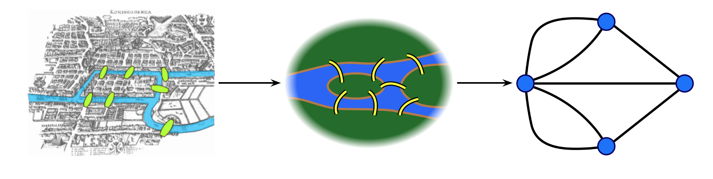
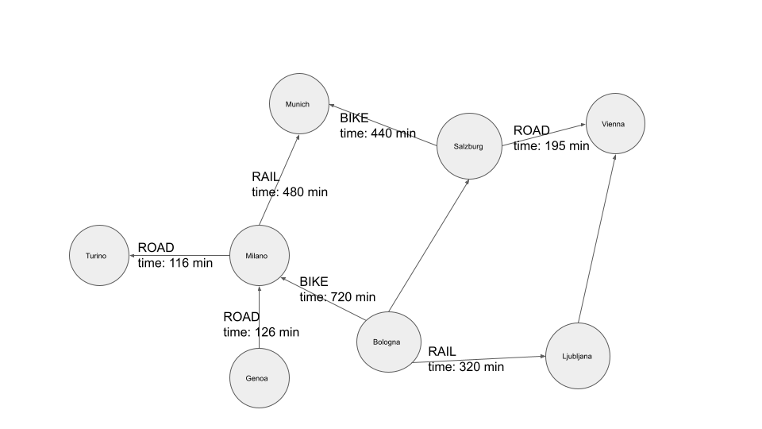

= Why use graphs
:type: quiz

[.transcript]
== Introduction

Leonhard Euler started graph theory in 1735 to (dis)prove whether a particular path exists through Königsberg.

Königsberg, Prussia (now Kaliningrad, Russia) is a city spanning the Pregel River.
It includes two large islands, which are connected to one another and to the river banks by seven bridges.
A map of this arrangement is pictured above.

The Seven Bridges problem is this: Is there any possible route through the city that crosses every bridge exactly once?
Some pen-and-paper experimentation will quickly suggest that there is no such route.
However, PROVING that there is no solution is much more difficult; Euler invented Graph Theory as a tool to aid this proof.
The graph representation of the problem is on the right: four land masses, each represented by a node, and seven bridges, each represented by a relationship.

=== Finding shortest paths

Essentially, graph theory was invented to deal with finding various paths.
It was just a matter of time before people started using the graph representation of data to find the shortest paths.

Imagine you are building a navigation system and want to recommend the shortest paths between cities to users.

Figure 2 visualizes an example transportation network between cities in Italy, Austria, and Slovenia.
The cities are represented as nodes, while the transportation modes are represented as relationships between cities.
For example, you could bike from Salzburg to Munich in about 440 minutes or take the train from Ljubljana to Bologna for 320 minutes.

You could use a graph-based representation of data to calculate the most optimal route based on your specifications.
The route could be optimized by time, distance, or cost.
In a relational database, you would have to hypothesize the order of relationships you must join to find an available path between two entities.
In this example, there are three relationship options you could choose to traverse.
Using the road, railroad, or bike network, you could hop from one city to another.
Another problem you might face with traditional databases is that you don't know beforehand how many relationships you must traverse to get from node A to node B.
Not knowing beforehand precisely which and how many relationships you must traverse could lead to potentially complex and computationally expensive queries.
On the other hand, graph databases are specialized to solve and find complex shortest paths with a single line or two of code.
Not only will your queries be simpler and easier to maintain, but they will most likely be more performant.
So if you are building a navigation system, lowering the response times will deliver a better user experience. 
At the same time, more straightforward queries will help you develop and maintain the platform more efficiently.

Finding optimal routes can be applied on the following scenarios:

* Logistics and routing
* Infrastructure management
* Finding optimal paths to make new contacts
* Web link analysis
* And more...

== Check your understanding
include::questions/1-database.adoc[leveloffset=+1]

include::questions/2-usecase.adoc[leveloffset=+1]

[.summary]
== Summary
In this lesson we covered high-level overview of advantages of using a graph database to solve the shortest path problem.

In the next lesson we will go over how to find shortest paths with Cypher query language.
