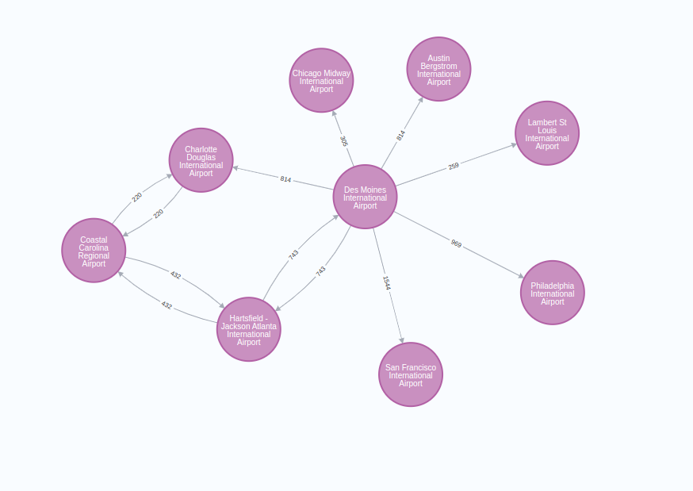

= Cypher shortest paths
:type: quiz

[.transcript]
== Introduction

Imagine you want to build a web application to help people find connections between various airports.
A user selects the start and target airport, and it is your job to suggest the best connections between the two.
As you might imagine, finding the best connections between various airports is a graph problem in a nutshell.
The airports are modeled as nodes, and the connecting flights are represented as relationships.

Cypher query language was developed to interact and retrieve data from a graph database.
Therefore, it supports typical graph operations out of the box.
One of the typical graph operations is finding the shortest paths between pairs of nodes in the graph.
Cypher query language supports finding _unweighted_ shortest paths with the _shortestPath_ function.
The cost of traversing any relationship in an unweighted network is identical.
On the other hand, a relationship can have a particular property that represents the cost of traversing the relationship.
In the airport route world, the relationship weight can represent the distance between two airports, the cost of the flight, or something else you might want to optimize.

Figure 1 visualizes a network of airport routes.
Airports are represented as nodes while connecting flights are described as relationships.
Relationships have an additional property that describes the cost of traversing the relationship.
In this case, the relationship weight describes the distance in miles between two airports.
Overall, you can say that you are dealing with a directed unweighted network.
It is a directed network because if there is a connection from Chicago to Des Moines, that doesn't directly imply that a reverse link from Des Moines to Chicago is also available.

=== Single shortest path

First, you will implement a function that recommends to users the shortest path between two airports based on the number of stops.
Essentially, you can find the shortest number of stops between two airports by finding the shortest unweighted path between the two.
Since the cost of traversing all relationships in an unweighted network is identical, the shortest path function optimizes the number of stops or intermediate nodes.

The following syntax identifies the shortest path between the *Montana* and *Paris* airports.

[source, cypher]
----
MATCH (source:Airport {name:"Montana"}),
      (target:Airport {name:"Paris"}) <1>
MATCH p=shortestPath((source)-[:HAS_ROUTE*]->(target)) <2>
RETURN p
----

**Notes:**

1. first, you need to `MATCH` the start and the target nodes.
2. the `shortestPath` function returns a *path* object

You must define the graph pattern you are looking at as an input to the `shortestPath` function.
The code listed above searches for the shortest path between the described `source` and `target` nodes.
The algorithm is allowed to traverse only the `HAS_ROUTE` relationships.
Other relationship types in the graph will be ignored.
If you want to allow the shortest path algorithm to traverse other relationship types like, for example, `REL`, you can simply describe it in the graph pattern.

[source, cypher]
----
MATCH (source:Airport {name:"Montana"}),
      (target:Airport {name:"Paris"})
MATCH p=shortestPath((source)-[:HAS_ROUTE|REL*]->(target)) <1>
RETURN p
----

**Notes:**

1. shortest path algorithm is allowed to traverse both the `HAS_ROUTE` and the `REL` relationships

Another important syntax detail is that you allow the algorithm to traverse any number of relationships with the `*` character.
If you want to limit the number of allowed hops, you can use the Cypher syntax for a variable length path with a maximum number of hops allowed.

[source, cypher]
----
MATCH (source:Airport {name:"Montana"}),
      (target:Airport {name:"Paris"})
MATCH p=shortestPath((source)-[:HAS_ROUTE|REL*..10]->(target)) <1>
RETURN p
----

**Notes:**

1. shortest path algorithm is allowed to at most 10 relationships. If a path with 10 or less relationships doesn't exist between the two nodes, the return will be empty.

=== All shortest paths

Sometimes there is more than one shortest path available between two nodes.
The `shortestPath` function will always return only a single path even if, for example, there are multiple paths available with the minimum number of hops.
If you are looking for all the possible shortest paths between two nodes, you can use the `allShortestPaths` function.
This function can be used for your web application to identify all the alternative shortest connections between two airports.

The following syntax identifies all the shortest paths between the *Montana* and *Paris* airports.

[source, cypher]
----
MATCH (source:Airport {name: "Montana"}),
      (target:Airport {name:"Paris"})
MATCH p=allShortestPaths((source)-[:ROUTE*]->(target))
RETURN p
----

The `allShortestPath` function returns one or more path objects if a path exists between the two nodes.
All the resulting paths will be of the same length, the minimum number of traversals between the pair of nodes.
Similarly as with the `shortestPath` function, you can describe the allowed relationship types and the number of allowed hops as an input to the `allShortestPath` object.

== Check your understanding
include::questions/1-sssp.adoc[leveloffset=+1]

include::questions/2-path.adoc[leveloffset=+1]

include::questions/3-allpaths.adoc[leveloffset=+1]

[.summary]
== Summary
In this lesson you learned about how GDS works and the high-level workflow in GDS.  You also learned about GDS concurrency and Neo4j memory configurations to support GDS workloads.

In the next module you will learn about graph management, the graph catalog, and working with graph projections in more detail.