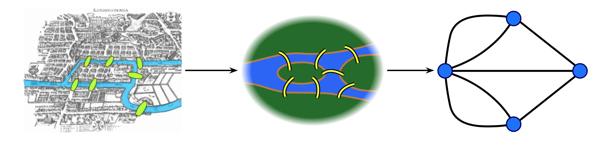

= Why use graphs
:type: quiz

[.transcript]
In the link:/courses/neo4j-fundamentals/[Neo4j Fundamentals^] course, we covered the Seven Bridges problem, and how Swiss Mathematician Leonhard Euler devised graph theory to (dis)prove whether a particular path exists through the bridges of Königsberg.

Euler's takeaway was that, using Graph Theory, he was able to prove that there were no possible routes through the city that crossed each bridge only once.

// Königsberg, Prussia (now Kaliningrad, Russia) is a city spanning the Pregel River.
// It includes two large islands, which are connected to one another and to the river banks by seven bridges.
// A map of this arrangement is pictured above.

// The Seven Bridges problem is this: Is there any possible route through the city that crosses every bridge exactly once?
// Some pen-and-paper experimentation will quickly suggest that there is no such route.
// However, PROVING that there is no solution is much more difficult; Euler invented Graph Theory as a tool to aid this proof.
// The graph representation of the problem is on the right: four land masses, each represented by a node, and seven bridges, each represented by a relationship.

== Finding shortest paths

Essentially, graph theory was invented to deal with finding various paths through a network of vertexes and edges.
// It was just a matter of time before people started using the graph representation of data to find the shortest paths.

Imagine you are building a navigation system and want to recommend the quickest route between cities to users.

image::images/ShortestPaths.png[title="Shortest paths",1200]

The image above visualizes an example transportation network between cities in Italy, Austria, and Slovenia.
The cities are represented as nodes, while the transportation modes are represented as relationships between cities.

The image demonstrates that you could bike from Salzburg to Munich in about 440 minutes or take the train from Ljubljana to Bologna for 320 minutes.

A graph-based representation of data is perfect fit for calculating the most optimal route based on your specifications.
The time property attributed to each relationship in this example could be used to calculate the shortest path from origin to destination in terms of time, but additional properties could be added to enable the route to be optimized by distance travelled or cost.

=== Graphs vs Relational Databases

This problem would cause a headache for any relational database developer.
To solve this problem in a relational database, you would need to hypothesize the order in which you would join the tables and build a complex SQL query or stored procedures to calculate the fastest route.

Another problem you might face with traditional databases is that you don't know beforehand how many relationships you must traverse to get from node A to node B.
Not knowing beforehand precisely which and how many relationships you must traverse could lead to potentially complex and computationally expensive queries.

On the other hand, graph databases are designed to solve and find complex shortest paths with a single line or two of code.

// TODO: Side by side comparison of SQL vs Cypher

=== Performance Considerations

Not only will your queries be simpler and easier to maintain, but they will almost certainly be more performant.

The Neo4j Fundamentals course also covers the link:/courses/neo4j-fundamentals/2-property-graphs/2-native-graph/[Graph Native Advantage] and the concept of Index-free Adjacency.
This concept is pertinent when calculating shortest paths.

When querying a relational database, any joins are calculated at runtime by scanning indexes.
Not only is this a computationally expensive, but the speed of the query is also proportional to the total size of the data.
The more information added to the database, the slower your queries will be.

In Neo4j, the data is stored in such a way that every node is aware of every incoming and outgoing relationship, and traversals through the network are instead performed by pointer chasing in memory.

So if you trying to find the optimal route through a network, it makes sense to run these calculations on top of a graph.
At the same time, more straightforward queries will help you develop and maintain the platform more efficiently.

// TODO: Comparison of neo4j vs {networkX,graphX}?

== Potential Use Cases

Finding optimal routes can be applied on the following scenarios:

* Logistics and routing
* Infrastructure management
* Finding optimal paths to make new contacts
* Web link analysis
* And more...

== Check your understanding
include::questions/1-database.adoc[leveloffset=+1]

include::questions/2-usecase.adoc[leveloffset=+1]

[.summary]
== Summary
In this lesson we covered high-level overview of advantages of using a graph database to solve the shortest path problem.

In the next module we will cover how to find shortest paths using the Cypher query language.
