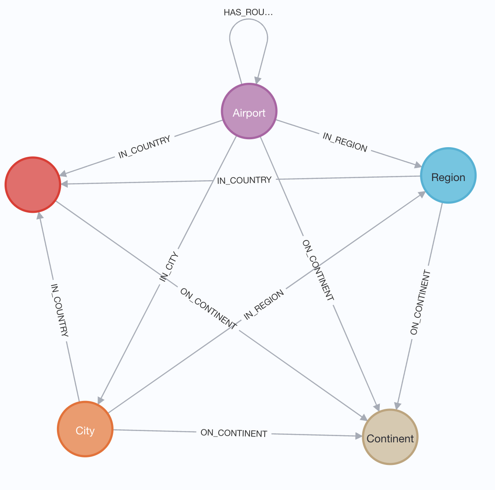

= Finding Shortest Paths using Cypher
:order: 2

== Module Overview

In this module, you will learn how to use Cypher query language to find the shortest paths between pairs of nodes in the graph.

The module will cover two core areas:

* *Why use graphs to calculate shortest paths* - What is the benefit of using a graph database
* *Using Cypher to find shortest paths* - Cypher syntax to find the shortest paths

== Domain model for this course

Throughout this course, we will be querying the `graph data science` dataset which consists of airports and their geographical information.

* `(:Airport)` nodes are identified by a unique `.iata` property, a `.name`, and latitude and longitude data held in a `.location` point property.
* Airports have an outgoing relationships to `(:Region)`, `(:Continent)`, `(:Country)`  and `(:City)` nodes which creates a geographical hierarchy.
* Airports are linked together through `:HAS_ROUTE` relationships, signifying where it is possible to travel from that airport
* Each `:HAS_ROUTE` relationship has a `.distance` property which we will use to calculate the _cost_ of travelling between two airports.
