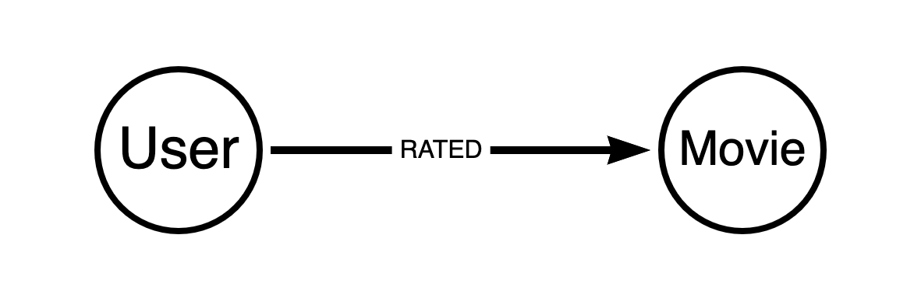
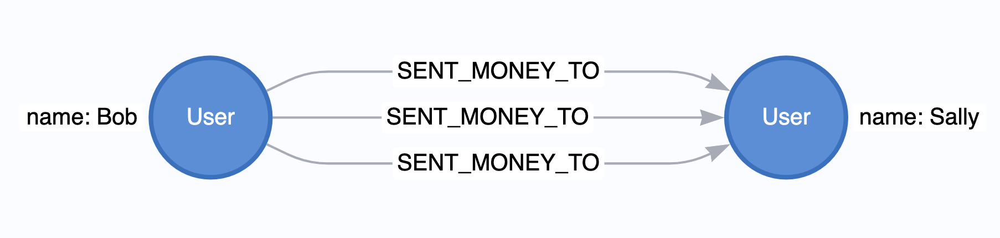
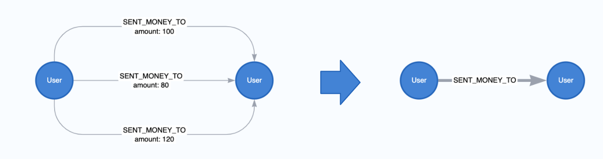
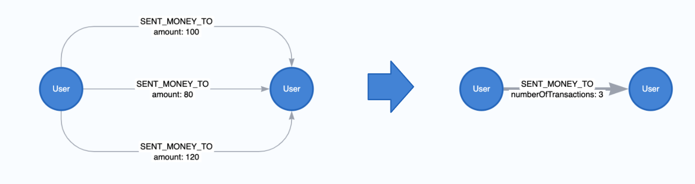

= Native Projections
:type: quiz

// [.video]
// video::xxxx[youtube,width=560,height=315]

[.transcript]
== Introduction
In the last lesson you learned about the graph catalog. We briefly introduced graph projections there, but we didn't go into much depth. Understanding Graph projections is foundational to success in GDS, so we will spend the next two lessons covering them in more detail.

There are 2 primary types of projections in GDS, native projections and cypher projections. In summary, native projections are optimized for efficiency and performance to support graph data science at scale. Cypher projections are optimized for flexibility and customization to support exploratory analysis, experimentation, and smaller graph projections.

In this lesson we will cover native projections specifically - what they are and how to use them. In the next lesson we will do the same for Cypher projections.

=== About Native Projections

We actually used a native projection in our last lesson.  When you call `gds.graph.project()` you are using a native projection.  Native projections provide the best performance by reading from the Neo4j store files directly. We recommend them for both development and production phases.

In addition to just projecting node and relationship elements as-is from the database, native projections offer a variety of other features.  Below are a few of the big ones:

* the inclusion of numeric node and relationship properties
* altering relationship direction or "orientation"
* aggregating parallel relationships

These options help prepare the projection for different types of analytical workflows and algorithms.

Below we cover the basic syntax for native projections and walk through a couple common configurations.

=== Basic Syntax

The native projection takes three mandatory arguments: `graphName`, `nodeProjection` and `relationshipProjection`. In addition, the optional `configuration` parameter allows us to further configure the graph creation.

[opts="header",cols="1,1,1, 4"]
|===
| Name                  | Type                | Optional | Description
| graphName             | String              | no       | The name under which the graph is stored in the catalog.
| nodeProjection        | String, List or Map | no       | The configuration for projecting nodes.
| relationshipProjection| String, List or Map | no       | The configuration for projecting relationships.
| configuration         | Map                 | yes      | Additional parameters to configure the native projection.
|===

There are multiple different options for the `nodeProjection` and `relationshipProjection`.  To introduce the basics it is helpful to walk through by use case.

=== Basic Native Projections
Let's first consider the very basic scenario where we want to project nodes and relationships as-is without any properties. You can use a list-like syntax for both the node labels and relationships you want to include. Take the below example where we project the `User` and `Movie` nodes with the `RATED` relationship.  This type of projection is very common for graph data science based Recommendation Systems as it supports variations of Implicit Collaborative Filtering - a memory based approach to recommendation.

[source,cypher,role=nocopy]
----
CALL gds.graph.project('native-proj',['User', 'Movie'], ['RATED']);
----

There are various forms of shorthand syntax too.  For example, if you plan to include only one node label or relationship type you can just use a single string value. We could for example just enter the value `RATED` for the `relationshipProjection` and get an equivalent projection.

[source, cypher,role=nocopy]
----
CALL gds.graph.project('native-proj',['User', 'Movie'], 'RATED');
----

[NOTE]
.A graph with name 'native-proj' already exists.
====
If you attempt to create a new graph projection with a name that already exists, you will receive an error.
To continue you will first have to run the `gds.graph.drop()` procedure to drop the existing graph projection.

.Dropping a Graph
[source,cypher]
----
CALL gds.graph.drop('native-proj');
----
====

The wildcard character '*' can be used to include all nodes and/or relationships in the database. The below projections all nodes and relationships.

[source, cypher,role=nocopy]
----
CALL gds.graph.project('native-proj','*', '*');
----

=== Changing Relationship Orientation

Native projections allow you to change the relationship orientation as well. To best describe the concept of orientation and why we would want to change it, we need to cover the difference between a directed and an undirected relationship.

A directed relationship is non-symmetrical. It goes from a source node to a target node, illustrated by the image below.  This type of relationship may contain additional qualifying properties, for example a weighting or strength indicator.

An undirected relationship is symmetric with no directional character, it is simply between two nodes instead of having a source and target.

image::images/undirected-relationship.png[title="Undirected Relationship",400]

Every relationship in the neo4j database is directed by design. However, some graph algorithms are designed to work on undirected relationships. Other algorithms are directed, but we may need to reverse the direction of the relationship in the database to get the analytic we want.

To accommodate this there are three orientation options we can apply to relationship types in the `relationshipProjection`:

* `NATURAL`: same direction as in the database (default)
* `REVERSE`: opposite direction as in the database
* `UNDIRECTED`: undirected

Take the graph we just projected as an example.  Say we want to count the number of user ratings each movie has.  If we try to use the degree call like we did last lesson we will get all zeros.

[source, cypher]
----
CALL gds.graph.drop('native-proj', false);
CALL gds.graph.project('native-proj',['User', 'Movie'], ['RATED']);
CALL gds.degree.mutate('native-proj', {mutateProperty: 'ratingCount'});
----

[source, cypher]
----
CALL gds.graph.streamNodeProperty('native-proj','ratingCount', ['Movie'])
YIELD nodeId, propertyValue
RETURN gds.util.asNode(nodeId).title AS movieTitle, propertyValue AS ratingCount
ORDER BY movieTitle DESCENDING LIMIT 10
----

[options="header"]
|==================================================
| movieTitle                          | ratingCount
| İtirazım Var                        | 0.0
| À nous la liberté (Freedom for Us)  | 0.0
| ¡Three Amigos!                      | 0.0
| xXx: State of the Union             | 0.0
| xXx                                 | 0.0
|==================================================

This has to do with the direction of the relationships. Let's delete that graph and project a new one where we reverse the `RATED` relationship direction.

[source, cypher]
----
CALL gds.graph.drop('native-proj', false);

//replace with a project that has reversed relationship orientation
CALL gds.graph.project(
    'native-proj',
    ['User', 'Movie'],
    {RATED_BY: {type: 'RATED', orientation: 'REVERSE'}}
);

CALL gds.degree.mutate('native-proj', {mutateProperty: 'ratingCount'});
----

Now when we use the degree algorithm we will get the rating counts we need.

[source, cypher]
----
CALL gds.graph.streamNodeProperty('native-proj','ratingCount', ['Movie'])
YIELD nodeId, propertyValue
RETURN gds.util.asNode(nodeId).title AS movieTitle, propertyValue AS ratingCount
ORDER BY movieTitle DESCENDING LIMIT 5
----

[options="header"]
|==================================================
| movieTitle                          | ratingCount
| İtirazım Var                        | 1.0
| À nous la liberté (Freedom for Us)  | 1.0
| ¡Three Amigos!                      | 31.0
| xXx: State of the Union             | 1.0
| xXx                                 | 23.0
|==================================================

=== Including Node and Relationship Properties

Node and relationship properties may be useful to consider in graph analytics. They can be used as weights in graph algorithms and features for machine learning.

Below is an example of including multiple movie node properties and the `rating` relationship property.

[source,cypher]
----
CALL gds.graph.drop('native-proj', false);

CALL gds.graph.project(
    'native-proj',
    ['User', 'Movie'],
    {RATED: {orientation: 'UNDIRECTED'}},
    {
        nodeProperties:{
            revenue: {defaultValue: 0}, // <1>
            budget: {defaultValue: 0},
            runtime: {defaultValue: 0}
        },
        relationshipProperties: ['rating'] // <3>
    }
);
----

**Notes:**

1. the `defaultValue` parameter allows us to fill in missing values with a default.  In this case we use `0`.
2. simpler syntax with no default values as these should not be missing according to the data model.

We will go over how to leverage properties like these in more detail in the Neo4j Graph Data Science Fundamentals course. There are a variety of different options for setting defaults and for alternative configurations, such as setting properties for all node labels and relationship types instead for doing so for each one separately.  Please refer to the https://neo4j.com/docs/graph-data-science/current/graph-project/#graph-project-native-syntax[documentation^] if you want more details on these.

=== Parallel Relationship Aggregations

The Neo4j database allows you to store multiple relationships of the same type and direction between two nodes.  These are colloquially known as _parallel_ relationships. For example, consider a graph of financial transaction data where users send money to one another.  If a user sends money to the same user multiple times this can form multiple parallel relationships.

Sometimes you will want to aggregate these parallel relationships into a single relationship in preparation for running graph algorithms or machine learning. This is because graph algorithms may count each relationship between two nodes separately when all we need to consider is whether a single relationship exists between them. Other times we may want to weight the connection between two nodes higher if more parallel relationships exists, but it's not always easy to do so without aggregating the relationships first depending on which algorithm you use.

Native projections allow for this aggregation. When you conduct relationship aggregation you can generate aggregate statics too, such as parallel relationship counts or sums or averages of relationship properties which can then be used as weights. Below is an example of aggregating relationships without any properties

[source, cypher, role=noplay]
----
CALL gds.graph.project(
  'user-proj',
  ['User'],
  {
    SENT_MONEY_TO: { aggregation: 'SINGLE' }
  }
);
----

We can create a property with the count of the relationships as well - like so:

[source, cypher, role=noplay]
----
CALL gds.graph.project(
  'user-proj',
  ['User'],
  {
    SENT_MONEY_TO: {
      properties: {
        numberOfTransactions: {
          // the wildcard '*' is a placeholder, signaling that
          // the value of the relationship property is derived
          // and not based on Neo4j property.
          property: '*',
          aggregation: 'COUNT'
        }
      }
    }
  }
);
----

We can also take the sum, min or max of relationship properties during aggregation.  Below is an example with sum.

[source, cypher, role=noplay]
----
CALL gds.graph.project(
  'user-proj',
  ['User'],
  {
    SENT_MONEY_TO: {
      properties: {
        totalAmount: {
          property: 'amount',
          aggregation: 'SUM'
        }
      }
    }
  }
);
----

image::images/parallell-rels-agg-3.png[title="Aggregate the SENT_MONEY_TO Realtionship With a Property Sum",800]

=== Other Native Projection Configuration and Features

We covered the basics here but there are actually many extended syntax and configuration options available for native projections which are detailed in the https://neo4j.com/docs/graph-data-science/current/graph-project/#graph-project-native-syntax[documentation^].  In general, if you are trying to do something in native projection and can't quite express the thing you want with the current syntax, check the docs to see if there are additional configurations or syntax extensions to support.

== Check your understanding

include::questions/1-graph-native-projection.adoc[leveloffset=+1]

include::questions/2-native-projection-use-cases.adoc[leveloffset=+1]

[.summary]
== Summary
In this lesson we went over native projections, the primary graph projection mechanism in GDS.  Native Projections are optimized for efficiency and performance to support graph data science at scale.  Native projections have a rich syntax and set of configuration options that allow you to

. filter the graph by node label and relationship types
. include node and relationship properties
. alter relationship orientation
. aggregate parallel relationships

In the next lesson you will be challenged to run a Native Projection against your Neo4j Sandbox.