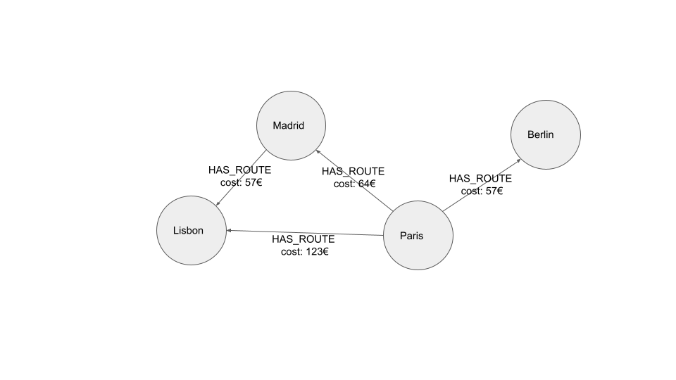

= Weighted Shortest Paths
:type: quiz

[.transcript]

In a property graph, relationships can have properties assigned to them.
In graph theory, relationship properties are referred to as weights.
A weight is a numerical property which represents the _cost_ of traversing that relationship, whether that is distance, time, financial cost or any other factor.

In the above diagram, the relationship weight is used to represent the cost of flying between airports as a monetary value.

You can see that flying between Paris and Lisbon costs 123€.
However, if you choose to fly from Paris to Lisbon via Madrid, the cost would actually be cheaper.
The cost property of the two relationships comes to 121€, which is 2€ cheaper than the direct route.

Therefore, based on the criteria of cost, the shortest weighted path between Paris and Lisbon follows through Madrid and is not actually the direct connection between the two.

Your application could use the shortest weighted path algorithm to find flight routes that:

* Produce the least CO~2~,
* Cost the least money,
* Take the least time,
* Or a combination of the three.

== Projecting Weighted Graphs in GDS

To use the weighted shortest path algorithms built into the Neo4j Graph Data Science library, you will first need to create a graph projection in memory using the `gds.graph.project()` procedure.
This topic is covered in more detail in the link:/courses/graph-data-science-fundamentals/[Neo4j Graph Data Science Fundamentals^] course.

When dealing with a single relationship type or having identical weights on all relationship types, you can use the `relationshipProperties` configuration parameter.
`relationshipProperties` has three possible inputs:

|===
| Type | Description | Example

|String
|To be used when your projected graph should contain a single relationship property.
|`"cost"`

|List of strings
|To be used when you need to add multiple relationship properties to the projection.
|`["cost", "distance"]`

|Map
|To be used when you need to add multiple relationship properties to the projection, while also providing a default value if one does not exist.
|`{ cost: {defaultValue: 1000}, distance: {defaultValue: 25 }}`

|===

In our dataset, we only have one property to represent weight, `.distance`, and it is present for all relationships so we don't need to provide a default value.
So in this case we can use a single string.

You can run the following Cypher statement to project the airport routes graph along with the *distance* relationship weight:

.Creating a Graph Projection
[source, cypher]
----
CALL gds.graph.project(
  'routes',                            // <1>
  'Airport',                           // <2>
  'HAS_ROUTE',                         // <3>
  {relationshipProperties:'distance'}  // <4>
);
----

1. We are creating a new projected graph with the name `routes`.
2. The graph should contain all nodes with the label `Airport`
3. The graph should contain all relationships with the type `HAS_ROUTE`
4. One relationship property should be loaded, `.distance`, which has no default value

== Common Weighted Shortest Path Algorithms

In this lesson, we will cover two of the most commonly used algorithms that come with the Neo4j Graph Data Science library.

* Dijkstra Source-Target Shortest Path
* yens

=== Dijkstra Source-Target Shortest Path

The **Dijkstra Source-Target algorithm** is a commonly used algorithm for finding the shortest weighted path between a _source_ and a _target_ node.

// TODO: More introduction

[TIP]
.Positive Weights Only
Dijkstra's algorithm supports weighted graphs with positive relationship weights only.
If you have any negative weights, the algorithm will not work correctly.

An implementation of Dijkstra's algorithm is available under the `gds.shortestPath.dijkstra` namespace in the Neo4j Graph Data Science library.
The `gds.shortestPath.dijkstra.stream()` procedure can be called to calculate the shortest weighted path between nodes.

You can run the following Cypher statement to calculate the shortest weighted path between  *Paris Charles de Gaulle* (CDG) and *Lisbon Portela Airport* (LIS) and stream the results.

.Dijkstra Source-Target Shortest Path Query
[source, cypher]
----
MATCH (source:Airport {iata: "CDG"}),  // <1>
      (target:Airport {iata:"LIS"})

CALL gds.shortestPath.dijkstra.stream(
  'routes',  // <2>
  {
    sourceNode: source,  // <3>
    targetNode: target,  // <4>
    relationshipWeightProperty: 'distance' // <5>
  }
)
YIELD nodeIds, costs, totalCost // <6>
RETURN [nodeId in nodeIds | gds.util.asNode(nodeId).descr] AS airports, costs, totalCost
----

1. The query starts by `MATCH` ing the source and target nodes.
2. The `gds.shortestPath.dijkstra.stream()` procedure is run on the `routes` projected graph created earlier.
3. The source node for the algorithm should be Paris Charles de Gaulle (CDG).
4. The target node for the algorithm should be Lisbon Portela Airport (LIS).
5. The relationship property that should be used to calculate the shortest path should be distance.
6. From the procedure's output, take a list of the internal IDs of the nodes in the shortest path (`nodeIds`), a list of the individual costs (`costs`) of this path, and the overall cost `totalCost`.

.Dijkstra Source-Target Shortest Path Query Results
[options="header"]
|==================================================
| airports                                                | costs        | totalCost
| `["Paris Charles de Gaulle","Lisbon Portela Airport"]`  | `[0, 913.0]` | `913.0`
|==================================================

// As mentioned, you need to provide the *source* and *target* nodes to the algorithm.
// Therefore, you must use the *MATCH* clause to identify them.
// Since you are finding the shortest _weighted_ path, you must specify the *relationshipWeightParameter*.
// With the *relationshipWeightParameter*, you define which relationship property the algorithm should consider as the weight.
// In this example, the *distance* relationship property is used.
// If a direct connection exists between the two airports, it's more likely than not that the direct connection will be the shortest by distance.

The *costs* output provides the accumulated cost of traversing to each node in the path, while the *totalCost* provides the total cost of traversing from source to target.

You can find more information on the Neo4j Graph Data Science implementation of Dijkstra in the link:https://neo4j.com/docs/graph-data-science/current/algorithms/dijkstra-source-target/[Graph Data Science Manual^].

[#yens]
== Yen's Algorithm

Yen's k-Shortest Path algorithm, also referred to as Yen's Shortest Path algorithm is similar to Dijkstra's shortest path algorithm with the exception of a configurable `k` value, where `k` represents the number of shortest paths to return.

The algorithm makes sure that an already discovered shortest path will not be traversed again.

// Users probably wouldn't have a great experience in your route recommendation application if you didn't present them with any alternatives.
// You can use Yen's Shortest Path algorithm to calculate the k-shortest paths, where the *k* represents the number of shortest paths.
// For example, if you wanted to identify the five shortest weighted paths, you would set the *k* value to five.

// For the actual path computation, Yen’s algorithm uses the Dijkstra shortest path algorithm.
// Therefore, the Yen's algorithm also doesn't support negative weights.

// For k = 1, the algorithm behaves exactly like Dijkstra’s shortest path algorithm and returns the shortest path. For k = 2, the algorithm returns the shortest path and the second shortest path between the same source and target node. Generally, for k = n, the algorithm computes at most n paths which are discovered in the order of their total cost.

An implementation Yen's algorithm is stored under the `gds.shortestPath.yens` namespace in the Neo4j Graph Data Science library.
The `gds.shortestPath.yens.stream()` procedure can be called to calculate the _k_ shortest weighted path between nodes.

You can run the following Cypher statement to calculate the three shortest weighted path between *Paris Charles de Gaulle* and *Lisbon Portela Airport* airports using the Yen's algorithm.

[source, cypher]
----
MATCH (source:Airport {iata: "CDG"}),
      (target:Airport {iata:"LIS"})

CALL gds.shortestPath.yens.stream(
  'routes',
  {
    sourceNode:source,
    targetNode:target,
    relationshipWeightProperty:'distance',
    k:3 // <1>
  })
YIELD index, nodeIds, totalCost // <2>
RETURN index, [nodeId in nodeIds | gds.util.asNode(nodeId).descr] AS airports, totalCost
----

1. The `k` value in the configuration map above is set to `3`, ensuring that up to three shortest routes are returned.
2. In addition to the node IDs and total cost, an additional `index` value is returned by this procedure which represents the order in which this path appears in the result set.

[options="header"]
|==================================================
| index |  airports                                               | totalCost
| `0`     |`["Paris Charles de Gaulle","Lisbon Portela Airport"]`     | `913.0`
| `1`     |`["Paris Charles de Gaulle", "Nantes Atlantique Airport", "Lisbon Portela Airport"]`  | `922.0`
| `2`     |`["Paris Charles de Gaulle", "Bilbao Airport", "Lisbon Portela Airport"]`  | `923.0`
|==================================================

From the results, you can see that the shortest path is identical to the value returned by Dijkstra's algorithm above, but two additional routes are suggested.

If you were to fly from Paris to Lisbon via Nantes, you would make additional 9 miles or additional 10 miles via Bilbao.

== Check your understanding

include::questions/1-weights.adoc[leveloffset=+1]

include::questions/2-multiple-paths.adoc[leveloffset=+1]

[.summary]
== Summary

In this lesson you learned how to find the shortest weighted paths using the two of the Path Finding procedures included in the Neo4j Graph Data Science library.

In the next challenge, you will use Dijkstra's shortest path algorithm to find the shortest weighted path between other nodes.
