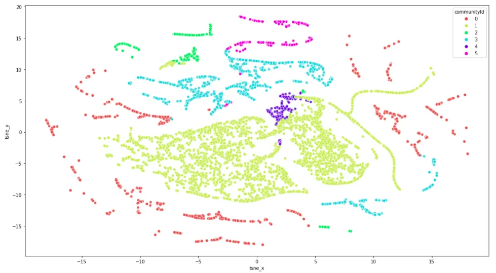

= Course overview

[.transcript]
In this course, we will be using a dataset from a survey conducted in 2013 by the Statistics class at FSEV UK and more details can be found on Kaggle[https://www.kaggle.com/datasets/miroslavsabo/young-people-survey].
The survey was designed to collect information on various aspects of the participants' lives, including their music and movie preferences, hobbies, phobias, health habits, personality traits, views on life, opinions, spending habits, and demographics.
The dataset contains 1010 survey responses with 150 questions, both numerical and categorical.
The survey was presented in both electronic and written form, and participants were of Slovakian nationality between the ages of 15 and 30.
Throughout this course, we will be using this dataset to identify groups of similar people based on their responses, also known as segmentation.

This course will teach you how to encode categorical variables and perform basic dimensionality reduction like eliminating low variance and highly correlating features.
After the preprocessing step is finished, you will learn how to perform community detection using the KMeans algorithm.

Additionally, you will also learn how to perform community detection of people based on their responses by constructing a nearest neighbor graph of and using the Leiden algorithm to identify groups of similar people.

image::images/network.png[title="Graph-based community detection"]

////
Doesn't render anyway
[.summary]
== Summary
In this lesson we covered high-level overview of advantages of using a graph database to solve the shortest path problem.

In the next module we will cover how to find shortest paths using the Cypher query language.
////