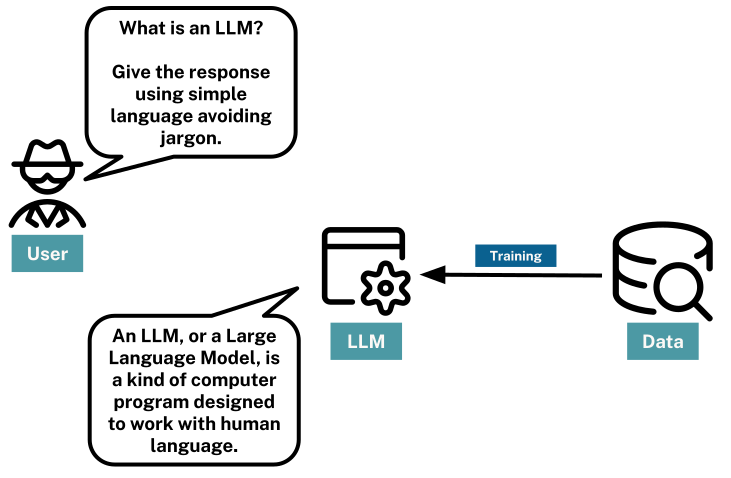

= What is Generative AI
:order: 1
:type: lesson
:slides: true

[.slide]
== GenAI

Generative AI (or GenAI) refers to artificial intelligence systems designed to create new content that resembles human-made data. The data could be text, images, audio, or code.

[.transcript-only]
====
These models, like GPT (for text) or DALL-E (for images), are trained on large datasets and use patterns learned from this data to generate new output.
====

image::images/genai-model-process.svg[A diagram showing the process of Generative AI, where a model is trained on a large dataset, learns patterns, and generates new content based on those patterns.]

[.transcript-only]
====
Generative AI is widely used in applications such as chatbots, content creation, image synthesis, and code generation.
====

[.slide.discrete]
== GenAI

Generative AI models are not "intelligent" in the way humans are:

. They do not understand or comprehend the content they generate
. They rely on statistical patterns and correlations learned from their training data.

While Generative AI models can produce coherent and contextually relevant outputs, they lack understanding.

[.slide]
## Large Language Models (LLMs)

This course will focus on text-generating models, specifically Large Language Models (LLMs)

LLMs are a type of generative AI model designed to understand and generate human-like text.

These models are trained on vast amounts of text data and can perform various tasks, including answering questions, summarizing data, and analyzing text.

[.slide.discrete]
## LLM Responses

The response generated by an LLM is a probabilistic continuation of the instructions it receives.

The LLM provides the most likely response based on the patterns it has learned from its training data.

If presented with the instruction:

    "Continue this sequence - A B C"

An LLM could respond:

    "D E F"

[.slide.col-2]
## Prompts

[.col]
====
To get an LLM to perform a task, you provide a **prompt**.

A prompt should specify your requirements and provide clear instructions on how to respond.
====

[.col]

[.slide.discrete]
## Precision

Precision in the task description, potentially combined with examples or context, ensures that the model understands the intent and produces relevant and accurate outputs.

An example prompt may be a simple question.

    What is the capital of Japan?

Or, it could be more descriptive:

    You are a friendly travel agent helping a customer to choose a
    holiday destination. Your readers may have English as a second
    language, so use simple terms and avoid colloquialisms.
    Avoid Jargon at all costs.

    Tell me about the capital of Japan.

The LLM will interpret these instructions and return a response based on the patterns it has learned from its training data.

[.next]
== Check Your Understanding

include::questions/1-generative-ai.adoc[leveloffset=+2]

[.summary]
== Lesson Summary

In this lesson, you learned about Generative AI and Large Language Models (LLMs).

In the next lesson, you will learn about the limitations of LLMs, including hallucination, and access to data.
