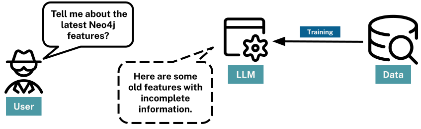

= Considerations
:order: 2
:type: lesson

While GenAI and LLMs provides a lot of potential, you should also be cautious.

At their core, LLMs are highly complex predictive text machines. LLM’s don’t know or understand the information they output; they simply predict the next word in a sequence.

The words are based on the patterns and relationships from other text in the training data.

== Access to Data

The sources for this training data are often the internet, books, and other publicly available text. 
The data could be of questionable quality and maybe be incorrect. 

Training happens at a point in time, it may not reflect the current state of the world and would not include any private information.

When asked to provide a response, relating to new or data not in the training set, the LLM may provide a response that is not accurate.

== Accuracy

LLMs are designed to create human-like text and often fine-tuned to be as helpful as possible, even if that means occasionally generating misleading or baseless content, a phenomenon known as **hallucination**.

For example, when asked to _"Describe the moon."_ an LLM may respond with _"The moon is made of cheese."_. 
While this is a common saying, it is not true.

While LLMs can represent the essence of words and phrases, they don't possess a genuine understanding or ethical judgment of the content.

== Temperature

LLMs have a _temperature_, corresponding to the amount of randomness the underlying model should use when generating the text.

The higher the temperature value, the more random the generated result will become, and the more likely the response will contain false statements.

A higher temperature may be appropriate when configuring an LLM to respond with more diverse and creative outputs, but it comes at the expense of consistency and precision.

For example, a higher temperature may be suitable for constructing a work of fiction or a novel joke, a lower temperature is required when a response grounded in facts is essential.

[TIP]
.Consider the correct temperature
====
In June 2023, link:https://www.reuters.com/legal/new-york-lawyers-sanctioned-using-fake-chatgpt-cases-legal-brief-2023-06-22/[A US judged sanctioned two US lawyers for submitting an LLM-generated legal brief^] that contained six fictitious case citations.
====

A quick fix _may_ be to reduce the temperature. But more likely, the LLM is hallucinating because it hasn't got the information required.

== Transparency

GenAI Models are often considered "black boxes" due to the difficulty deciphering their decision-making processes.
The LLM would also be unable to provide the sources for its output or explain its reasoning.

All these factors can lead to outputs that might be biased, devoid of context, or lack logical coherence.

== Check Your Understanding

include::questions/1-hallucination.adoc[leveloffset=+1]

[.summary]
== Lesson Summary

In this lesson, you learned about the limitations of GenAI models, including hallucination, and access to data.

In the next lesson, you will learn about how to provide context to GenAI models to improve the accuracy of their responses.
