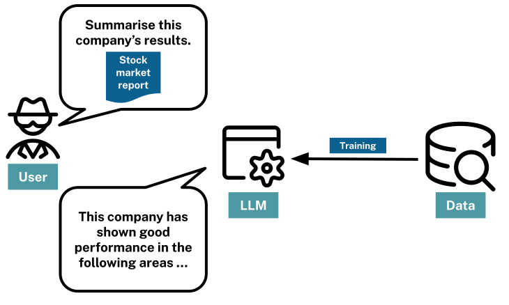
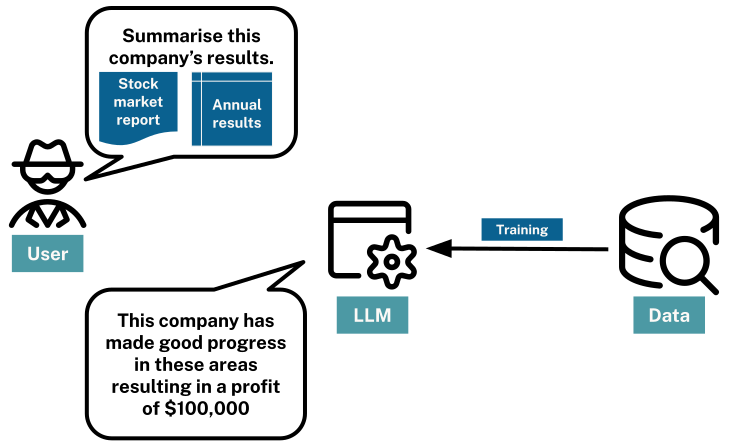

= Context
:order: 3
:type: lesson

You can improve the accuracy of responses from a Large Language Models (LLMs) by providing _context_ in your prompts.

== Avoiding hallucination

Providing clear and detailed context can help minimize hallucinations by anchoring the model’s response to the facts and details you supply. 

For example, if you ask a model to summarize a companies performance an include a relevant stock market report in your prompt, the model is more likely to produce an accurate summary based on the actual content rather than inventing details.

== Access to data

LLMs have a fixed knowledge cutoff and cannot access real-time or proprietary data unless it is provided in the prompt.

If you need the model to answer questions about recent events or organization-specific information, you must supply that data as part of your prompt. This ensures that the model’s responses are up-to-date and relevant to your particular use case.

You could also provide statistics or data points in the prompt to help the model include useful facts in its response.

== Supplying context

Supplying context in your prompts helps LLMs generate more accurate, relevant, and trustworthy responses by reducing hallucinations and compensating for their lack of access to external or current data.

== Check Your Understanding

include::questions/1-context.adoc[leveloffset=+1]

[.summary]
== Lesson Summary

In this lesson, you learned about how providing context in your prompts can help reduce hallucinations and improve the accuracy of LLM responses.

In the next module, you will learn about you can use RAG (Retrieval-Augmented Generation) to include additional context in your prompts.
