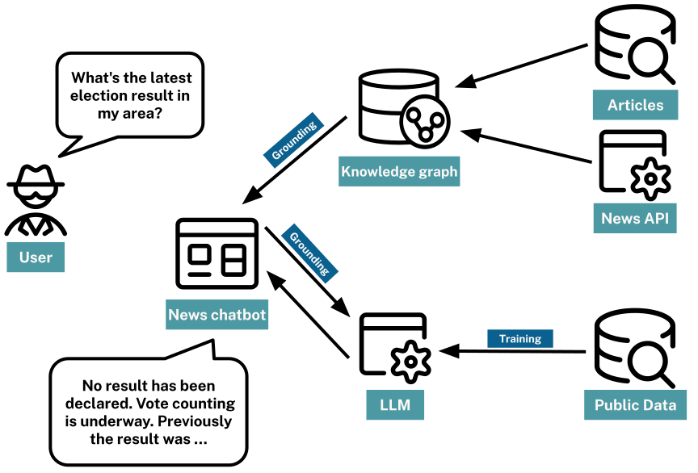

= What is RAG?
:order: 1
:type: lesson

Retrieval-Augmented Generation (RAG) is an approach that enhances the responses of language models by providing them with relevant, up-to-date information retrieved from external sources. 

This process helps generate more accurate and tailored answers, especially when the required information is not present in the model’s training data.

The RAG process typically involves three main steps:

. **Understanding User Queries**
+
The system first interprets the user’s input or question to determine what information is needed.
. **Information Retrieval** 
+ 
A _retriever_ searches external data sources (such as documents, databases, or knowledge graphs) to find relevant information based on the user’s query.
. **Response Generation** 
+ 
The retrieved information is inserted into the prompt, and the language model uses this context to generate a more accurate and relevant response.

By combining these steps, RAG systems can provide responses that are both contextually aware and grounded in real, up-to-date information.

For instance, if building a chatbot for a news agency, you could use RAG to pull real-time headlines or results from a news API. 

When a user asks, "What’s the latest news on the Olympics?", the chatbot, can provide a current headline or summary from the most recent articles, ensuring the response is timely and accurate.

[INFO]
.Grounding
The process of providing context to an LLM to improve the accuracy of its responses and reduce the likelihood of hallucinations is known as _Grounding_.

== Retrievers

The retriever is a key component of the RAG process. It is responsible for searching and retrieving relevant information from external data sources based on the user’s query.

A retriever typically takes an *unstructured input* (like a question or prompt) and searches for structured data that can provide context or answers.

Neo4j support various methods for building retrievers, including:

* Full-text search
* Vector search
* Text to Cypher

You will explore these methods in the rest of the course.

== Data sources

The data sources used in the RAG process can vary widely, depending on the application and the type of information needed. Common data sources include:

* **Documents**
+
Textual data sources, such as articles, reports, or manuals, that can be searched for relevant information.
* **APIs**
+ 
External services that can provide real-time data or specific information based on user queries.
* **Knowledge Graphs**
+
Graph-based representations of information that can provide context and relationships between entities.

For example, the news agency chatbot for a news agency, you could use:

* A news API to retrieve the latest articles or headlines. 
* A knowledge graph to understand the relationships between different news topics, such as how they relate to each other or their historical context. This would help the chatbot provide more in-depth and contextual responses.
* A document database to store and retrieve articles, reports, or other textual data that can be used to answer user queries.

[TIP]
You will learn more about knowledge graphs and their construction in the next module.

== Check Your Understanding

include::questions/1-rag.adoc[leveloffset=+1]

[.summary]
== Lesson Summary

In this lesson, you learned about RAG, which combines understanding user queries, retrieving relevant information, and generating a response using the retrieved information.

In the next lesson, you will explore how embeddings and vector search can help retrieve relevant information.
