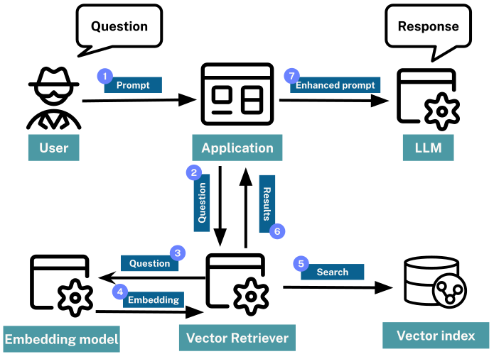

= Vector RAG
:order: 2
:type: lesson

In the last lesson, you learned about **Retrieval Augmented Generation** (RAG) and the role of retrievers in finding relevant information.

One of the challenges of RAG is understanding what the user is asking for and finding the correct information to pass to the LLM.

In this lesson, you will learn about semantic search and how vector indexes can help you find relevant information from a user's question.

== Semantic Search 

Semantic search aims to understand search phrases' intent and contextual meaning, rather than focusing on individual keywords.

Traditional keyword search often depends on exact-match keywords or proximity-based algorithms that find similar words.

For example, if you input "apple" in a traditional search, you might predominantly get results about the fruit.

However, in a semantic search, the engine tries to gauge the context: Are you searching about the fruit, the tech company, or something else?

The results are tailored based on the term and the perceived intent.

== Vectors

You can represent data as **vectors** to perform semantic search.

Vectors are simply a list of numbers.
For example, the vector `[1, 2, 3]` is a list of three numbers and could represent a point in three-dimensional space.

image::images/3d-vector.svg[A diagram showing a 3d representation of the x,y,z coordinates 1,1,1 and 1,2,3]

You can use vectors to represent many different types of data, including text, images, and audio.

The number of dimensions in a vector is called the **dimensionality** of the vector.
A vector with three numbers has a dimensionality of 3.

== Embeddings

When referring to vectors in the context of machine learning and NLP, the term "embedding" is typically used. An embedding is a vector that represents the data in a useful way for a specific task.

Each dimension in a vector can represent a particular semantic aspect of the word or phrase.
When multiple dimensions are combined, they can convey the overall meaning of the word or phrase.

For example, the word "apple" might be represented by an embedding with the following dimensions:

* fruit
* technology
* color
* taste
* shape

When applied in a search context, the vector for "apple" can be compared to the vectors for other words or phrases to determine the most relevant results.

You can create embeddings in various ways, but one of the most common methods is to use an *embedding model*.

For example, the embedding for the word "apple" is `0.0077788467, -0.02306925, -0.007360777, -0.027743412, -0.0045747845, 0.01289164, -0.021863015, -0.008587573, 0.01892967, -0.029854324, -0.0027962727, 0.020108491, -0.004530236, 0.009129008,` ... and so on.

[%collapsible]
.Reveal the completed embeddings for the word "apple"!
====
[source]
----
include::apple-embedding.adoc[]
----
====

[NOTE]
.Embedding models
====
OpenAI's `text-embedding-ada-002` embedding model created this embedding - a vector of 1,536 dimensions.

LLM providers typically expose API endpoints that convert a _chunk_ of text into a vector embedding.
Depending on the provider, the shape and size of the vector may differ.
====

While it is possible to create embeddings for individual words, embedding entire sentences or paragraphs is more common, as the meaning of a word can change based on its context. 
For example, the word _bank_ will have a different vector in _river bank_ than in _savings bank_.

Semantic search systems can use these contextual embeddings to understand user intent.

Embeddings can represent more than just text.
They can also represent entire documents, images, audio, or other data types.

== How are vectors used in semantic search?

You can use the _distance_ or _angle_ between vectors to gauge the semantic similarity between words or phrases.

image::images/vector-distance.svg[A 3 dimensional chart illustrating the distance between vectors. The vectors are for the words "apple" and "fruit",width=700,align=center]

Words with similar meanings or contexts will have vectors that are close together, while unrelated words will be farther apart.

== Vector RAG

This principle is employed in vector based RAG to find contextually relevant results for a user's question.

An embedding model is used to create a vector representation of the source data.

When a user submits a question, the system:

. Creates an embedding of the question.
. Compares the question vector to the vectors of the indexed data.
. The results are scored based on their similarity.
. The most relevant results are used as context for the LLM.

[TIP]
.Learn more
====
You can learn more about vectors, embeddings, and semantic search in the GraphAcademy course link:https://graphacademy.neo4j.com/courses/llm-vectors-unstructured/[Introduction to Vector Indexes and Unstructured Data^]
====

== Check Your Understanding

include::questions/1-embeddings.adoc[leveloffset=+1]

[.summary]
== Lesson Summary

In this lesson, you learned about vectors and embeddings, and how they can be used in RAG to find relevent information.

In the next lesson, you will use a vector index in Neo4j to find relevant data.
