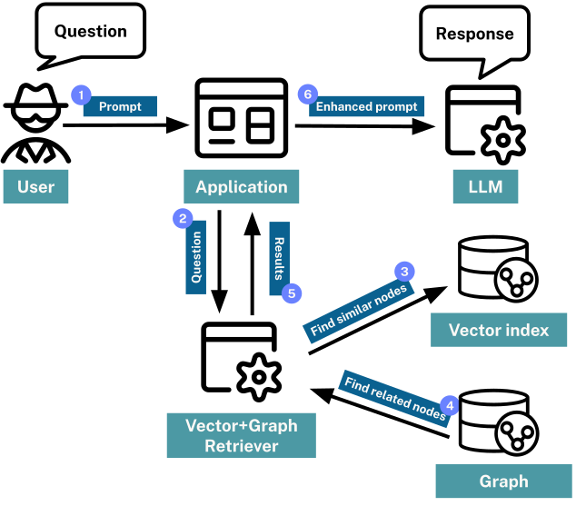
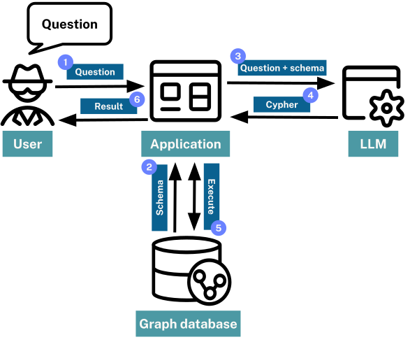

= GraphRAG
:order: 4
:type: lesson

[.slide.discrete]
== GraphRAG

GraphRAG (Graph Retrieval Augmented Generation) is an approach that uses the strengths of graph databases to provide relevant and useful context to LLMs. 

While vector RAG uses embeddings to find contextually relevant information, GraphRAG enhances this process by leveraging the relationships and structure within a graph.

[.slide.discrete]
== GraphRAG

Benefits of GraphRAG:

* *Richer Context*
+
Graphs capture relationships between entities, enabling retrieval of more relevant and connected information.
* *Improved Accuracy*
+
By combining vector similarity with graph traversal, results are more precise and context-aware.
* *Explainability*
+
Graphs provide clear paths and connections, making it easier to understand why certain results were retrieved.
* *Flexible Queries*:
+
GraphRAG supports complex queries, such as combining full-text, vector, and text-to-cypher searches.
* *Enhanced Reasoning*
+
Graphs enable reasoning over data, supporting advanced use cases like recommendations and knowledge discovery.

[.slide.col-60-40]
== Graph-Enhanced Vector Search

[.col]
====
A common approach to GraphRAG is to use a combination of vector search and graph traversal.

This allows for the retrieval of relevant documents based on semantic similarity, followed by a graph traversal to find related entities or concepts.

The high-level process is as follows:

. A user submits a query.
. The system uses a vector search to find nodes similar to the users query.
. The graph is then traversed to find related nodes or entities.
. The entities and relationships are added to the context for the LLM.
. The related data could also be scored based on its relevance to the user query.
====

[.col]

[.slide.col-2]
== Movie Plot Graph Enhanced Search

[.col]
====
You can enhance the movie plot vector search with graph traversal, by:

- Adding related actors, directors, or genres.
- Finding other movies with similar themes or connections.
- Using user ratings to filter or rank results.

This Cypher query demonstrates how to perform a vector search for movie plots and then traverse the graph to retrieve additional context:
====

[.col]
====
[source, cypher]
----
// Search for movie plots using vector search
WITH genai.vector.encode(
    "A mysterious spaceship lands Earth", 
    "OpenAI", 
    { token: "sk-..." }) AS myMoviePlot
CALL db.index.vector.queryNodes('moviePlots', 6, myMoviePlot)
YIELD node, score

// Traverse the graph to find related actors, genres, and user ratings
MATCH (node)<-[r:RATED]-()
RETURN 
  node.title AS title, node.plot AS plot, score AS similarityScore, 
  collect { MATCH (node)-[:IN_GENRE]->(g) RETURN g.name } as genres, 
  collect { MATCH (node)<-[:ACTED_IN]->(a) RETURN a.name } as actors, 
  avg(r.rating) as userRating
ORDER BY userRating DESC
----
====

[.transcript-only]
====
[IMPORTANT]
=====
You will need to replace the `sk-...` with your OpenAI API key.
=====

The results are also ordered by the users rating, which can help surface the most relevant movies based on user preferences.
====

[.slide]
== Full Text Search

Full text search is another powerful technique that can be combined with graph-enhanced search to further improve information retrieval. 

While vector search excels at finding semantically similar content, full text search allows users to match specific keywords or phrases within documents or nodes. 

If the user is looking for a movie or actor by name, full text search can quickly locate those entities based on exact text matches.

Full text search can be used as a replacement for or in conjunction with vector search. 

When used in conjunction with vector search, full text search can refine results by filtering out irrelevant content based on specific keywords or phrases.

[TIP]
Full text search is available in Neo4j using link:https://neo4j.com/docs/cypher-manual/current/indexes/semantic-indexes/full-text-indexes/[full-text indexes^].

[.slide.col-2]
== Text to Cypher

[.col]
====
Text to Cypher is an alternative approach in GraphRAG that allows users to express their information needs in natural language, which is then automatically translated into Cypher queries. 

You leverage the power of LLMs to interpret user intent and generate precise graph queries, enabling direct access to structured data and relationships within the graph. 

You can us text to Cypher to turn users queries into complex searches, aggregations, or traversals, making advanced graph querying more accessible and flexible. 

Text to Cypher works by passing the user's query and the graph schema to an LLM, which generates a Cypher query that can be executed against the graph database.
====

[.col]

[.transcript-only]
====
[IMPORTANT]
=====
Caution should always be taken when executing LLM-generated Cypher queries, as they may not always be safe or efficient.

You are trusting the generation of Cypher to the LLM.
It may generate invalid Cypher queries that could corrupt data in the graph or provide access to sensitive information.

In a production environment, you should ensure that access to data is limited, and sufficient security is in place to prevent malicious queries.
=====
====

[.next]
== Check Your Understanding

include::questions/1-graphrag.adoc[leveloffset=+2]

[.summary]
== Lesson Summary

In this lesson, you learned about GraphRAG techniques, and how they can be used to enhance information retrieval.

In the next module, you will learn about knowledge graphs and how they can support GenAI applications.
