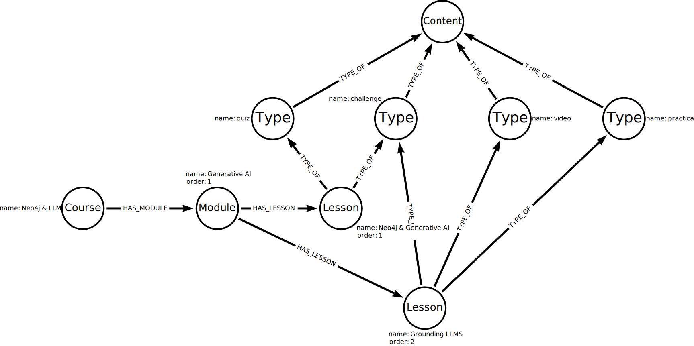

= What is a Knowledge Graph
:order: 1
:type: lesson

[.slide.discrete]
== Knowledge Graphs

A knowledge graph is an organized representation of real-world entities and their relationships.

Knowledge graphs provide a structured way to represent entities, their attributes, and their relationships, allowing for a comprehensive and interconnected understanding of the information.

Knowledge graphs are useful for Generative AI applications because they provide structured, interconnected data that enhances context, reasoning, and accuracy in generated responses.

[.slide.discrete.col-2]
== Search Engines

[.col]
====
Search engines typically use knowledge graphs to provide information about people, places, and things.

This knowledge graph could represent Neo4j:
====

[.col]
image::images/neo4j-google-knowledge-graph.svg["An example of a knowledge graph of Neo4j showing the relationships between people, places, and things", width=90%]

[.slide.discrete.col-2]
== Data sources

[.col]
====
Knowledge graphs can break down sources of information and integrate them, allowing you to see the relationships between the data.

This integration from diverse sources gives knowledge graphs a more holistic view and facilitates complex queries, analytics, and insights.

Knowledge graphs can readily adapt and evolve as they grow, taking on new information and structure changes.
====

[.col]
image::images/generic-knowledge-graph.svg[a diagram of an abstract knowledge graph showing how sources contain chunks of data about topics which can be related to other topics]

[.transcript-only]
====
Neo4j is well-suited for representing and querying complex, interconnected data in Knowledge Graphs.
Unlike traditional relational databases, which use tables and rows, Neo4j uses a graph-based model with nodes and relationships.
====

[.slide.col-2]
== Organizing principles

[.col]
====
A knowledge graph stores data and relationships alongside frameworks known as organizing principles.

The organizing principles are the rules or categories around the data that provide structure to the data.
Organizing principles can range from simple data descriptions, for example, describing a GraphAcademy course as `course -> modules -> lessons`, to a complex vocabulary of the complete solution.

Knowledge graphs are inherently flexible, and you can change the organizing principles as the data grows and changes.

The organizing principles describing the content in GraphAcademy could look like this:
====

[.col]

[.slide.discrete.col-40-60]
== Organizing principles <- Why is this repeated?

[.col]
====
The organizing principles are stored as nodes in the graph and can be stored alongside the actual data.

This integration of organizing principles and data allows for complex queries and analytics to be performed.

Mapping the organizing principles to the lesson content in GraphAcademy could look like this:
====

[.col]

[.slide]
== Generative AI applications

In Generative AI applications, knowledge graphs play a crucial role by capturing and organizing important domain-specific or proprietary company information. They are not limited to strictly structured data—knowledge graphs can also integrate and represent less organized or unstructured information.

GraphRAG can use knowledge graphs for context, forming the foundation for applications that leverage proprietary or domain-specific data. By grounding responses in a knowledge graph, these applications can provide more accurate answers and greater _explainability_, thanks to the rich context and relationships present in the data.

[.next]
== Check Your Understanding

include::questions/1-knowledge-graphs.adoc[leveloffset=+2]

[.summary]
== Lesson Summary

In this lesson, you learned about knowledge graphs and how they are an organized representation of real-world entities and their relationships.

You can learn more in the Neo4j blog post link:https://neo4j.com/blog/what-is-knowledge-graph[What Is a Knowledge Graph?^].

In the next lesson, you will learn about the process of constructing knowledge graphs.
