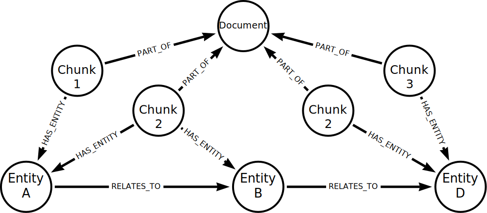

= Creating Knowledge Graphs
:order: 2
:type: lesson

[.slide.discrete]
== Creating Knowledge Graphs
How you create a knowledge graph depends on the type of data you have and how you want to structure it.

[.slide]
== Unstructured data

Unstructured data, such as text documents, web pages, or PDFs, can be a rich source for knowledge graphs.

Creating knowledge graphs from unstructured data can be complex, involving multiple steps of data query, cleanse, and transform.

However, you can use the text analysis capabilities of Large Language Models (LLMs) to help automate knowledge graph creation.

[.slide.discrete]
== Constructing a Knowledge Graph from Unstructured Data

Typically, you would follow these steps to construct a knowledge graph from unstructured text using an LLM:

. *Gather the data* - The data could be from multiple sources and in different formats.
. *Chunk the data* - Break down the data into manageable parts, or _chunks_, that the LLM can process effectively.
. *_Vectorize_ the data* - Depending on your requirements for querying and searching the data, you may need to create *vector embeddings*.
. *Pass the data to an LLM* - Extract entities (nodes) and relationships from the data. You may provide additional context or constraints for the extraction, such as the type of entities or relationships you are interested in extracting.
. *Generate the graph* - Use the output from the LLM to create nodes and relationships in the graph.

[.slide]
== Unstructured Data Structure

A typical structure for the knowledge graph could look like this:

[.transcript-only]
====
[TIP]
=====
You can learn more about how to construct knowledge graphs from unstructured data in the link:https://graphacademy.neo4j.com/courses/llm-knowledge-graph-construction/[GraphAcademy Building Knowledge Graphs with LLMs course^].
=====
====

[.slide]
== Structured data

Constructing knowledge graphs from structured data is often more straightforward than from unstructured sources. Structured data is already organized, making it easier to map nodes, relationships, and relationships directly into a graph.

To create a knowledge graph from structured data, you typically:

. *Identify the sources* - The data sources could be other graphs, relational database, CSV files, APIs.
. *Analysize the data* - Understand the entities, attributes, and relationships in your data (for example, rows in a table may represent entities, columns as attributes, and foreign keys as relationships).
. *Define a graph schema* - The schema should represent the entities as nodes and relationships as well as defining the organizing principles for the graph.
. *Create the graph* - Transform and import the data into the graph database.

This process allows you to leverage existing structured data sources—such as relational databases, CSV files, or APIs—to quickly build a knowledge graph that can be queried and expanded as needed.

[.transcript-only]
====
[TIP]
=====
You can learn more about importing data into Neo4j in the link:https://graphacademy.neo4j.com/courses/importing-fundamentals[GraphAcademy Importing Data Fundamentals course^].
=====
====

[.next]
== Check Your Understanding

include::questions/1-diff-structured-unstructured.adoc[leveloffset=+2]

[.summary]
== Lesson Summary

In this lesson, you learned about the process for constructing knowledge graphs.

In the next module, you will use the Python and the `neo4j-graphrag` package to explore GraphRAG techniques with Neo4j.
