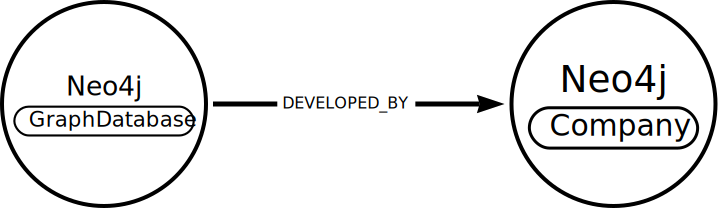

= Extracting a Schema from Text
:type: lesson
:order: 1
:branch: new-course

The link:https://neo4j.com/docs/neo4j-graphrag-python/current/[GraphRAG for Python^] package (`neo4j-graphrag`) allows you to access Neo4j Generative AI functions.

During this course you will use the `neo4j_graphrag` package to build a knowledge graph and retrievers to extract information from the graph using LLMs.

In this lesson you will review how a graph schema can be extract from text using an LLM.

Open the `genai-graphrag-python/extract_entities.py`

[source, python]
.extract_entities.py
----
include::{repository-raw}/{branch}/genai-graphrag-python/extract_entities.py[]
----

The code uses the `SchemaFromTextExtractor` class to extract a schema from a given text input. 

The extractor:

. Create a prompt instructing the LLM to: 
.. Identify entities and relationships in any given text
.. Format the output as JSON 
. Passes the prompt and text to the LLM for processing
. Parses the JSON response to create a schema object

Given the text, _"Neo4j is a graph database management system (GDBMS) developed by Neo4j Inc."_, a simplified version of the extracted schema would be:

[source,text]
.Extracted Schema
----
node_types=(
    NodeType(label='GraphDatabase), 
    NodeType(label='Company')
) 
relationship_types=(
    RelationshipType(label='DEVELOPED_BY'),
) 
patterns=(
    ('GraphDatabaseManagementSystem', 'DEVELOPED_BY', 'Company')
) 
----

Run the program and observe the output. You will see a more detailed schema based on the text provided.

This schema can be used to stored the data held within the text.

Experiment with different text inputs to see how the schema extraction varies based on the content provided, for example:

* "Python is a programming language created by Guido van Rossum."
* "The Eiffel Tower is a wrought-iron lattice tower on the Champ de Mars in Paris, France."
* "Large Language Models (LLMs) are a type of artificial intelligence model designed to understand and generate human-like text."

[.quiz]
== Check your understanding

include::questions/1-question.adoc[leveloffset=+2]

[.summary]
== Lesson Summary

In this lesson, you:

* Learned how to extract a graph schema from unstructured text using an LLM.
* Explore how different text inputs can lead to different schema extractions.

In the next lesson, you will create a knowledge graph construction pipeline using the `SimpleKGPipeline` class.