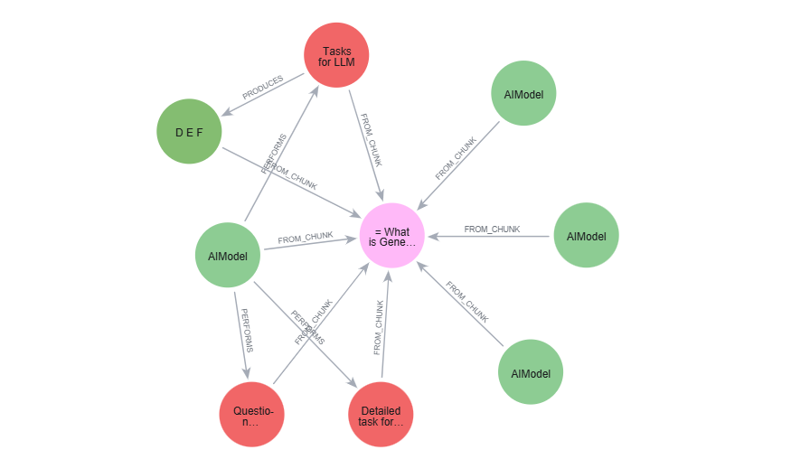

= Create a Graph
:type: lesson
:order: 2
:branch: main

In this lesson, you will learn how to create a knowledge graph from unstructured data using the `SimpleKGPipeline` class.

The `SimpleKGPipeline` class provides a pipeline which implements a series of steps to create a knowledge graph from unstructured data:

1. Load the text
2. Split the text into chunks
3. Create embeddings for each chunk
4. Extract entities from the chunks
5. Write the data to a Neo4j database

image::images/kg_builder_pipeline.png["Pipeline showing these steps"]

[TIP]
.Customizing the pipeline
Typical default values are used for each step. Throughout the course will you learn how to customize each step to suit your requirements.

== Create the knowledge graph

Open `genai-graphrag-python/kg_builder.py` and review the code.

[source, python]
.kg_builder.py
----
include::{repository-raw}/{branch}/genai-graphrag-python/kg_builder.py[]
----

The code loads a single pdf file, `data/genai-fundamentals_1-generative-ai_1-what-is-genai.pdf`, and run the pipeline to create a knowledge graph in Neo4j.

The PDF document contains the content from the link:https://graphacademy.neo4j.com/courses/genai-fundamentals/[Neo4j & Generative AI Fundamentals^] course link:https://graphacademy.neo4j.com/courses/genai-fundamentals/1-generative-ai/1-what-is-genai/[What is Generative AI?^] lesson.

Breaking down the code, you can see the following steps:

. Create a connection to Neo4j:
+
[source, python]
.Neo4j connection
----
include::{repository-raw}/{branch}/genai-graphrag-python/solutions/kg_builder.py[tag=neo4j_driver]
----
. Instantiate an LLM model:
+
[source, python]
.LLM
----
include::{repository-raw}/{branch}/genai-graphrag-python/solutions/kg_builder.py[tag=llm]
----
+
Model parameters, `model_params`, are set to lower the temperature of the model to be more deterministic, and set to response format to be `json`.
. Create an embedding model:
+
[source, python]
.Embedding model
----
include::{repository-raw}/{branch}/genai-graphrag-python/solutions/kg_builder.py[tag=embedder]
----
. Setup the `SimpleKGPipeline`:
+
[source, python]
.kg_builder
----
include::{repository-raw}/{branch}/genai-graphrag-python/solutions/kg_builder.py[tag=kg_builder]
----
. Run the pipeline to create the graph from a single PDF file:
+
[source, python]
.kg_builder
----
include::{repository-raw}/{branch}/genai-graphrag-python/solutions/kg_builder.py[tag=run_one_doc]
----

When you run the program, the pipeline will process the PDF document and create the graph in Neo4j.

A summary of the results will be returned, for example:

    {'resolver': {'number_of_nodes_to_resolve': 12, 'number_of_created_nodes': 10}}

== Explore the Knowledge Graph

The `SimpleKGPipeline` creates the following default graph model:

image::images/kg-builder-default-model.svg["a graph model showing (Document)<[:FROM_DOCUMENT]-(Chunk)<-[:FROM_CHUNK]-(Entity)"]

The `Entity` nodes represent the entities extracted from the text chunks. Relevant properties are extract from the chunk and associated with the entity nodes.

You can view the documents and chunks created in the graph using the following Cypher query:

[source, cypher]
.View the documents and chunks
----
MATCH (d:Document)<-[:FROM_DOCUMENT]-(c:Chunk)
RETURN d.path, c.text
----

[NOTE]
.Chunk size
The default chunk size is greater than the length of the document, so only a single chunk is created.

The extracted entities and the relationships between them can be found using a variable length path query:

[source, cypher]
.View the entities extracted from each chunk
----
MATCH p = (c:Chunk)-[*..3]-(e:__Entity__)
RETURN p
----

[.quiz]
== Check your understanding

include::questions/1-simple-kg-pipeline.adoc[leveloffset=+2]

[.summary]
== Lesson Summary

In this lesson, you:

* Learned how to use the `SimpleKGPipeline` class.
* Explored the graph model created by the pipeline.

In the next lesson, you will modify the chunk size used when splitting the text and define a custom schema for the knowledge graph.