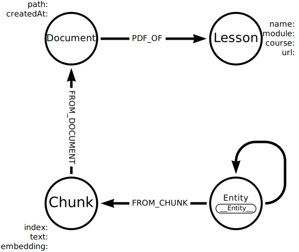

= Add structured data to the knowledge graph
:type: lesson
:order: 5
:branch: main

The knowledge graph you created is solely based on unstructured data extracted from documents. You may have access to structured data sources such as databases, CSV files, or APIs that contain valuable information relevant to your domain.

Combining the structured and unstructured data can enhance the knowledge graph's richness and usefulness.

[NOTE]
.Lexical and Domain Graphs
The unstructured part of your graph is known as the link:https://graphrag.com/reference/knowledge-graph/lexical-graph/[Lexical Graph], while the structured part is known as the link:https://graphrag.com/reference/knowledge-graph/domain-graph/[Domain Graph].

== Load from CSV file

The repository contains a sample CSV file `genai-graphrag-python/data/docs.csv` which contains metadata about the lessons the documents were created from.

[source, csv]
.Sample docs.csv
----
filename,course,module,lesson,url
genai-fundamentals_1-generative-ai_1-what-is-genai.pdf,genai-fundamentals,1-generative-ai,1-what-is-genai,https://graphacademy.neo4j.com/courses/genai-fundamentals/1-generative-ai/1-what-is-genai
genai-fundamentals_1-generative-ai_2-considerations.pdf,genai-fundamentals,1-generative-ai,2-considerations,https://graphacademy.neo4j.com/courses/genai-fundamentals/1-generative-ai/2-considerations
...
----

You can use the CSV file as input and a structured data source when creating the knowledge graph.

Open `genai-graphrag-python/kg_structured_builder.py` and review the code.

[source, python]
.kg_structured_builder.py
----
include::{repository-raw}/{branch}/genai-graphrag-python/kg_structured_builder.py[]
----

The key differences are:

. The `docs.csv` file is loaded using `csv.DictReader` to read each row as a dictionary:
+
[source, python]
.Load docs.csv
----
include::{repository-raw}/{branch}/genai-graphrag-python/solutions/kg_structured_builder.py[tag=load_csv]
----
. The path of the PDF document is constructed using the `filename` field from the CSV:
+
[source, python]
.PDF path
----
include::{repository-raw}/{branch}/genai-graphrag-python/solutions/kg_structured_builder.py[tag=pdf_path]
----
. A `cypher` statement is defined to create `Lesson` nodes with properties from the CSV data:
+
[source, python]
.Cypher statement
----
include::{repository-raw}/{branch}/genai-graphrag-python/solutions/kg_structured_builder.py[tag=cypher]
----
+
The `pdf_path` is used as the key to match the `Document` nodes created from the PDF files.
. A `Lesson` node is created for each document using the `cypher` statement and the CSV data:
+
[source, python]
.Lesson nodes
----
include::{repository-raw}/{branch}/genai-graphrag-python/solutions/kg_structured_builder.py[tag=create_structured_graph]
----

The resulting knowledge graph will now contain `Lesson` nodes connected to the `Document` nodes created from the PDF files:

Run the program to create the knowledge graph with the structured data.

[TIP]
.Clear the graph before importing
====
Remember to clear the database before running the program to avoid inconsistent data.

[source, cypher]
.Delete all
----
MATCH (n) DETACH DELETE n
----
====

== Explore the structured data

The structured data allows you to query the knowledge graph in new ways.

You can find all lessons that cover a specific technology or concept:

[source, cypher]
.Find lessons about Knowledge Graphs
----
MATCH (kg:Technology)
MATCH (kg)-[:FROM_CHUNK]->(c)-[:FROM_DOCUMENT]-(d)-[:PDF_OF]-(l)
WHERE toLower(kg.name) CONTAINS "knowledge graph"
RETURN DISTINCT toLower(kg.name), l.name, l.url
----

The knowledge graph allows you to summarize the content of each lesson by specific categories such as technologies and concepts:

[source, cypher]
.Summarize lesson content
----
MATCH (lesson:Lesson)<-[:PDF_OF]-(:Document)<-[:FROM_DOCUMENT]-(c:Chunk)
RETURN lesson.name,
  [ (c)-[:FROM_CHUNK]->(tech:Technology) | tech.name ] AS technologies,
  [ (c)-[:FROM_CHUNK]->(concept:Concept) | concept.name ] AS concepts
----

Spend some time exploring the knowledge graph and experiment with adding additional data.

[.quiz]
== Check your understanding

include::questions/1-benefits.adoc[leveloffset=+2]

[.summary]
== Lesson Summary

In this lesson, you learned:

* About benefits of adding structured data to a knowledge graph.
* How to load structured data from a CSV file.
* How to create nodes from structured data and connect them to unstructured data nodes.

In the next module, you will create retrievers to query the knowledge graph.
