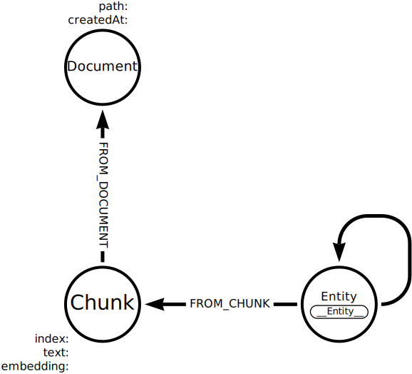
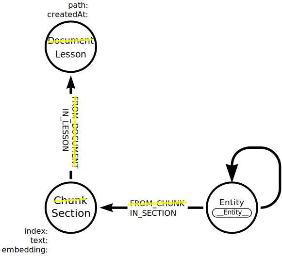

= Lexical graph configuration
:type: lesson
:order: 3
:optional: true
:branch: new-course

The `SimpleKGBuilder` uses a default unstructured graph data model to represent documents, text chunks, and entities.

You can modify this data model to suit your own use case by creating a link:https://neo4j.com/docs/neo4j-graphrag-python/current/types.html#lexicalgraphconfig[`LexicalGraphConfig`^].

== Create Lexical Graph Configuration

The documents you have been using contain lessons which can be sub-divided into sections.

An alternative graph data model could represent each document as a `Lesson` node, with `Section` nodes representing each chunks within the text.

To create this graph data model you can define a custom `LexicalGraphConfig`:

[source,python]
----
include::{repository-raw}/{branch}/genai-graphrag-python/examples/lexical_graph_config.py[tag=import_config]

include::{repository-raw}/{branch}/genai-graphrag-python/examples/lexical_graph_config.py[tag=config]
----

The `config` object defines the mapping between the documents, chunks, and entities nodes.

You can then use the custom configuration in the `SimpleKGPipeline` by setting the `lexical_graph_config` parameter:

[source,python]
----
include::{repository-raw}/{branch}/genai-graphrag-python/examples/lexical_graph_config.py[tag=kg_builder]
----

[%collapsible]
.Reveal the complete code
====
This example code shows how to create and use the `LexicalGraphConfig` in a `SimpleKGPipeline`:
[source, python]
----
include::{repository-raw}/{branch}/genai-graphrag-python/examples/lexical_graph_config.py[tag=**]
----
====

When you're ready you can continue.

read::Continue[]

[.summary]
== Lesson Summary

In this lesson, you learned about ..

In the next lesson, you will learn about ..