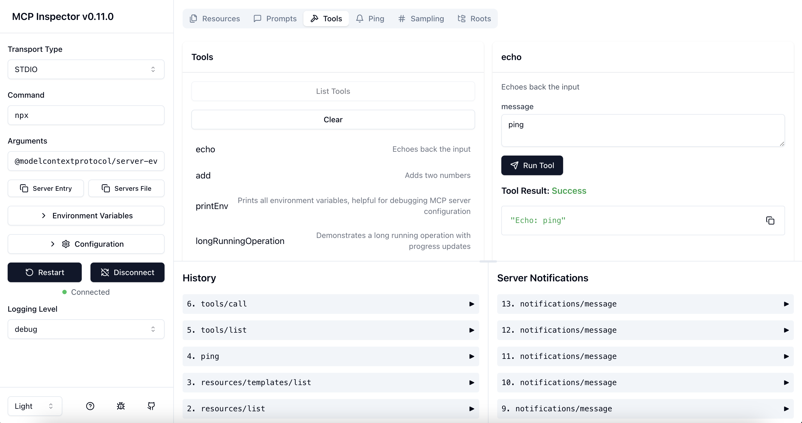
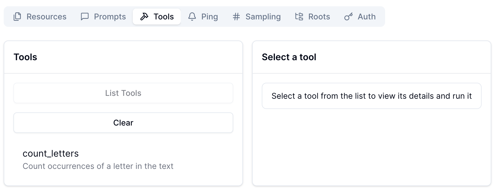
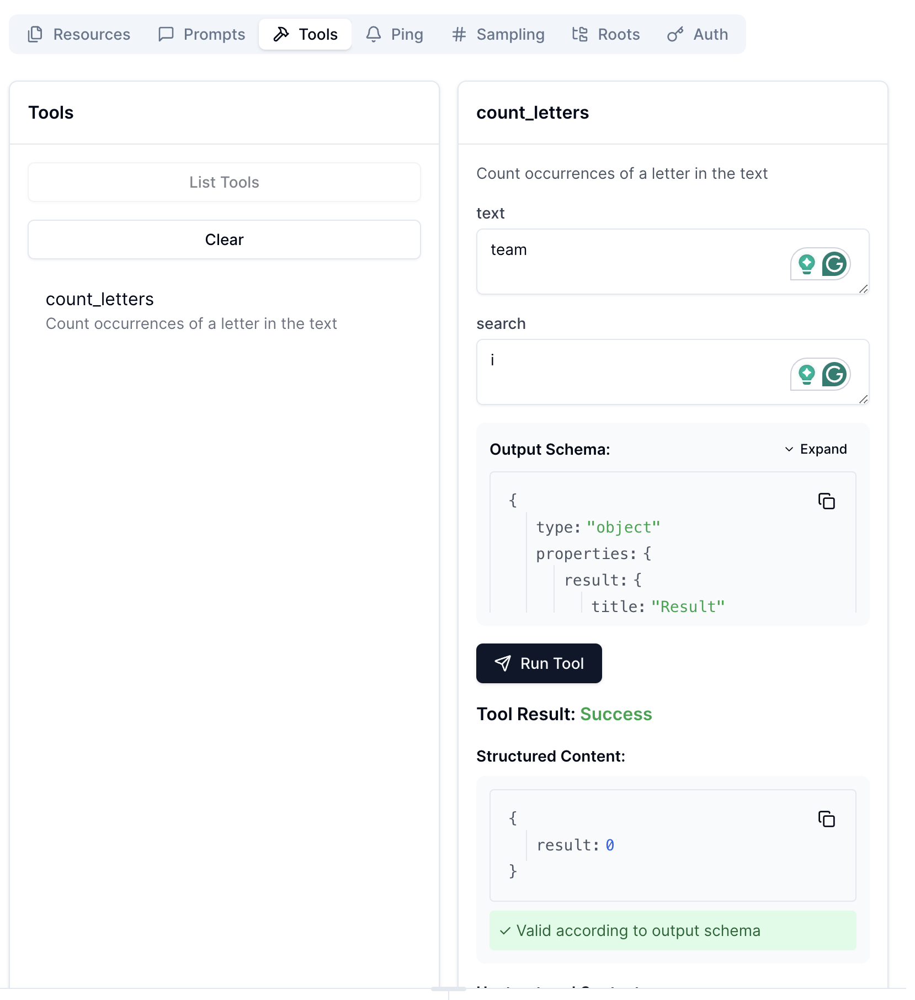

= The MCP Inspector
:type: lesson
:order: 4

// * What is the MCP Inspector?
// * Using MCP Inspector in Codespaces
// * Testing tools and resources with the Inspector

Great!  You now have your first MCP server running.  But the Chat window in VS Code isn't the most efficient or cost-effective way to test your server.

In this lesson, you will learn about the MCP Inspector, a tool that allows you to test and debug your MCP servers and tools through a UI.

== Introducing the MCP Inspector

The MCP Inspector is a tool that allows you to test and debug your MCP servers and tools through a UI.

// TODO: screenshot with strawberry tool

The left hand panel allows you to define the connection details for the MCP server you want to test.

Once connected to a server, the server features are listed to the right.

=== Running the MCP Inspector

The tool is written in JavaScript, so link:https://nodejs.org/en/download[you will need Node.js and the `npx` command installed^].

[source,shell]
.Running the MCP Inspector
----
npx @modelcontextprotocol/inspector
----

The first time you run the tool with `npx`, you will be required to install the tool.

[source]
.Installing the MCP Inspector
----
Need to install the following packages:
@modelcontextprotocol/inspector@0.17.1
Ok to proceed? (y) 
----

Press `y` to proceed.

[TIP]
.Using `npx`
====
The `npx` command is a package runner for Node.js.  It is used to run Node.js packages without installing them globally.

You can install npx along with Node.js by link:https://nodejs.org/en/download[downloading Node.js from the official website^].
====

Once installed, the MCP Inspector UI will be served on port 6274.

[source]
----
Starting MCP inspector...
⚙️ Proxy server listening on localhost:6277
🔑 Session token: d3a6bc6d116f75b1a5f7861361fb5fa7190c29b02c70f614e8ccf14080d1eadd
   Use this token to authenticate requests or set DANGEROUSLY_OMIT_AUTH=true to disable auth

🚀 MCP Inspector is up and running at:
   http://localhost:6274/?MCP_PROXY_AUTH_TOKEN=d3a6bc6d116f75b1a5f7861361fb5fa7190c29b02c70f614e8ccf14080d1eadd

🌐 Opening browser...
----

Note the Session token, you may need to copy and paste this into the Configuration tab of the MCP Inspector to connect to your server and run tools.

==== Pre-filling the Server details 

You can pre-fill the details of your server by appending the configuration details to the command.

[source,shell]
.Running the MCP Inspector with pre-filled server details
----
npx @modelcontextprotocol/inspector --url http://localhost:8000/mcp --transport http
----

// This will run the `main.py` file in the `server` directory using the `uv` command as we instructed VS Code to do in the previous lesson.

// [TIP]
// .`$PWD`
// ====
// The `$PWD` environment variable is used to get the current working directory, which is required by the `uv` command.

// The command assumes that you are running the command from the root of the project.
// If you are running the command from the `server/` directory you can omit the directory name from the command.
// ====

// Once you have opened the UI and verified the Transport Type is `stdio`, you can click the **Connect** button to connect to your server.

== Using the MCP Inspector

// To connect to your server, you will need to either specify the full path of your file, or switch the transport method to HTTP.

// [source,shell]
// ----
// npx @modelcontextprotocol/inspector
// Starting MCP inspector...
// ⚙️ Proxy server listening on 127.0.0.1:6277
// 🔑 Session token: 32be7bf018a86d10c0428db91e0ff4ad32236a664e176642451b1ebbcaf69869
// Use this token to authenticate requests or set DANGEROUSLY_OMIT_AUTH=true to disable auth

// 🔗 Open inspector with token pre-filled:
//    http://localhost:6274/?MCP_PROXY_AUTH_TOKEN=32be7bf018a86d10c0428db91e0ff4ad32236a664e176642451b1ebbcaf69869

// 🔍 MCP Inspector is up and running at http://127.0.0.1:6274 🚀
// ----

Clicking the link in the console will open the MCP Inspector in your browser with the server details pre-filled on the left hand side.  Verify the connection details and click the **Connect** button to connect to your server.

Once you have connected, take a look at the **History** tab.  You should see a list item called `1. initialize`, which represents the handshake between the client and server.

You should see a request sent with the mode `initialize` and in response, a list of capabilities and server information.

[source,json]
.initialize response
----
{
  "capabilities": {
    "experimental": {},
    "prompts": {
      "listChanged": false
    },
    "resources": {
      "subscribe": false,
      "listChanged": false
    },
    "tools": {
      "listChanged": false
    }
  },
  "serverInfo": {
    "name": "Strawberry",
    "version": "1.10.1"
  }
}
----

== Testing server features 

At the top of the right hand panel, you should see a set of tabs that correspond to the features of the server.

If you click on the **Tools** tab, you should see the `count_letters` tool that you created in the previous lesson.
Selecting the tool will open a form to the right hand side with a form generated based on the parameters requested for the tool.

You can fill in the form and click the **Run tool** button to invoke the tool.

== Next steps 

As you progress through the course, you will use the MCP Inspector to test and debug your MCP server.

Now it is time to try it for yourself!

read::Mark as Completed[]

[.summary]
== Summary

In this lesson, you learned about the MCP Inspector, an essential tool for anyone building or debugging MCP servers and tools.

You can link:https://github.com/modelcontextprotocol/inspector[find documentation for the MCP Inspector on GitHub^].

In the next challenge, you will run the MCP Inspector in a GitHub Codespace and test the `count_letters` tool for yourself.
