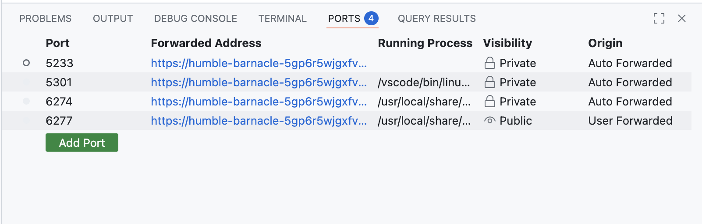
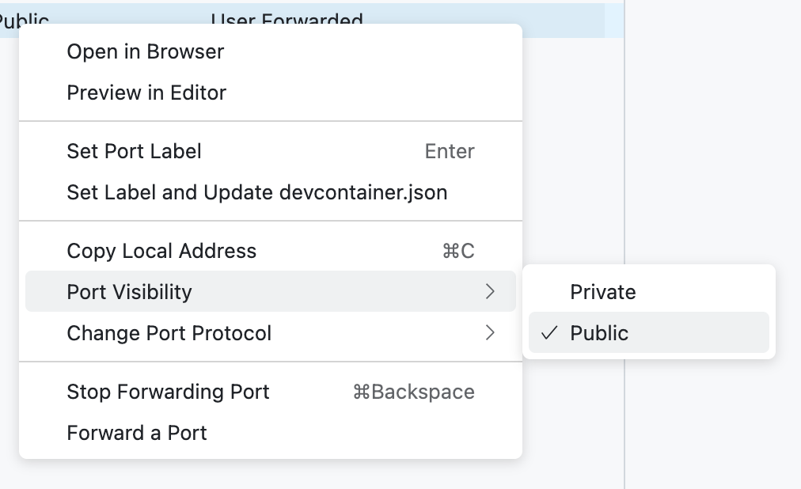
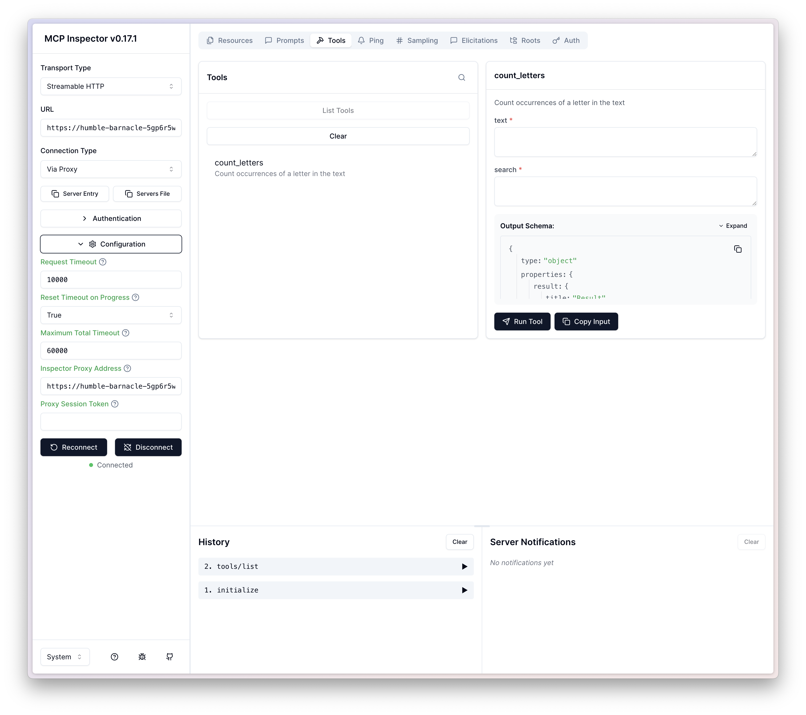
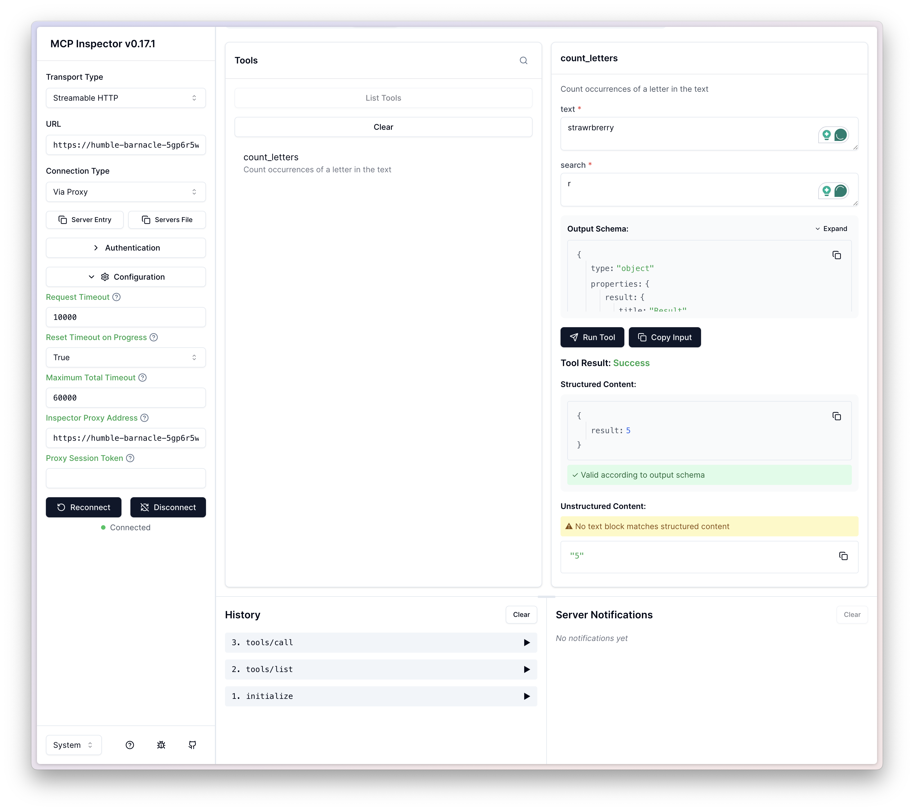

= Test with Inspector
:type: challenge
:order: 5
:optional: true

In the previous lesson, you learned how to use the MCP Inspector to connect to your MCP server, explore its features, and test tools through a user-friendly UI. You saw how to launch the Inspector, connect to your MCP server via stdio, and run tools using the auto-generated form.

In this challenge, you will run your MCP server in GitHub Codespaces, launch the MCP Inspector, and use it to test your tool implementation.

To pass the challenge, you will need to:

1. Start your MCP server and the Inspector in a Codespaces environment.
2. Connect the Inspector to your running server.
3. Use the Inspector UI to run a tool and verify its output.

== Step 1: Start the Inspector and Server Together

Open a new terminal window in your Codespaces environment and run the following command from the project root:

[source,shell]
----
ALLOWED_ORIGINS=https://$CODESPACE_NAME-6274.app.github.dev,https://$CODESPACE_NAME-6277.app.github.dev DANGEROUSLY_OMIT_AUTH=true npx @modelcontextprotocol/inspector uv --directory /workspaces/genai-mcp-build-custom-tools-python/server
----

Once the Inspector is running, note the port numbers used for the MCP Inspector and your server.

[source]
----
Starting MCP inspector...
⚙️ Proxy server listening on localhost:6277
⚠️  WARNING: Authentication is disabled. This is not recommended.

🚀 MCP Inspector is up and running at:
   http://localhost:6274

🌐 Opening browser...
----

Note the port numbers used for the MCP Inspector and your server, the default for the Proxy server is `6277` and the default for the Inspector is `6274`.

[WARNING]
.DANGEROUSLY_OMIT_AUTH
====
The command above uses the `DANGEROUSLY_OMIT_AUTH` environment variable to disable authentication for the purpose of this challenge.
This is not recommended for production environments.
====

Next, head to the **Ports** tab.  

Github Codespace will automatically detect the two ports and create a port forwarding rule for them.
Find the list entry for port 6277, right click and set **Port Visibility** to **Public**.

Add an additional port, `8000`, to create a URL for your MCP server, and set Port Visibility to **Public**.

Make a note of the Forwarded addresses for ports 6277 and 8000.  
These will be a combination of the name of your Codespace and the port number, for example `https://humble-barnacle-5gp6r5wjgxfvxj7-6277.app.github.dev/`. 

You will need these in the next step.

== Step 2: Connect the Inspector to Your Server

If the MCP Inspector window has not opened, click the URL in the terminal window to open it.

To connect to your server, you will need to update the configuration in the left panel.

1. Set the **Transport Type** to **Streamable HTTP**.
2. Set the **URL** to the Forwarded address for port 8000.
3. Expand the **Configuration** section and set the **Inspector Proxy Address** to the Forwarded address for port 6277.

Then click the **Connect** button to connect to your server.

If all has gone well, you should see an `initialize` step in the History tab.

== Step 3: Run a Tool in the Inspector

Once connected, select the **Tools** tab at the top of the screen, and click the **List Tools** button.
A list of tools should appear below, including the `count_letters` tool you created in the previous lesson.

Click on the `count_letters` tool to open a form generated based on the parameters requested for the tool.
Enter the text and search parameters and click the **Run tool** button.

You should see the output of the tool along with a new `tools/call` item added to the history tab.

read::It works![]

[.summary]
== Summary

In this challenge, you started your MCP server using the MCP Inspector in Codespaces, connected to your server, and ran a tool through the Inspector UI. You now have a repeatable workflow for testing and debugging your MCP tools interactively. 

In the next module, you will start to build our your MCP server with tools, resources and prompts.
