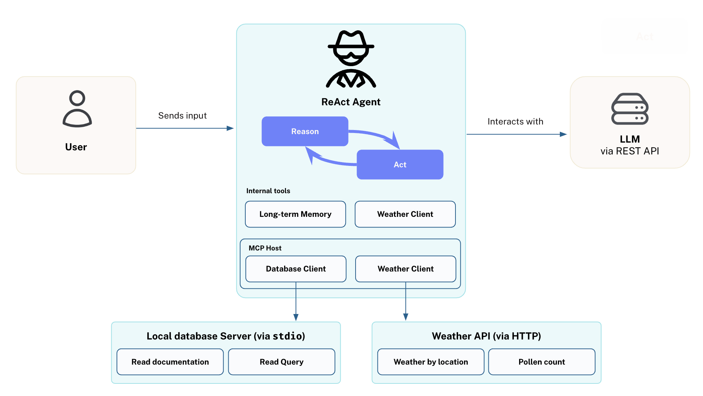

= What is MCP?
:type: lesson
:order: 1

The link:https://modelcontextprotocol.org[Model Context Protocol^], commonly referred to as MCP, is an open protocol developed by link:https://anthropic.com[Anthropic^] that enables AI agents and assistants to access tools and resources in a standardized way.

Before you learn more about MCP, it is important to understand the concept of an **Agent**.

== What are Agents?

There are many definitions of an Agent, but for the context of this course, an Agent is a system that **acts independently**, using tool calling to access information and take actions to **achieve a specific goal**.

A common framework for building agents is the **ReAct** framework (Reason/Act).
When a ReAct agent receives an input, it follows a continuous loop of **planning**, **reasoning**, and **acting** until the goal is achieved.

The process begins with **planning**, where the LLM analyzes the task, breaks it down into sub-tasks, extracts required information and parameters, and may gain additional details from the user. During this phase, the agent determines what tools will be needed and in what sequence they should be called.

Next comes **reasoning**, where the LLM uses the descriptions of available tools to select the correct tool(s) for each sub-task. The agent evaluates which tools are most appropriate based on the current context and requirements.

Finally, the agent **acts** by calling the selected tools, either in sequence or in parallel, to gather information and perform the necessary actions. The results from these tool calls are then fed back into the planning phase, creating a continuous loop where the agent refines its approach based on new information.

For example, consider a smart home automation agent, that uses the weather forecast combined with local temperature sensor data to adjust the blinds and turn on an air conditioning unit.

== Where does MCP fit in?

While agents may have access to tools written directly into their codebase, MCP provides a standardized way for the agent to consume tools built by third parties. 
An agent could be configured to access a weather API service hosted in the cloud, or connect to a local database tool running on the same machine through Standard Input/Output (stdio).

== Architecture

The MCP protocol consists of the following elements:

* Servers 
* Clients 
* Hosts

=== Servers

The protocol follows a client-server architecture, similar to microservices, where **Servers** provide capabilities through a list of **tools**.
Each tool that the server hosts has additional metadata assigned to it, including a unique identifier, a description of when that tool can be used, and a list of parameters that the tool can receive.
Servers describe the parameters that the tool can receive, and the expected output of the tool.

Along with tools, servers provide access to **Resources**, read-only data that can be consumed by the client.
Each resource has its own unique URI, similar to an endpoint in a REST API, and can be used to provide direct access to specific objects with a fixed location.

MCP tools can also provide **Prompt templates**, allowing the client to use pre-written prompts that follow best practices.

=== Clients 

A **Client** is responsible for managing a one-to-one connection to a server.

When a client starts, it will connect to a server, and request a list of tools, resources, and prompt templates that the server provides access to.

This is a **stateful connection**, meaning the client maintains an ongoing connection to the server throughout its lifecycle. The connection can be established using different transport methods:

* **stdio** - The client starts the server locally and communicates through standard input/output streams
* **HTTP** - The client connects to a remotely hosted server using HTTP Server Sent Events (SSE) or HTTP streaming

You will learn more about transport methods in the next lesson.

=== Hosts 

One or more clients are managed by a **Host**, an application or piece of software that maintains session state and context.

An example of a host may be Claude Desktop, Amazon Q, VS Code, or Cursor.
Your agent applications are also examples of an MCP host.

The host determines which tool to use and provides the appropriate parameters to the tool.
The client then executes the tool on behalf of the host.

=== Tools 

Each tool will have a unique identifier, a description of when that tool can be used, and a list of parameters that the tool can receive. 

For example, a tool for searching the web may be defined as:

* **id**: search-web
* **description**: Search the web for information
* **parameters**: query, a string

// TODO: verify, add more info when other types become available.
Tools can output a result as text or return Base-64 encoded images.

[.summary]
== Lesson summary

In this lesson, you learned:

* **Agents** are systems that act independently to achieve specific goals, often using the ReAct framework (reasoning and acting with tools)
* **MCP (Model Context Protocol)** provides a standardized way for agents to consume tools from external providers
* **MCP Architecture** consists of four key components:
  - **Servers** provide capabilities through tools, resources, and prompt templates
  - **Clients** manage one-to-one connections to servers
  - **Hosts** (like Claude Desktop) manage clients and decide which tools to use
  - **Tools** have unique identifiers, descriptions, and parameters
* **Real-world usage** involves configuring hosts to connect to MCP servers for enhanced functionality

You can find more information about these terms at link:https://modelcontextprotocol.io/[modelcontextprotocol.io].

