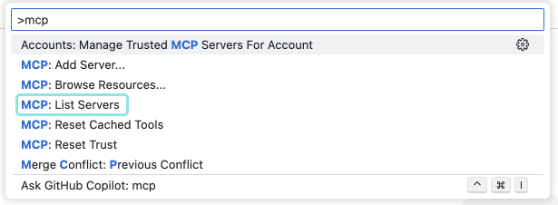
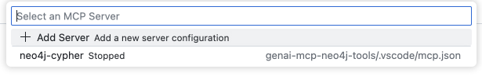
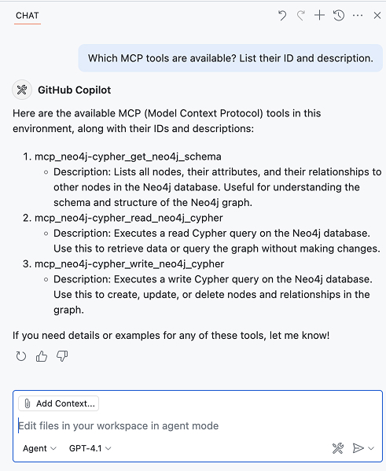

= Installing the Neo4j Cypher MCP server
:type: challenge 
:order: 4

In the previous lesson, you learned how to configure an MCP server in Claude Desktop. 

In this challenge, you will install the Neo4j Cypher MCP server to VS Code and configure it to connect to your Neo4j database.

You can either attempt the challenge locally or in a link:https://github.com/codespaces/new/{repository}[GitHub Codespace^].
If you open the challenge in Github Codespaces, the instructions are contained within the README, which should open automatically for you.  

Your environment variables required for step 2 can be found further down this page.

link:https://github.com/codespaces/new/{repository}[Open in GitHub Codespaces^,role="btn"]

[NOTE]
.GitHub Codespaces
====
Keep the Codespace open for the remainder of the course.
====

== Interacting with Neo4j

To interact with a Neo4j database, we can use the link:https://github.com/neo4j-contrib/mcp-neo4j/tree/main/servers/mcp-neo4j-cypher[Neo4j Cypher MCP Server^].  This server is one of a number of link:https://github.com/neo4j-contrib/mcp-neo4j[MCP servers offered by Neo4j^].
When configured with environment variables that point to a Neo4j database, the server will enable the host to:

* Obtain the schema of the database
* Execute Cypher statements that _read_ and _write_ data to the database

include::{repository-raw}/main/README.adoc[tag=setup]

== Verify your installation

To verify that the server is installed correctly, you can use the Command Palette to execute the ***MCP: List servers*** command.

You should see a server named `neo4j-cypher` in the list.

Select the server and then **Start Server**.  VS Code will connect to the server and pull the description of the tools available.

If you ask Copilot which MCP tools are available, you should get a list containing three tools.
Open the Copilot chat window by executing the **Chat: Open Chat (Agent mode)** command in the Command Palette or accessing the three line menu, selecting **View** and then **Chat**.

[source,text]
.Prompt to list MCP tools
----
Which MCP tools are available?  List their ID and description.
----

[TIP]
.Agent mode
====
Tools are only available when you use Chat in **Agent mode**.
====

include::questions/1-tools-available.adoc[leveloffset=+1]

[.summary]
== Summary

In this challenge, you demonstrated how to install an MCP server and configure it with environment variables.

[%collapsible]
.Installing Multiple Neo4j Connections 
====
You can install the Neo4j Cypher MCP server multiple times within the same host using the `--namespace` option.

[source,json]
----
{
  "mcpServers": {
    "movies-neo4j": {
      "command": "uvx",
      "args": [ "mcp-neo4j-cypher@0.2.3", "--namespace", "movies" ],
      "env": {
        "NEO4J_URI": "neo4j+s://demo.neo4jlabs.com",
        "NEO4J_USERNAME": "recommendations",
        "NEO4J_PASSWORD": "recommendations",
        "NEO4J_DATABASE": "recommendations"
      }
    },
    "local-neo4j": {
      "command": "uvx",
      "args": [ "mcp-neo4j-cypher@0.2.3" ],
      "env": {
        "NEO4J_URI": "bolt://localhost:7687",
        "NEO4J_USERNAME": "neo4j",
        "NEO4J_PASSWORD": "password",
        "NEO4J_DATABASE": "neo4j",
        "NEO4J_NAMESPACE": "local"
      }
    }
  }
}
----

This configuration will install two Neo4j Cypher MCP servers, one with tools prefixed with `movies-` for the movies database and one prefixed with `local-` for the local database.

====

In the next module, you will explore and understand the full capabilities of the Neo4j Cypher MCP server and its available tools.
