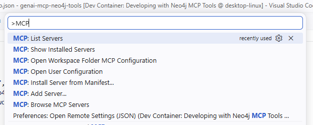
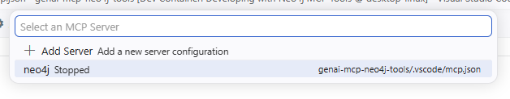
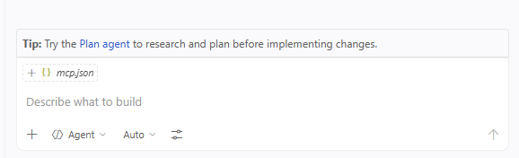
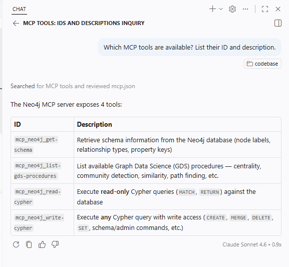

= Installing the Neo4j MCP server
:type: challenge
:order: 4
:branch: main

In the previous lesson, you learned how to configure an MCP server.

In this challenge, you will create a development environment and connect VS Code to your Neo4j database using the Neo4j MCP server.

include::../../../../../../shared/courses/codespace/get-started.adoc[]

The Neo4j MCP server is automatically installed in your Codespace, you can view the complete installation instructions below, or the link:https://neo4j.com/docs/mcp/current/[Neo4j MCP server documentation^].

[%collapsible]
.Neo4j MCP Server Installation
====
You will need to :

. Install an MCP server host, e.g. link:https://code.visualstudio.com/[VS Code^].
. link:https://github.com/neo4j/mcp/releases[Download the Neo4j MCP server archive for your operating system]^ from the link:https://github.com/neo4j/mcp[github.com/neo4j/mcp repository^].
. link:https://neo4j.com/docs/mcp/current/installation/[Install the MCP server^] by extracting the archive, copying the executable to a location on your system, and adding the location to your system PATH.
. Configure your host to add the Neo4j MCP server.
+
For examples, in VS Code, add the following configuration to your `.vscode/mcp.json` file:
+
[source,json]
.vscode/mcp.json
----
include::{repository-raw}/{branch}/.vscode/mcp.json[]
----

You can find detailed instructions in the link:https://neo4j.com/docs/mcp/current/installation/[Installation documentation^].

You do not need to create a Neo4j database as you will use the provided sandbox instance. Connection details are detailed below.

The sandbox uses Neo4j's GenAI functions, you can find out more about how to configure them in the link:https://neo4j.com/docs/cypher-manual/current/genai-integrations/[Neo4j GenAI integration documentation^].
====

== Configuring the Neo4j MCP server

The MCP server is configured in the host configuration file (e.g. `.vscode/mcp.json`):

[source,json]
..vscode/mcp.json
----
include::{repository-raw}/{branch}/.vscode/mcp.json[]
----

You can identify: 

* The server name - `neo4j`
* The transport `type` - `stdio`
* The `command` to start the server - `neo4j-mcp`
* That the environment variables will be loaded from the `envFile` location a `.env` file in the workspace root folder.

=== Environment variables

The connection to the Neo4j database is configured using environment variables stored in a `.env` file.

Update the `.env` file with the connection details for your Neo4j database:

[source]
[subs="verbatim,attributes"]
.Create a .env file
----
NEO4J_URI="{instance-scheme}://{instance-ip}:{instance-boltPort}"
NEO4J_USERNAME="{instance-username}"
NEO4J_PASSWORD="{instance-password}"
NEO4J_DATABASE="{instance-database}"
----

== Interacting with Neo4j

You can use the MCP Server to interact with your Neo4j database. The server provides access to the following tools:

[cols="1,3"]
|===
| Tool | Purpose

| `get-schema`
| Get labels, relationship types, and property keys from the Neo4j database. Provides valuable context to AI clients.

| `read-cypher`
| Execute Cypher queries in read-only mode. Rejects writes, schema/admin operations, and PROFILE queries.

| `write-cypher`
| Execute Cypher queries with write access (CREATE, MERGE, DELETE, SET, etc.). Can be disabled via `NEO4J_READ_ONLY=true`.

| `list-gds-procedures`
| List Graph Data Science procedures available in the Neo4j instance. Helps AI clients understand available GDS capabilities.
|===

== Verify your installation

To test the MCP server you will need to:

. Start the server.
+
Using VS Code, you can start the server by executing the **MCP: List servers** command in the Command Palette (Ctrl/Cmd + Shift + P)
+

+
Select the `neo4j` server, and clicking **Start Server**.
+

+ 

. Initiate a request through the agent to call the server.
+
Open a new chat in *Agent* mode (Ctrl/Cmd + Shift + I).
+

+
Prompt the agent with the following question:
+
[copy]#Which MCP tools are available? List their ID and description.#

You should see the agent work through a reasoning process to call the MCP server and list the available tools.

[TIP]
.Agent mode
====
Tools are only available when you use Chat in **Agent mode**.
====

include::questions/1-tools-available.adoc[leveloffset=+1]

[.summary]
== Summary

In this challenge, you demonstrated how to install an MCP server and configure it with environment variables.

[%collapsible]
.Installing Multiple Neo4j Connections
====
You can use the Neo4j  MCP server multiple times within the same host allowing you to connect to multiple databases.

[source,json]
----
{
  "mcpServers": {
    "movies-neo4j": {
      "type": "stdio",
      "command": "neo4j-mcp",
      "env": {
        "NEO4J_URI": "neo4j+s://demo.neo4jlabs.com",
        "NEO4J_USERNAME": "recommendations",
        "NEO4J_PASSWORD": "recommendations",
        "NEO4J_DATABASE": "recommendations"
      }
    },
    "local-neo4j": {
      "type": "stdio",
      "command": "neo4j-mcp",
      "env": {
        "NEO4J_URI": "bolt://localhost:7687",
        "NEO4J_USERNAME": "neo4j",
        "NEO4J_PASSWORD": "password",
        "NEO4J_DATABASE": "neo4j",
        "NEO4J_NAMESPACE": "local"
      }
    }
  }
}
----

This configuration will use two Neo4j MCP servers, one with tools prefixed with `movies-` for the movies database and one prefixed with `local-` for the local database.

====

In the next module, you will explore the full capabilities of the Neo4j MCP server and the available tools.
