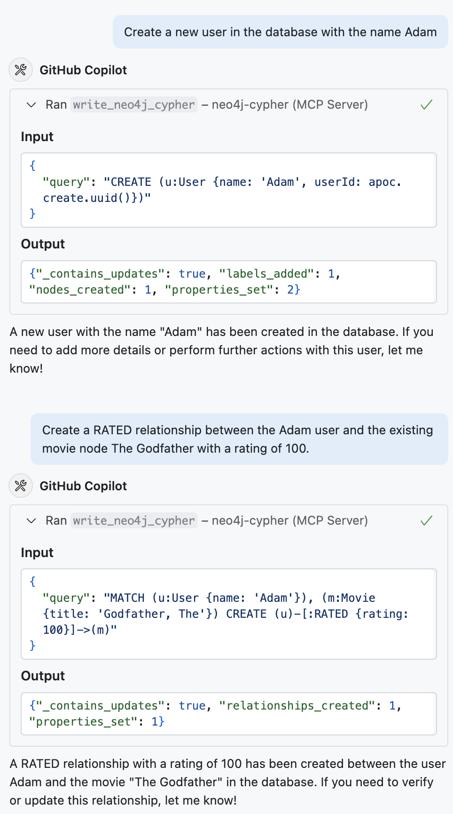

= Using the Neo4j Cypher MCP Server

// TODO: enable "MCP" tool in the GA chatbot

The Neo4j Cypher MCP Server is a useful tool for developers and non-technical users alike.
It provides an LLM with the ability to read and write data to a Neo4j database.

In this lesson, you will learn how to use the three tools provided by the Neo4j Cypher MCP Server to interact with Neo4j databases through natural language.

== Setting up agent mode

To use MCP tools, the server will need to be running and you need to be in **Agent mode** in the Copilot chat window.

To start your MCP server:

* Open the Command Palette (Ctrl+Shift+P)
* Select **MCP: List Servers**
* Select the _Neo4j Cypher_ server
* Select **Start Server**

Or alternatively, you can open `.vscode/mcp.json` and click the **Start** button that appears above the server in the UI.

Once the server is running, open Copilot chat window in VS Code:

* Go to the File menu &rarr; View &rarr; Chat
* Open the Command Palette (Ctrl+Shift+P) and select `Chat: Focus on Chat view`
* Select **Agent mode** in the bottom left corner

image::images/agent-mode.png[Enabling gent mode]

Agent mode allows Copilot to use the MCP tools to answer your questions about the database.

== Understanding the database schema

The first tool you'll use is `get-neo4j-schema`.

This tool solves a common problem with AI-generated database queries: LLMs have been known to invent the label names, properties, or relationship types that don't exist in your actual database.

The `get-neo4j-schema` tool lets the AI discover what's actually in your Neo4j database before writing queries.

You can invoke the tool by asking a question about the database schema.  For example:

* _Describe the data model_
* _What node labels and relationship types are available in the database?_
* _How are <label 1> and <label 2> related?_

The tool has no input, and returns a JSON object that describes the schema of the database.

// [quote]
// **What nodes are connected to a User?**

// A User node is connected to Movie nodes through the RATED relationship. This means users are linked to the movies they have rated. No other direct connections to different node types are defined for User in your current data model.

[%collapsible]
.Example schema output
====
[source,json]
include::includes/schema.json[]
====

== Reading data safely

The `read-neo4j-cypher` tool is used to read data from the database.  It does not have permissions to create, update, or delete data.

You can invoke the tool by asking a question about the data in the database.  For example:

* _What are the top 10 movies by revenue?_
* _Who directed the movie "The Matrix"?_

This method has two benefits.  Firstly, it adheres to the routing policy of the Neo4j server, directing queries across servers in a Neo4j cluster.
Secondly, as the query is executed within a _read transaction_, the tool is not capable of performing potentially destructive actions.

This means you can approve the tool to always run without permission, knowing that it will not delete or modify any data.

[%collapsible]
.What are the top 10 movies by revenue?
====

**Input:** 

[source,json]
{
  "query": "MATCH (m:Movie) WHERE m.revenue IS NOT NULL RETURN m.title AS title, m.revenue AS revenue ORDER BY m.revenue DESC LIMIT 10"
}

**Output:** 

[source,text]
----
The top 10 movies by revenue in your Neo4j database are:

1. Avatar
2. Titanic
3. Star Wars: Episode VII - The Force Awakens
4. Jurassic World
5. The Avengers
6. Furious 7
7. Avengers: Age of Ultron
8. Harry Potter and the Deathly Hallows: Part 2
9. Frozen
10. Iron Man 3
----
====

Because this tool only reads data, many AI hosts will run it automatically without asking for permission.

== Writing data with approval

The `write-neo4j-cypher` tool allows an agent to write data to the Neo4j database.

This tool can create, update, or delete data in your database.
It's perfect for non-technical users who want to modify data using natural language instead of learning Cypher.

This tool will be invoked with a question about creating or modifying data.  For example:

* _Create a new user named Sarah_
* _Add a 5-star rating from John to The Godfather_

[%collapsible]
.Conversational writes
====
// TODO: video 

====

Most AI hosts will ask for permission before running this tool, showing you the generated Cypher so you can review it first.

== Where this fits

These three tools work together to create a complete database interaction experience.

The schema tool prevents hallucinations, the read tool explores data safely, and the write tool makes changes with your approval.

This combination allows anyone to work with Neo4j databases using natural language, while maintaining safety and accuracy.

== What's next

Now that you understand how the Neo4j MCP tools work, you're ready to try them yourself.

In the next lesson, you'll use these tools to explore and modify a movie recommendation database.

[.quiz]
== Check your understanding

include::questions/1-tool-safety.adoc[leveloffset=+1]

[.summary]
== Summary

The Neo4j Cypher MCP Server provides three tools for natural language database interaction:

* **`get-neo4j-schema`** - Obtains the database schema to prevent AI hallucinations
* **`read-neo4j-cypher`** - Executes safe, read-only queries automatically  
* **`write-neo4j-cypher`** - Modifies data with user approval for safety

These tools let anyone interact with Neo4j databases using natural language while maintaining safety through read-only operations and approval workflows.