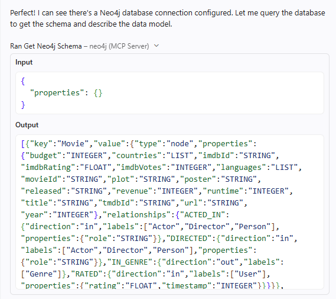

= Using the Neo4j Cypher MCP Server
:type: lesson
:order: 1

The Neo4j MCP Server is a useful tool for developers and non-technical users alike.
It provides an LLM with the ability to inspect and read and write data to a Neo4j database.

In this lesson, you will learn how to use the tools provided by the Neo4j Cypher MCP Server to interact with Neo4j databases through natural language.

== Understanding the database schema

Start the Neo4j MCP server (if its not running), and open a new chat window to start using the tools.

[TIP]
.Start the MCP server in VS Code
====
If you need to start, stop, or restart your MCP server, you can use the MCP commands in the Command Palette:

* Open the Command Palette (Ctrl+Shift+P)
* Select **MCP: List Servers**
* Select the _Neo4j Cypher_ server
* Select **Start** Server
====

The first tool you'll use is `get-schema`.

This tool solves a common problem with AI-generated database queries: LLMs have been known to invent the label names, properties, or relationship types that don't exist in your actual database.

The `get-schema` tool lets the AI discover what's actually in your Neo4j database before writing queries.

You can invoke the tool by asking a question about the database schema. For example:

* [copy]#Describe the Neo4j data model#
* [copy]#What node labels and relationship types are available in the database?#
* [copy]#How are <label 1> and <label 2> related?#

The agent should call the `get-schema` tool and return a description of the database schema based on the labels, relationship types, and property keys in your database.

[IMPORTANT]
.Allow access to the tool
====
You will be prompted to allow the agent to call any new tool. You can choose to allow access for the session, workspace, or always allow. 
====

You can expand the tool output in the chat window to see the request and response.

The tool has no input, and returns a JSON object that describes the schema of the database.

[%collapsible]
.Example schema output
====
[source,json]
include::includes/schema.json[]
====

== Reading data safely

The `read-cypher` tool is used to read data from the database.  It does not have permissions to create, update, or delete data.

You can invoke the tool by asking a question about the data in the database.  For example:

* _What are the top 10 movies by revenue?_
* _Who directed the movie "The Matrix"?_

. Run the query
. Observe the reasoning and response from the Agent 
. Expand the `read-cypher` tool output to see the generated Cypher query, parameters, and results.

[%collapsible]
.read-cypher tool output example
====

The read-cypher tool will generate a Cypher query and return the results, for example:

**Input:** 

[source,json]
{
  "query": "MATCH (m:Movie) WHERE m.revenue IS NOT NULL RETURN m.title AS title, m.revenue AS revenue ORDER BY m.revenue DESC LIMIT 10"
}

**Output:** 

[source,text]
----
The top 10 movies by revenue in your Neo4j database are:

1. Avatar
2. Titanic
3. Star Wars: Episode VII - The Force Awakens
4. Jurassic World
5. The Avengers
6. Furious 7
7. Avengers: Age of Ultron
8. Harry Potter and the Deathly Hallows: Part 2
9. Frozen
10. Iron Man 3
----
====

The tool adheres to the routing policy of the Neo4j server, directing queries across servers in a Neo4j cluster.
Secondly, as the query is executed within a _read transaction_, and is not capable of performing potentially destructive actions.

You can approve the tool to always run without permission, knowing that it will not delete or modify any data.

== Writing data with approval

The `write-cypher` tool allows an agent to write data to the Neo4j database.

This tool can create, update, or delete data in your database.
It's perfect for non-technical users who want to modify data using natural language instead of learning Cypher.

This tool will be invoked with a question about creating or modifying data.  For example:

* [copy]#Create a new user named Sarah#
* [copy]#Add a 5-star rating from Sarah to The Godfather#

Run the queries and observe the agent's reasoning process. The agent may use the `read-cypher` tool first to find the relevant nodes, and then use the `write-cypher` tool to make the change.

[%collapsible]
.Example of write-cypher tool usage
====
When asking the agent to complete write operation, such as _Add a 5-star rating from Sarah to The Godfather_, you may find that the agent uses multiple tools to complete the task, for example:

_I’ll first verify there is a Movie node titled “The Godfather” and identify Sarah’s user node so I can create exactly one correct RATED relationship._

`Ran Read Cypher - neo4j (MCP Server)`

[source,text]
----
Input:

{
  "query": "MATCH (m:Movie) WHERE toLower(m.title) CONTAINS 'godfather' RETURN m.title AS title, m.year AS year ORDER BY m.year"
}

Output:
[
  {
    "title": "Godfather, The",
    "year": 1972
  },
  {
    "title": "Godfather: Part II, The",
    "year": 1974
  },
  {
    "title": "Godfather: Part III, The",
    "year": 1990
  },
  {
    "title": "Tokyo Godfathers",
    "year": 2003
  }
]
----

_I’ve identified the exact records (userId 672 and movie title Godfather, The); now I’ll create or update Sarah’s rating to 5 stars and confirm it._

`Ran Write Cypher - neo4j (MCP Server)`

[source,text]
----
Input:
{
  "query": "MATCH (u:User {userId:'672'})\nMATCH (m:Movie {title:'Godfather, The'})\nMERGE (u)-[r:RATED]->(m)\nSET r.rating = 5.0,\n    r.timestamp = toInteger(datetime().epochSeconds)\nRETURN u.name AS user, m.title AS movie, r.rating AS rating, r.timestamp AS timestamp"
}

Output:
[
  {
    "movie": "Godfather, The",
    "rating": 5,
    "timestamp": 1775030009,
    "user": "Sarah"
  }
]
----

_Added successfully._

_Sarah (userId 672) now has a RATED relationship to Godfather, The with rating: 5, timestamp: 1775030009._
====

== How tools work together

The Neo4j MCP server tools work together to create a complete database interaction experience.

The schema tool prevents hallucinations, the read tool explores data safely, and the write tool makes changes with your approval.

The combination of tools allows anyone to work with Neo4j databases using natural language, while maintaining safety and accuracy.

== What's next

Now that you understand how the Neo4j MCP tools work, you're ready to try them yourself.

In the next lesson, you'll use these tools to explore and modify a movie recommendation database.

[.quiz]
== Check your understanding

include::questions/1-tool-safety.adoc[leveloffset=+1]

[.summary]
== Summary

The Neo4j Cypher MCP Server provides three tools for natural language database interaction:

* **`get-schema`** - Obtains the database schema to prevent AI hallucinations
* **`read-cypher`** - Executes safe, read-only queries automatically  
* **`write-cypher`** - Modifies data with user approval for safety

These tools let anyone interact with Neo4j databases using natural language while maintaining safety through read-only operations and approval workflows.
