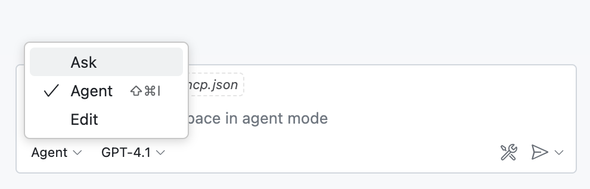

= Using the Neo4j Cypher MCP Server

// TODO: enable "MCP" tool in the GA chatbot

The Neo4j Cypher MCP Server is a useful tool for developers and non-technical users alike.
It provides an LLM with the ability to read and write data to a Neo4j database.

In this lesson, we will take a look at the tools that are available in the Neo4j Cypher MCP Server and how they can be used within the VS Code Copilot chat window.

== Chat & Agent mode

To use MCP tools, the server will need to be running and you need to be in **Agent mode** in the Copilot chat window.

To start a local MCP server, you can:

* Open the Command Palette (Ctrl+Shift+P):
** Select **MCP: List Servers**
** Select the _Neo4j Cypher_ server
** Select **Start Server**

* Or open `.vscode/mcp.json` and click the **Start** button that appears above the server.

Once the server is running, open Copilot chat window in VS Code:

* Go to the File menu &rarr; View &rarr; Chat
* Open the Command Palette (Ctrl+Shift+P) and select `Chat: Focus on Chat view`

Ensure that the chat is in **Agent mode** by selecting the `Agent` option in the bottom left hand corner of the chat window.

== Schema Discovery - `get-neo4j-schema`

It is well known that LLM's are prone to hallucinations, and this can be a problem when requesting a Cypher statement.
Even if the LLM generates a syntactically correct Cypher statement, it may invent labels, properties, or relationships that are not present in the database.

The `get-neo4j-schema` provides a way for an agent to discover the schema of the database.

You can invoke the tool by asking a question about the database schema.

* _Describe the data model_
* _What node labels and relationship types are available in the database?_
* _How are <label 1> and <label 2> related?_

The tool has no input, and returns a JSON object that describes the schema of the database.

// [quote]
// **What nodes are connected to a User?**

// A User node is connected to Movie nodes through the RATED relationship. This means users are linked to the movies they have rated. No other direct connections to different node types are defined for User in your current data model.

[%collapsible]
.Example schema output
====
[source,json]
include::includes/schema.json[]
====

== Reading Data - `read-neo4j-cypher`

The `read-neo4j-cypher` tool allows you to read data from the Neo4j database.
Many agents will use this tool in conjunction with the `get-neo4j-schema` tool to generate a Cypher statement and execute it to answer questions about the data contained in the graph.

For example, you could ask it: 

* _What are the top 10 movies by revenue?_
* _Who directed the movie "The Matrix"?_

This method has two benefits.  Firstly, it adheres to the routing policy of the Neo4j server, directing queries across servers in a Neo4j cluster.
Secondly, as the query is executed within a _read transaction_, the tool is not capable of performing potentially destructive actions.

This means you can approve the tool to always run without permission, knowing that it will not delete or modify any data.

[%collapsible]
.What are the top 10 movies by revenue?
====

**Input:** 

[source,json]
{
  "query": "MATCH (m:Movie) WHERE m.revenue IS NOT NULL RETURN m.title AS title, m.revenue AS revenue ORDER BY m.revenue DESC LIMIT 10"
}

**Output:** 

[source,text]
----
The top 10 movies by revenue in your Neo4j database are:

1. Avatar
2. Titanic
3. Star Wars: Episode VII - The Force Awakens
4. Jurassic World
5. The Avengers
6. Furious 7
7. Avengers: Age of Ultron
8. Harry Potter and the Deathly Hallows: Part 2
9. Frozen
10.Iron Man 3
----
====

== Writing Data - `write-neo4j-cypher`

The `write-neo4j-cypher` tool allows an agent to write data to the Neo4j database.
This allows non-technical users to write data to the database using natural language rather than Cypher.

For example, in a conversation interface, you could ask the agent to:

1. Create a new user
2. Create a rating between the newly created user and a movie

[%collapsible]
.Conversational writes
====
// TODO: video 

====

Many hosts will ask for permission to run this tool before executing it, giving you the ability to review the Cypher statement before execution and stop it if necessary.

== Check your understanding

include::questions/1-tool-safety.adoc[leveloffset=+1]

[.summary]
== Summary

The Neo4j Cypher MCP Server provides three essential tools for interacting with Neo4j databases:

* **`get-neo4j-schema`** - Discovers and returns the database schema to prevent LLM hallucinations when generating Cypher statements
* **`read-neo4j-cypher`** - Executes read-only Cypher queries within read transactions, ensuring data safety while allowing exploration of the graph
* **`write-neo4j-cypher`** - Enables data modification through natural language requests, with host permission controls for security

These tools allow agents to interact with Neo4j databases using natural language, with the LLM handling the Cypher generation.

Ready for a challenge?  Let's use these tools to interact with the movie recommendations database.