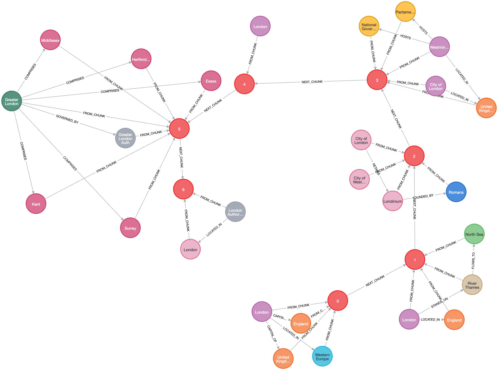

= Build Graph
:order: 11
:type: challenge
:sandbox: true

In the previous task, you split a piece of text into chunks and created embeddings for those chunks.

In this task you're going to go a step further and extract nodes and relationships from text in order to build a knowledge graph.

This knowledge graph will capture the entities and relationships within the data.

It will also include the chunks and embeddings as well as their connections to the extracted entities and relationships.

You will use the `neo4j` GraphRAG package for Python driver and OpenAI API for this. 

== Getting Started

Open the `1-knowledge-graphs-vectors\build_graph.py` file in your code editor.

[source, python]
----
include::{repository-raw}/main/1-knowledge-graphs-vectors/build_graph.py[]
----

== 1. Chunking the Text

The first step in the knowledge graph creation process is to split the text into chunks.

[source, python]
----
include::{repository-raw}/main/1-knowledge-graphs-vectors/solutions/build_graph.py[tag=text_splitter]
----

== 2. Embedding the Chunks

The next step is to create an embedding for each chunk.

We need an embeddings model in order to create embeddings from our chunks.

We can use the OpenAI `text-embedding-3-large` model for this.

[source, python]
----
include::{repository-raw}/main/1-knowledge-graphs-vectors/solutions/build_graph.py[tag=embedder]
----

== 3. Listing the Entities and Relationships to Extract

To help guide the LLM we list the types of entities (nodes) and relationships we want to extract from our text.

[source, python]
----
include::{repository-raw}/main/1-knowledge-graphs-vectors/solutions/build_graph.py[tag=schema]
----

== 4. Extracting Nodes and Relationships from the Chunks

Now we add an LLM to extract entities (nodes) and relationships from each chunk.

[source, python]
----
include::{repository-raw}/main/1-knowledge-graphs-vectors/solutions/build_graph.py[tag=llm]
----

== 5. Creating the Pipeline

Finally we create a knowledge graph creation pipeline.

The pipeline allows us to chain the various objects defined above, such as text splitters, embedders, etc. together in order to build a knowledge graph.

[source, python]
----
include::{repository-raw}/main/1-knowledge-graphs-vectors/solutions/build_graph.py[tag=create_pipeline]
----

== 6. Running the Pipeline

Finally we feed our input text to the pipeline then run it to create our knowledge graph!

[source, python]
----
include::{repository-raw}/main/1-knowledge-graphs-vectors/solutions/build_graph.py[tag=run_pipeline]
----

== 7. Viewing the Graph

View your graph by running the following command.

[source, cypher]
----
MATCH (c:Chunk)-[]-(n) RETURN *
----

== 8. Bonus Challenges

1. Create a vector index on the `embedding` property of your `Chunk` nodes.
2. Use the `db.index.vector.queryNodes` Cypher procedure to search this property.
3. Create a full text index on the `text` property of your `Chunk` nodes.
4. Use the `db.index.fulltext.queryNodes` Cypher procedure to search this property.

== Continue

When you are ready, you can move on to the next task.

read::Move on[]

[.summary]
== Summary

You created a graph of the course content using the `neo4j` GraphRAG package for Python and the OpenAI API.