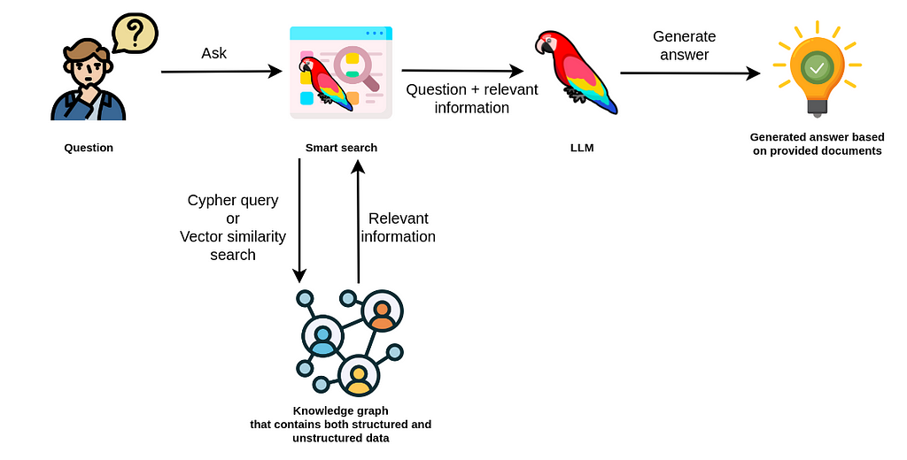

= Retrieval-Augmented Generation
:order: 1
:type: lesson
:sandbox: true

Retrieval-Augmented Generation (RAG) combines retrieval-based methods with generative language models to enhance response quality and accuracy. By fetching relevant information from a database, RAG ensures generated responses are contextually relevant and factually correct.

In neo4j-graphrag, RAG leverages the graph database to retrieve nodes and relationships that inform the language model's output, significantly improving the quality of responses from large language models (LLMs).

== Continue

When you are ready, you can move on to the next task.

read::Move on[]

[.summary]
== Summary

You learned about Retrieval-Augmented Generation (RAG) and the purpose of the `neo4j-graphrag` project.