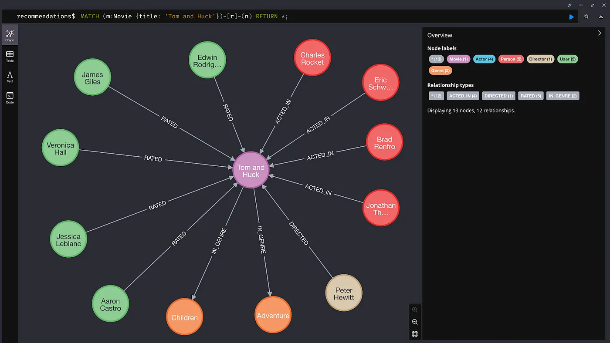

= Vector Retrieval with Graph Traversal
:order: 3
:type: challenge

== Understanding VectorCypherRetriever

The `VectorCypherRetriever` combines vector similarity with Cypher queries to retrieve relevant nodes from your Neo4j recommendations database. This integration allows for more refined searches by applying graph-specific filters alongside semantic similarity.

== How It Works

* **Cypher Filtering**:
  - Applies a Cypher query to filter nodes based on specific criteria.

* **Vector Similarity**:
  - Utilizes vector embeddings to find semantically similar nodes within the filtered results.

* **Retrieval**:
  - Returns the top relevant nodes that match both the Cypher filters and vector similarity.

== When to Use VectorCypherRetriever

* **Combined Filtering and Similarity**:
  - When you need to filter nodes based on properties or relationships before performing a similarity search.

* **Structured and Unstructured Data**:
  - Your graph contains both structured properties and unstructured text data.

* **Advanced Querying**:
  - Require complex retrieval logic that leverages Cypher’s capabilities alongside vector similarity.

== Setting Up VectorCypherRetriever

Follow these steps to set up and use the `VectorCypherRetriever`.

== 1. Initialize the Embedder

Create the embedding function using Sentence Transformers:

[source, python]
----
include::{repository-raw}/main/2-neo4j-graphrag/solutions/vector_cypher_retriever.py[tag=embedder]
----

== 2. Initialize the VectorCypherRetriever

Set up the `VectorCypherRetriever` with your Neo4j database and embedding model:

[source, python]
----
include::{repository-raw}/main/2-neo4j-graphrag/solutions/vector_cypher_retriever.py[tag=retriever]
----

== 3. Using the Retriever

Utilize the `VectorCypherRetriever` to perform semantic searches within your Neo4j database:

[source, python]
----
include::{repository-raw}/main/2-neo4j-graphrag/solutions/vector_cypher_retriever.py[tag=graphrag]
----

== Tips for Effective Use

* **Consistent Embeddings**:
  - Use the same model for both query and node embeddings to ensure compatibility.

* **Vector Indexing**:
  - Utilize the `moviePostersEmbedding` vector index created using the "clip-ViT-B-32" model.

* **Optimize Cypher Queries**:
  - Ensure your Cypher queries are efficient to reduce retrieval time.

== Continue

When you are ready, you can move on to the next task.

read::Move on[]

[.summary]
== Summary

You've learned how to use `VectorCypherRetriever` to perform filtered semantic searches in Neo4j, enhancing your RAG pipeline by combining Cypher queries with vector similarity.
