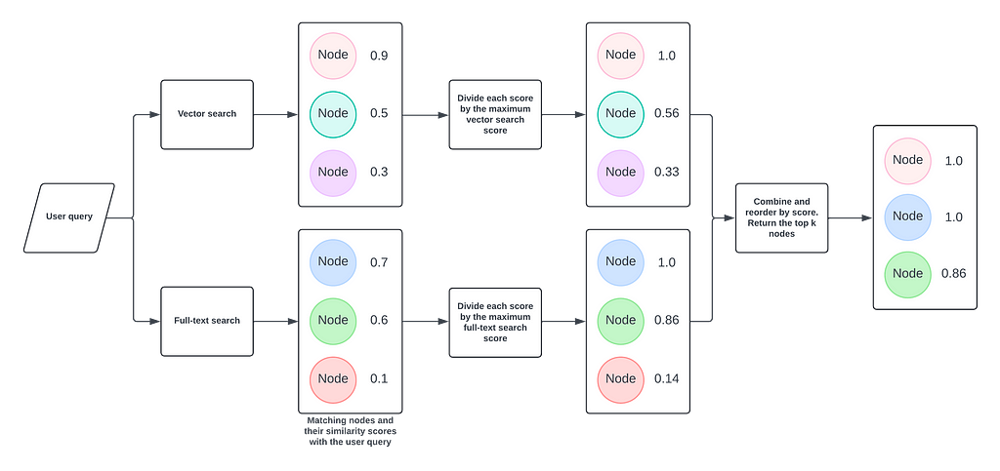

= HybridRetriever
:order: 4
:type: challenge
:sandbox: true

== Understanding HybridRetriever

The `HybridRetriever` combines vector similarity with full-text search to retrieve relevant nodes from your Neo4j recommendations database. This hybrid approach enhances the retrieval process by leveraging both semantic similarity and exact keyword matching, ensuring more accurate and comprehensive results.

=== How It Works

* **Vector Similarity**: Uses vector embeddings to find semantically similar nodes.
* **Full-text Search**: Utilizes full-text indexes to match exact keywords or phrases.
* **Aggregation**: Merges and ranks results from both retrieval methods to provide the top relevant nodes.

== When to Use HybridRetriever

* **Comprehensive Search**: When you need both semantic and keyword-based retrieval.
* **Diverse Data**: Your graph contains a mix of structured and unstructured data.
* **Enhanced Relevance**: Aim to improve both precision and recall in search results.

== Setting Up HybridRetriever

Follow these steps to set up and use the `HybridRetriever`.

=== Step 1: Install Required Libraries

Install the necessary Python packages:

[source, bash]
----
pip install neo4j-graphrag neo4j openai
----

=== Step 2: Connect to Your Neo4j Database

Establish a connection using the Neo4j Python driver:

[source, python]
----
from neo4j import GraphDatabase
uri = "neo4j+s://demo.neo4jlabs.com"
username = "recommendations"
password = "recommendations"
driver = GraphDatabase.driver(uri, auth=(username, password))
----

Placeholder for Image: Neo4j Connection Diagram

=== Step 3: Set Up the Embedding Function

Define a function to generate query embeddings using OpenAI's model:

[source, python]
----
import os
from neo4j_graphrag.embeddings.openai import OpenAIEmbeddings

os.environ["OPENAI_API_KEY"] = "sk-…"
embedder = OpenAIEmbeddings(model="text-embedding-ada-002")
----

=== Step 4: Initialize the HybridRetriever

Create an instance of `HybridRetriever` with both vector and full-text indexes:

[source, python]
----
from neo4j_graphrag.retriever import HybridRetriever
from neo4j_graphrag.llm import OpenAILLM

retriever = HybridRetriever(
    driver=driver,
    vector_index_name="moviePlotsEmbedding",
    fulltext_index_name="movieFulltext",
    embedder=embedder,
    return_properties=["title", "plot"],
)
----
* `driver`: Neo4j database driver.
* `vector_index_name`: Name of the vector index for semantic search.
* `fulltext_index_name`: Name of the full-text index for keyword search.
* `embedder`: Function to generate query embeddings.
* `return_properties`: Properties to return from retrieved nodes.

Placeholder for Image: Retrieval Process Flow

== Example in Action

Assume you have a recommendations database with movies, each having an `embedding` property and a `genre` attribute.

=== Running the Retriever

Given a query, `HybridRetriever` finds semantically similar thriller movies with strong female leads:

[source, python]
----
from neo4j_graphrag.generation import GraphRAG

llm = OpenAILLM(model_name="gpt-4o", model_params={"temperature": 0})
rag = GraphRAG(retriever=retriever, llm=llm)
query_text = "Who were the actors in the movie about the magic jungle board game?"
response = rag.search(query_text=query_text, retriever_config={"top_k": 5})
print(response.answer)
----
=== Expected Output

----
The actors in the movie "Jumanji," which is about a magical board game, are Robin Williams, Bradley Pierce, Kirsten Dunst, and Jonathan Hyde.
----

== Tips for Effective Use

* **Consistent Embeddings**: Use the same model for query and node embeddings.
* **Vector Indexing**: Create a vector index in Neo4j on the `embedding` property to speed up searches.
* **Optimize Queries**: Ensure your Cypher and full-text queries are efficient to reduce retrieval time.

== Next Steps

In the next lesson, you'll learn how to build a GraphRAG pipeline using the `HybridRetriever`.

read::Continue to Building a GraphRAG Pipeline[]

[.summary]
== Summary

You've learned how to use `HybridRetriever` to perform comprehensive semantic and keyword-based searches in Neo4j, enhancing your RAG pipeline by combining multiple retrieval strategies.
