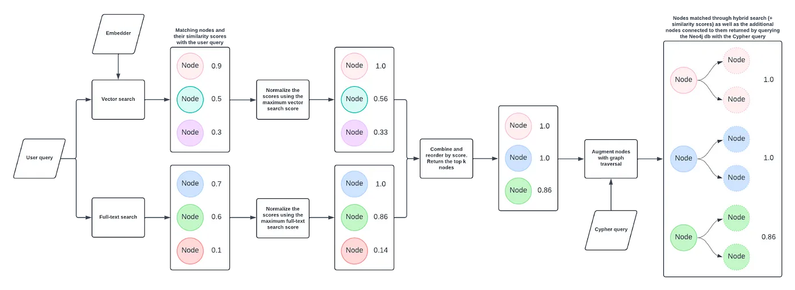

= Hybrid Retrieval with Graph Traversal
:order: 5
:type: challenge
:sandbox: true

== Understanding HybridCypherRetriever

The `HybridCypherRetriever` enhances the retrieval process by combining hybrid search (vector and full-text) with graph traversal techniques. This allows you to retrieve not only semantically similar nodes but also related information through graph relationships, enabling more comprehensive and accurate responses in your GraphRAG applications.

=== How It Works

* **Hybrid Search**:
  - Combines vector similarity and full-text search to find relevant nodes.

* **Graph Traversal**:
  - Uses Cypher queries to fetch additional related nodes based on the initial retrieval.

* **Aggregation**:
  - Merges results from both search methods and traversal to provide enriched data for the language model.

== When to Use HybridCypherRetriever

* **Complex Queries**:
  - When user queries require both semantic understanding and specific relationship-based information.

* **Rich Data Relationships**:
  - Your graph contains interconnected data where related nodes hold valuable context.

* **Enhanced Accuracy**:
  - Aim to retrieve precise information by leveraging both search methods and graph structure.

== Setting Up HybridCypherRetriever

Follow these steps to set up and use the `HybridCypherRetriever`.

== 1. Initialize the Embedder

Create the embedding function using OpenAI's model:

[source, python]
----
include::{repository-raw}/main/2-neo4j-graphrag/solutions/hybrid_cypher_retriever.py[tag=embedder]
----

== 2. Initialize the HybridCypherRetriever

Set up the `HybridCypherRetriever` with your Neo4j database and embedding model:

[source, python]
----
include::{repository-raw}/main/2-neo4j-graphrag/solutions/hybrid_cypher_retriever.py[tag=retriever]
----

== 3. Running the GraphRAG

Use the `HybridCypherRetriever` as part of a GraphRAG pipeline to perform hybrid searches within your Neo4j database:

[source, python]
----
include::{repository-raw}/main/2-neo4j-graphrag/solutions/hybrid_cypher_retriever.py[tag=graphrag]
----

=== Expected Output

----
The names of the actors in the movie set in 1375 in Imperial China, "Musa the Warrior (Musa)," are Irrfan Khan, Ziyi Zhang, Sung-kee Ahn, and Jin-mo Ju.
----

== Tips for Effective Use

* **Consistent Embeddings**:
  - Use the same model for query and node embeddings to ensure compatibility.

* **Vector Indexing**:
  - Create a vector index in Neo4j on the `embedding` property to speed up searches.

* **Optimize Queries**:
  - Ensure your Cypher and full-text queries are efficient to reduce retrieval time.

* **Leverage Graph Relationships**:
  - Design your graph schema to maximize the benefits of traversal-based retrieval.

== Continue

When you are ready, you can move on to the next task.

read::Move on[]

[.summary]
== Summary

You've learned how to use `HybridCypherRetriever` to perform advanced filtered semantic searches in Neo4j, enhancing your RAG pipeline by combining hybrid search methods with graph traversal techniques. This enables your applications to handle more complex queries and retrieve comprehensive information.
