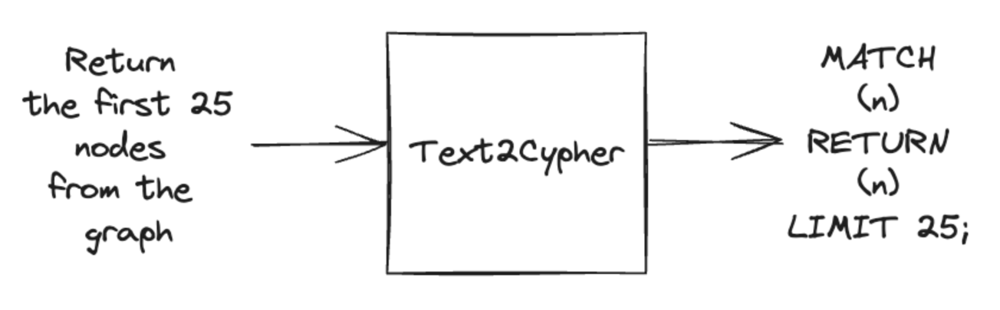

= Text2Cypher Retrieval
:order: 6
:type: challenge
:sandbox: true

== Understanding Text2CypherRetriever

The `Text2CypherRetriever` simplifies the retrieval process by translating natural language queries into Cypher queries using a large language model (LLM). This approach eliminates the need for manual Cypher query writing and complex embedding setups, making data retrieval more intuitive and accessible.

=== What is Text2Cypher?

Text2Cypher converts natural language into Cypher queries. The `Text2CypherRetriever` leverages this by generating precise Cypher queries based on user input, executing them against the Neo4j database, and using the results to inform the language model's responses. This method allows users to interact with the database using plain language, enhancing ease of use and flexibility.

Try this Cypher command in sandbox:
[source, cypher]
MATCH (actor:Actor {name: "Hugo Weaving"})-[:ACTED_IN]->(movie:Movie)
RETURN movie.title AS movie_title, movie

== When to Use Text2CypherRetriever

* **Simplicity**:
  - Avoid manual Cypher query writing.

* **Natural Interaction**:
  - Allow users to interact with the database using natural language.

* **Accessibility**:
  - Enable developers of all skill levels to easily retrieve data without a deep understanding of Cypher.

== Setting Up Text2CypherRetriever

Follow these steps to set up and use the `Text2CypherRetriever`.

== 1. Initialize the Text2CypherRetriever

Set up the `Text2CypherRetriever` to connect your Neo4j database with the LLM:

[source, python]
----
include::{repository-raw}/main/2-neo4j-graphrag/solutions/text2cypher_retriever.py[tag=retriever]
----
* `driver`: Neo4j database driver.
* `llm`: Large language model for query generation.
* `neo4j_schema`: (Optional) Schema definition for better query accuracy.
* `examples`: (Optional) Example queries to guide the LLM.

== 2. Using the Retriever

Integrate the `Text2CypherRetriever` with GraphRAG to perform data retrieval using natural language queries:

[source, python]
----
include::{repository-raw}/main/2-neo4j-graphrag/solutions/text2cypher_retriever.py[tag=graphrag]
----

=== Expected Output

----
Hugo Weaving starred in "Cloud Atlas," "V for Vendetta," "The Matrix," and "The Adventures of Priscilla, Queen of the Desert."
----

== Tips for Effective Use

* **Schema Definition**:
  - Provide a clear Neo4j schema to improve query accuracy.

* **Example Queries**:
  - Supply example queries to guide the LLM in generating accurate Cypher queries.

* **Handle Errors**:
  - Be prepared to handle `Text2CypherRetrievalError` if the generated query is incorrect.

== Continue

When you are ready, you can move on to the next task.

read::Move on[]

[.summary]
== Summary

You've learned how to use `Text2CypherRetriever` to perform natural language-based data retrieval in Neo4j, simplifying your RAG pipeline by translating user queries into precise Cypher queries. This approach enhances accessibility and efficiency in integrating Neo4j with generative AI models.
