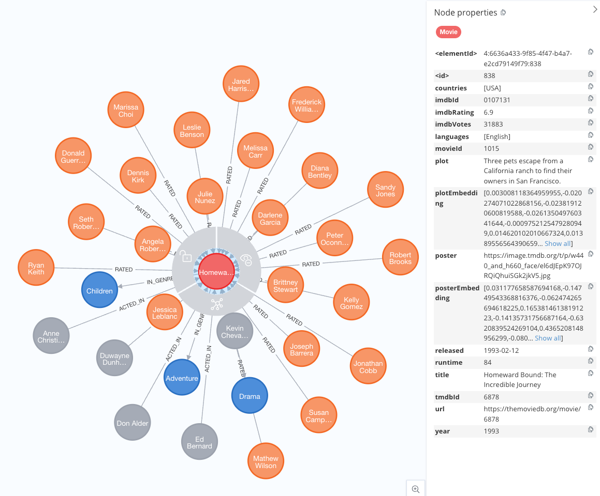

= Building a Multimodal Application with VectorCypherRetriever
:order: 7
:type: challenge
:sandbox: true

== Recap and Introduction

Previously, you've explored various retrieval strategies using Neo4j, including `VectorRetriever`, `VectorCypherRetriever`, `HybridRetriever`, `HybridCypherRetriever`, and `Text2CypherRetriever` to fetch semantically relevant data. Now, we'll enhance your GraphRAG applications with a multimodal approach using the `VectorCypherRetriever`. This retriever integrates both textual and visual data, enabling more powerful and accurate queries.

== Key Components

The `VectorCypherRetriever` allows for multimodal integration, where both text and visual data are used to perform advanced searches within your Neo4j recommendations database. Follow these steps to set up the components.

== 1. Initialize the Embedder

Create an image embedder using the "clip-ViT-B-32" model to extract visual features from movie posters:

[source, python]
----
include::{repository-raw}/main/2-neo4j-graphrag/solutions/multimodal_app.py[tag=embedder]
----

== 2. Initialize the VectorCypherRetriever

Set up the `VectorCypherRetriever` to integrate both visual and text data for more comprehensive retrieval:

[source, python]
----
include::{repository-raw}/main/2-neo4j-graphrag/solutions/multimodal_app.py[tag=retriever]
----
* `driver`: Neo4j database driver.
* `index_name`: The vector index for the movie poster embeddings.
* `retrieval_query`: Cypher query to retrieve nodes along with their properties.
* `result_formatter`: Function to format the returned nodes.
* `embedder`: Embedder for generating visual embeddings.

== Tips for Effective Use

* **Image Embeddings**:
  - Generated using the "clip-ViT-B-32" model from Sentence Transformers.
  - Capture visual features of movie posters for semantic similarity.

* **Vector Index**:
  - Utilize the `moviePostersEmbedding` vector index.
  - Stores embeddings of movie posters, enabling efficient image-based searches.

* **Multimodal Integration**:
  - Combines text-based plot descriptions with image-based poster analysis.
  - Allows retrieval based on both semantic content and visual representation.

[.summary]
== Summary

You've learned how to use `VectorCypherRetriever` in a multimodal context, integrating text and image embeddings to enhance your GraphRAG applications. This method offers a powerful way to perform sophisticated, multimodal searches that leverage both textual and visual information within your Neo4j knowledge graph.
