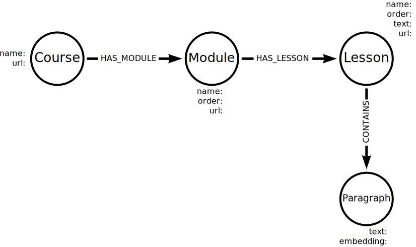

= Unstructured data
:order: 6
:type: lesson

Unstructured data refers to information that doesn't fit neatly into pre-defined structures and types. 
For example,  text files, emails, social media posts, videos, photos, audio files, and web pages. 

Unstructured data is often rich in information but challenging to analyze.

== Vectors and Graphs

Vectors and embeddings can represent unstructured data, making it easier to identify similarities and search for related data.

Graphs are a powerful tool for representing and analyzing unstructured data.

For example, you can use vectors to find the correct documentation to support a customer query and a graph to understand the relationships between different products and customer feedback.

== Chunking

When dealing with large amounts of data, breaking it into smaller, more manageable chunks is helpful. This process is called chunking.

There are countless strategies for splitting data into chunks, and the best approach depends on the data and the problem you are trying to solve.

Later in this workshop, you will import the unstructured data from GraphAcademy course and chunk it into paragraphs.

You can store embeddings for individual chunks and create relationships between chunks to capture context and relationships.

When storing the course content, you will create a node for each `Paragraph` chunk and a relationship `CONTAINS` between the `Lesson` and `Paragraph` nodes.

== Continue

When you are ready, you can move on to the next task.

read::Move on[]

[.summary]
== Summary

You learned about how you can store unstructured data in a graph.

In the next task, you will use Python and LangChain to load, chunk, embed, and store unstructured data in Neo4j.