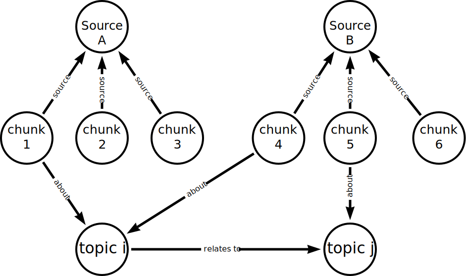

= Knowledge graph
:order: 7
:type: lesson

Knowledge graphs are essential to many AI and machine learning applications. 
You can use a knowledge graph to give context and ground an LLM, giving it access to structured data beyond its initial training data.

== What are Knowledge Graphs?

Knowledge graphs are a specific implementation of a Graph Database, where information is captured and integrated from many different sources, representing the inherent knowledge of a particular domain.

They provide a structured way to represent entities, their attributes, and their relationships, allowing for a comprehensive and interconnected understanding of the information within that domain.

Knowledge graphs break down sources of information and integrate them, allowing you to see the relationships between the data.

You can tailor knowledge graphs for semantic search, data retrieval, and reasoning. 

You may not be familiar with the term knowledge graph, but you have probably used one. Search engines typically use knowledge graphs to provide information about people, places, and things.

The following knowledge graph could represent Neo4j:

image::images/neo4j-google-knowledge-graph.svg[An example of a knowledge graph of Neo4j showing the relationships between people, places, and things]

This integration from diverse sources gives knowledge graphs a more holistic view and facilitates complex queries, analytics, and insights.

[TIP]
You can find more information about knowledge graphs including white papers, and free resources at link:https://neo4j.com/use-cases/knowledge-graph[neo4j.com/use-cases/knowledge-graph^].

Knowledge graphs can readily adapt and evolve as they grow, taking on new information and structure changes. 

In the next task, you will build a simple graph of the course data.

== Continue

When you are ready, you can move on to the next task.

read::Move on[]

[.summary]
== Summary

You learned about knowledge graphs and their benefits. 

In the next task, you will build a simple graph of the course data.