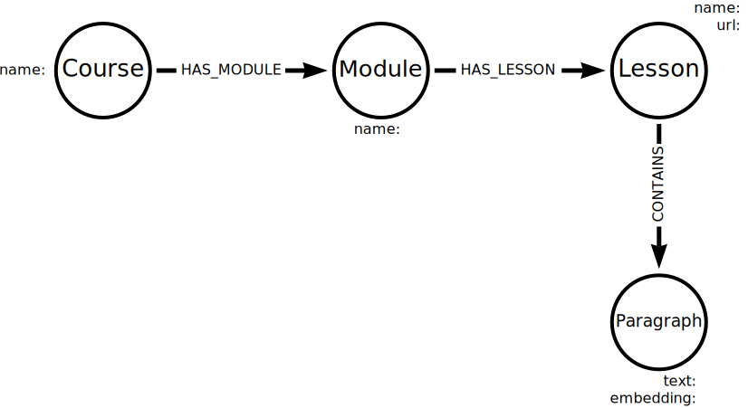
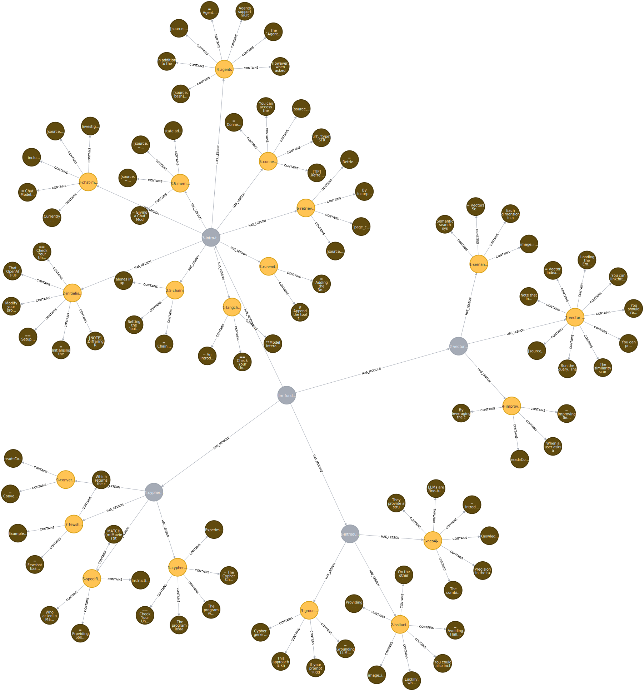

= Build Graph
:order: 9
:type: challenge
:sandbox: true

In the previous task, you used the `Neo4jVector` class to create `Chunk` nodes in the graph.
Using `Neo4jVector` is an efficient and easy way to get started. 

To create a graph where you can also understand the relationships within the data, you must incorporate the metadata into the data model.

In this lesson, you will create a graph of the course content using the `neo4j` Python driver and OpenAI API. 

== Data Model

The data model you will create is a simplified version of the course content model you saw earlier.

The graph will contain the following nodes, properties, and relationships:

- `Course`, `Module`, and `Lesson` nodes with a `name` property
- A `url` property on `Lesson` nodes will hold the GraphAcademy URL for the lesson
- `Paragraph` nodes will have `text` and `embedding` property
- The `HAS_MODULE`, `HAS_LESSON`, and `CONTAINS` relationships will connect the nodes

You can extract the `name` properties and `url` metadata from the directory structure of the lesson files.
For example, the first lesson of the Neo4j & LLM Fundamentals course has the following path:

[source]
----
courses\llm-fundamentals\modules\1-introduction\lessons\1-neo4j-and-genai\lesson.adoc
----

You can extract the following metadata from the path:

- `Course.name` - `llm-fundamentals`
- `Module.name` - `1-introduction`
- `Lesson.name` - `1-neo4j-and-genai`
- `Lesson.url` - `graphacademy.neo4j.com/courses/{Course.name}/{{Module.name}}/{Lesson.name}`

== Extracting the data

Open the `1-knowledge-graphs-vectors\build_graph.py` file in your code editor.

This starter code loads and chunks the course content.

.Load and chunk the content
[source, python]
----
include::{repository-raw}/main/1-knowledge-graphs-vectors/build_graph.py[]
----

For each chunk, you have to create an embedding of the text and extract the metadata.

Create a function to create and return an embedding using the OpenAI API:

.Create embeddings
[source, python]
----
include::{repository-raw}/main/1-knowledge-graphs-vectors/solutions/build_graph.py[tag=get_embedding]
----

Create a 2nd function, which will extract the data from the chunk:

.Get course data
[source, python]
----
include::{repository-raw}/main/1-knowledge-graphs-vectors/solutions/build_graph.py[tag=get_course_data]
----

The `get_course_data` function:

. Splits the document source path to extract the `course`, `module`, and `lesson` names
. Constructs the `url` using the extracted names
. Extracts the `text` from the chunk
. Creates an `embedding` using the `get_embedding` function
. Returns a dictionary containing the extracted data

== Create the graph

To create the graph, you will need to:

. Create an OpenAI object to generate the embeddings
. Connect to the Neo4j database
. Iterate through the chunks
. Extract the course data from each chunk
. Create the nodes and relationships in the graph

Create the OpenAI object:

[source, python]
----
include::{repository-raw}/main/1-knowledge-graphs-vectors/solutions/build_graph.py[tag=openai]
----

Connect to the Neo4j sandbox:

[source, python]
----
include::{repository-raw}/main/1-knowledge-graphs-vectors/solutions/build_graph.py[tag=neo4j]
----

[TIP]
.Test the connection
====
You could run your code now to check that you can connect to the OpenAI API and Neo4j sandbox.
====

To create the data in the graph, you will need a function that incorporates the course data into a Cypher statement and runs it in a transaction.

.Create chunk function
[source, python]
----
include::{repository-raw}/main/1-knowledge-graphs-vectors/solutions/build_graph.py[tag=create_chunk]
----

The `create_chunk` function will accept the `data` dictionary created by the `get_course_data` function.

You should be able to identify the `$course`, `$module`, `$lesson`, `$url`, `$text`, and `$embedding` parameters in the Cypher statement.

Iterate through the chunks and execute the `create_chunk` function:

[source, python]
----
include::{repository-raw}/main/1-knowledge-graphs-vectors/solutions/build_graph.py[tag=create]
----

A new session is created for each chunk. The `execute_write` method calls the `create_chunk` function, passing the `data` dictionary created by the `get_course_data` function.

Finally, close the driver.

[source, python]
----
include::{repository-raw}/main/1-knowledge-graphs-vectors/solutions/build_graph.py[tag=close]
----

[%collapsible]
.Click to view the complete code
====
[source]
----
include::{repository-raw}/main/1-knowledge-graphs-vectors/solutions/build_graph.py[tag=**]
----
====

Run the code to create the graph.
It will take a minute or two to complete as it creates the embeddings for each paragraph.

== Explore the graph

View the graph by running the following Cypher:

[source, cypher]
----
MATCH (c:Course)-[:HAS_MODULE]->(m:Module)-[:HAS_LESSON]->(l:Lesson)-[:CONTAINS]->(p:Paragraph)
RETURN *
----

You will need to create a vector index to query the paragraph embeddings.

[source, cypher]
.Create Vector Index
----
CREATE VECTOR INDEX paragraphs IF NOT EXISTS
FOR (p:Paragraph)
ON p.embedding
OPTIONS {indexConfig: {
 `vector.dimensions`: 1536,
 `vector.similarity_function`: 'cosine'
}}
----

You can use the vector index and the graph to find a lesson to help with specific questions:

[source, cypher]
.Find a lesson
----
WITH genai.vector.encode(
    "How does RAG help ground an LLM?", 
    "OpenAI", 
    { token: "sk-..." }) AS userEmbedding
CALL db.index.vector.queryNodes('paragraphs', 6, userEmbedding)
YIELD node, score
MATCH (l:Lesson)-[:CONTAINS]->(node)
RETURN l.name, l.url, score
----

Explore the graph and see how the relationships between the nodes can bring additional meaning to the unstructured data.

== Continue

When you are ready, you can move on to the next task.

read::Move on[]
[.summary]
== Summary

You created a graph of the course content using the `neo4j` Python driver and OpenAI API.