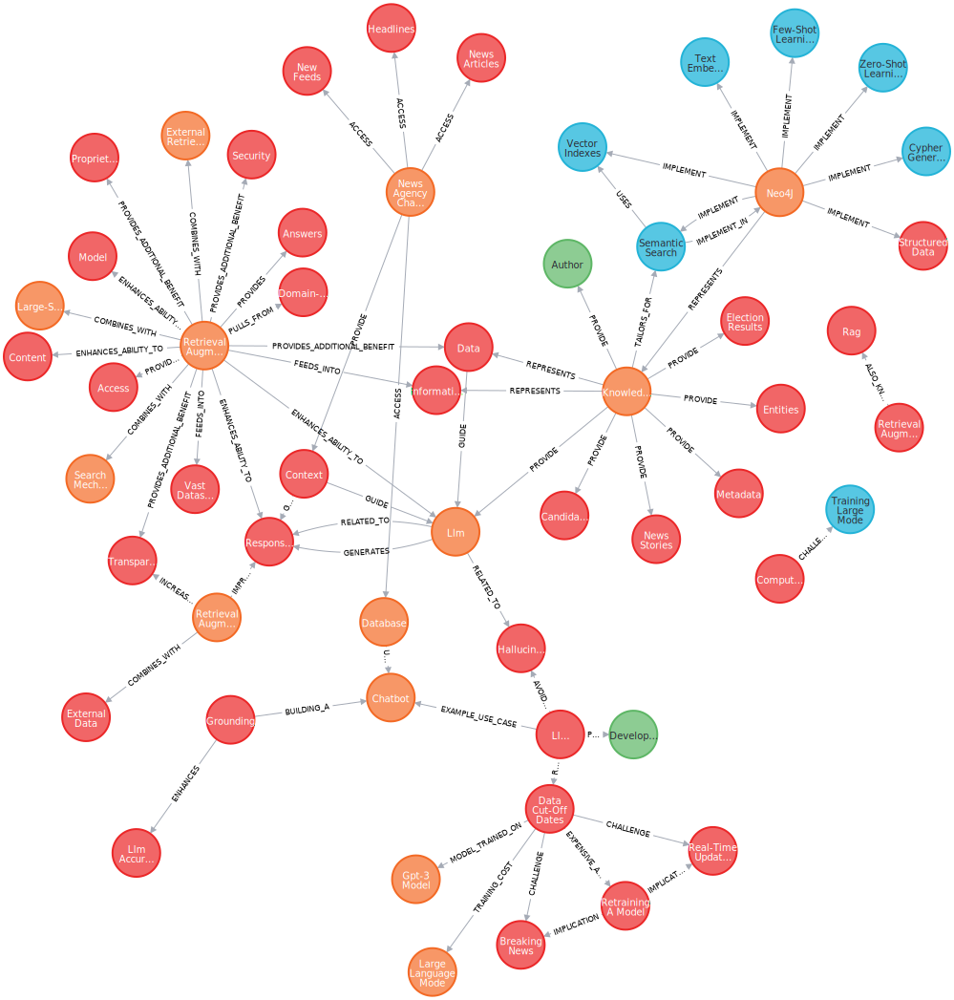
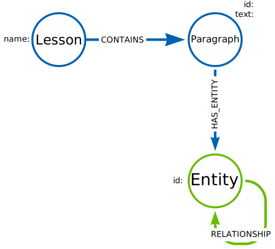
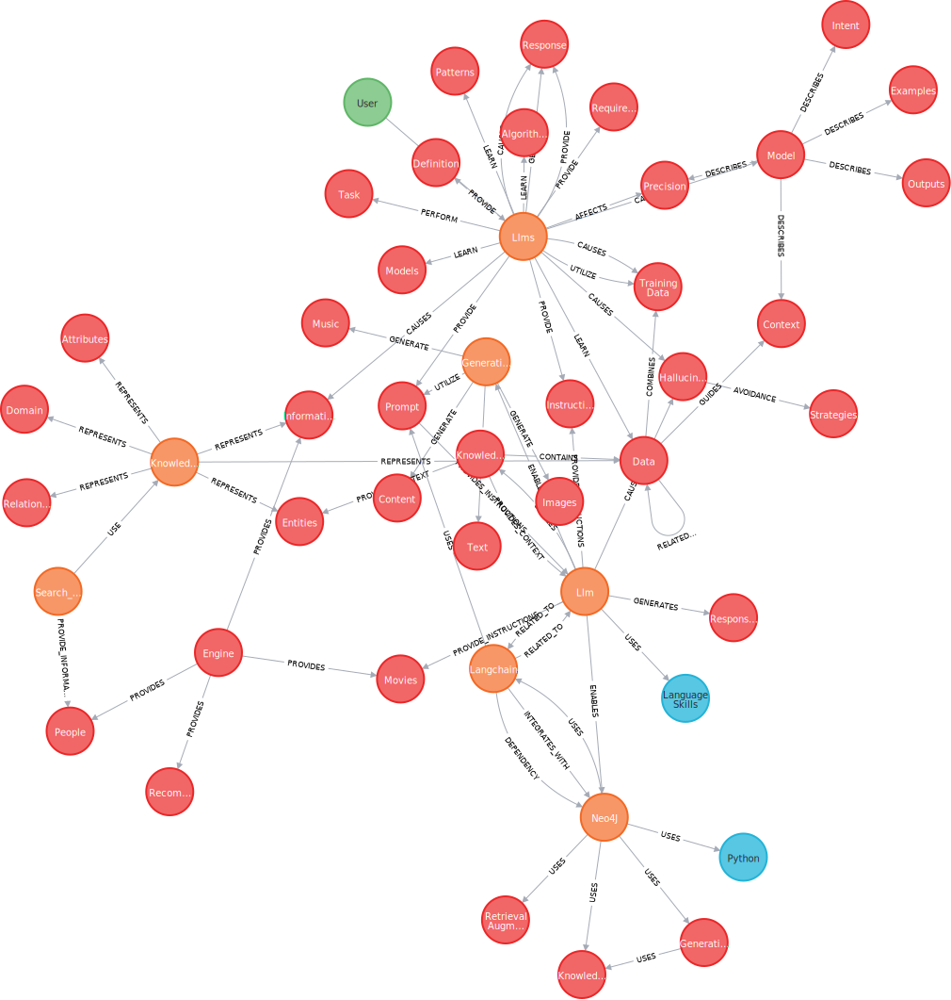

= Constructing Knowledge Graphs with LLMs
:order: 9
:type: challenge
:branch: llm-kg
:slides: true

[slide.discrete.col-2]
== Unstructured data and graphs

[.col]
====
Creating knowledge graphs from unstructured data can be complex, involving multiple steps of data query, cleanse, and transform.

You can use the text analysis capabilities of Large Language Models (LLMs) to automate the extraction of entities and relationships from your unstructured text.

An LLM generated this knowledge graph of `Technologies`, `Concepts`, and `Skills` from a link:{repository-link}/{branch}/1-knowledge-graphs-vectors/data/asciidoc/courses/llm-fundamentals/modules/1-introduction/lessons/3-grounding/lesson.adoc[lesson on grounding LLMS^].
====

[.col]
====

====

[.slide]
== Extend your graph

In this challenge, you will use an LLM to extend your graph with new entities and relationships found in the unstructured text data.

Open the `1-knowledge-graphs-vectors\llm_build_graph.py` starter code that creates the graph of lesson content.

[.transcript-only]
====
[%collapsible]
.Click to view the starter code
=====
[source]
.llm_build_graph.py
----
include::{repository-raw}/{branch}/1-knowledge-graphs-vectors/llm_build_graph.py[tag=**]
----
=====
====

You will need to:

. Create an LLM instance
. Create a transformer to extract entities and relationships
. Extract entities and relationships from the text
. Map the entities to the paragraphs
. Add the graph documents to the database

[.slide]
== Create an LLM

You need an LLM instance to extract the entities and relationships:

.Create the llm
[source, python]
----
include::{repository-raw}/{branch}/1-knowledge-graphs-vectors/solutions/llm_build_graph.py[tag=llm]
----

The `model_name` parameter defines which link:https://platform.openai.com/docs/models[OpenAI model^] will be used. 
`gpt-3.5-turbo` is a good choice for this task given its accuracy, speed, and cost.

[.slide]
== Graph Transformer

To extract the entities and relationships, you will use a graph transformer.
The graph transformer takes unstructured text data, passes it to the LLM, and returns the entities and relationships.

.Create the transformer
[source, python]
----
include::{repository-raw}/{branch}/1-knowledge-graphs-vectors/solutions/llm_build_graph.py[tag=doc_transformer]
----

The optional `allowed_nodes` and `allowed_relationships` parameters allow you to defined the types of nodes and relationships you want to extract from the text.

In this example, the nodes are restricted to entities relevant to the content. 
The relationships are not restricted, allowing the LLM to find any relationships between the entities.

[.transcript-only]
====
[IMPORTANT]
=====
Restricting the nodes and relationship will result in a more concise knowledge graph.
A more concise graph may support you in answering specific questions but it could also be missing information.
=====
====

[.slide]
== Extract entities and relationships

For each chunk of text, you will use the transformer to convert the text into a graph.
The transformer returns a set of graph documents that represent the entities and relationships in the text.

.Call the transformer
[source, python]
----
include::{repository-raw}/{branch}/1-knowledge-graphs-vectors/solutions/llm_build_graph.py[tag=llm_graph_docs]
----

[.slide.col-2]
== Map extracted entities to the paragraphs

[.col]
====
The graph documents contain the extracted nodes and relationships, but they are not linked to the original paragraphs.

To understand which entities are related to which paragraphs, you will map the extracted nodes to the paragraphs.

You will create a data model with a `HAS_ENTITY` relationship between the paragraphs and the entities.
====

[.col]
====

====

[.slide.discrete.col-2]
== Map extracted entities to the paragraphs
    
[.col]
====
This code inserts the `Paragraph` node into the graph document, and creates a `HAS_ENTITY` relationship between the paragraph and the extracted entities.
====

[.col]
====
.Map the entities to the paragraphs
[source, python]
----
include::{repository-raw}/{branch}/1-knowledge-graphs-vectors/solutions/llm_build_graph.py[tag=map_entities]
----
====

[.slide]
== Add the graph documents

Finally, you need to add the new graph documents to the Neo4j graph database.

.Add the graph documents
[source, python]
----
include::{repository-raw}/{branch}/1-knowledge-graphs-vectors/solutions/llm_build_graph.py[tag=llm_add_graph]
----

When you are ready, run the program to extend your graph.

[NOTE]
Calls to the LLM are relatively slow, so the program will take a few minutes to run.

[.slide]
== Querying the knowledge graph

You can view the generated entities using the following Cypher query:

[source, cypher]
MATCH (p:Paragraph)-[:HAS_ENTITY]-(e)
RETURN p, e

[.slide]
== Entities

The entities in the graph allow you to understand what the context in the text.

You can find the most mentioned topics in the graph by counting the number of times a node label (or entity) appears in the graph:

[source, cypher]
----
MATCH ()-[:HAS_ENTITY]->(e)
RETURN labels(e) as labels, count(e) as nodes
ORDER BY nodes DESC
----

[.slide.discrete]
== Entities
You can drill down into the entity id to gain insights into the content.
For example, you can find the most mentioned `Technology`.

[source, cypher]
----
MATCH ()-[r:HAS_ENTITY]->(e:Technology)
RETURN e.id AS entityId, count(r) AS mentions
ORDER BY mentions DESC
----

[.slide]
== Related lessons

The knowledge graph can also show you the connections within the content.
For example, what lessons relate to each other.

This Cypher query matches one specific document and uses the entities to find related documents:

[source, cypher]
----
MATCH (l:Lesson {
    name: "1-neo4j-and-genai"
})-[:CONTAINS]->(p:Paragraph)

MATCH (p)-[:HAS_ENTITY]->(entity)<-[:HAS_ENTITY]-(otherParagraph)
MATCH (otherParagraph)<-[:CONTAINS]->(otherLesson)
RETURN DISTINCT entity.id, otherLesson.name
----

[.slide.discrete.col-2]
== Lesson entities

[.col]
====
The knowledge graph contains the relationships between entities in all the documents.

This Cypher query restricts the output to a specific chunk or document:

[source, cypher]
----
MATCH (l:Lesson {
    name: "1-neo4j-and-genai"
})-[:CONTAINS]->(p:Paragraph)
MATCH (p)-[:HAS_ENTITY]->(e)

MATCH path = (e)-[r]-(e2)
WHERE (p)-[:HAS_ENTITY]->(e2)
RETURN path
----

A path is returned representing the knowledge graph for the document.
====

[.col]
====

====

[.slide.discrete.col-2]
== Labels, ids, and relationships

[.col]
====
You can gain the nodes labels, ids, relationship types by _unwinding_ the path's relationships:
====

[.col]
====
[source, cypher]
----
MATCH (l:Lesson {
    name: "1-neo4j-and-genai"
})-[:CONTAINS]->(p:Paragraph)
MATCH (p)-[:HAS_ENTITY]->(e)

MATCH path = (e)-[r]-(e2)
WHERE (p)-[:HAS_ENTITY]->(e2)

UNWIND relationships(path) as rels
RETURN
    labels(startNode(rels))[0] as eLabel,
    startNode(rels).id as eId,
    type(rels) as relType,
    labels(endNode(rels))[0] as e2Label,
    endNode(rels).id as e2Id
----
====

[.slide.discrete]
== Explore the graph

Take some time to explore the knowledge graph to find relationships between entities and lessons.

[.next]
== Continue

When you are ready, you can move on to the next task.

read::Move on[]
[.summary]
== Summary

You used an LLM to create a knowledge graph from unstructured text.