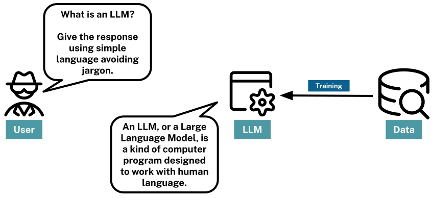
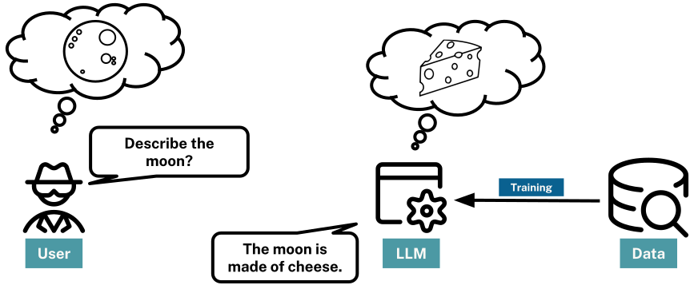

= LLMs, Hallucination and Grounding
:order: 2
:type: lesson

Large Language Models, referred to as LLMs, are trained on vast amounts of text data to understand and generate human-like text. However, they can also generate misleading or baseless content and may need additional information to ensure they are reliable and helpful.

== Large Language Models

LLMs can answer questions, create content, and assist with various linguistic tasks by leveraging patterns learned from the data.

The response generated by an LLM is a probabilistic continuation of the instructions it receives. The LLM provides the most likely response based on the patterns it has learned from its training data.

In simple terms, if presented with the prompt _"Continue this sequence - A B C"_, an LLM could respond _"D E F"_.

To get an LLM to perform a task, you provide a **prompt**, a piece of text that should specify your requirements and provide clear instructions on how to respond.

An example prompt may be a simple question.

    What is the capital of Japan?

Or, it could be more descriptive. For example:

    Tell me about the capital of Japan.
    Produce a brief list of talking points exploring its culture and history.
    The content should be targeted at tourists.
    Your readers may have English as a second language, so use simple terms and avoid colloquialisms.
    Avoid Jargon at all costs.
    Return the results as a list of JSON strings containing content formatted in Markdown.

The LLM will interpret these instructions and return a response based on the patterns it has learned from its training data.

== Challenges

While LLMs provide a lot of potential, you should also be cautious.

At their core, LLMs are trained to predict the following word(s) in a sequence.

The words are based on the patterns and relationships from other text in the training data. The sources for this training data are often the internet, books, and other publicly available text. This data could be of questionable quality and maybe be incorrect. 

LLMs are fine-tuned to be as helpful as possible, even if that means occasionally generating misleading or baseless content, a phenomenon known as **hallucination**.

For example, when asked to _"Describe the moon."_ and LLM may respond with _"The moon is made of cheese."_. While this is a common saying, it is not true.

While LLMs can represent the essence of words and phrases, they don't possess a genuine understanding or ethical judgment of the content.

These factors can lead to outputs that might be biased, devoid of context, or lack logical coherence.

== Fixing Hallucination

Providing additional *contextual* data helps to _ground_ the LLM's responses and make them more accurate.

A knowledge graph is a mechanism for providing additional data to an LLM. Data within the knowledge graph can guide the LLM to provide more relevant, accurate, and reliable responses. 

While the LLM uses its language skills to interpret and respond to the contextual data, it will not disregard the original training data.

You can think of the original training data as the base knowledge and linguistic capabilities, while the contextual information guides in specific situations.

The combination of both approaches enables the LLM to generate more meaningful responses.

Throughout this course, you will explore how to leverage the capabilities of Neo4j and Generative AI to build intelligent, context-aware systems.

Grounding allows a language model to reference external, up-to-date sources or databases to enrich the responses.

By integrating additional and real-time data or APIs, developers ensure the model remains current and provides factual information beyond its training data.

For instance, if building a chatbot for a news agency, instead of solely relying on the model's last training data, grounding could allow the model to pull real-time headlines or articles from a news API. When a user asks, "What's the latest news on the Olympics?", the chatbot, through grounding, can provide a current headline or summary from the most recent articles, ensuring the response is timely and accurate.

image::images/llm-news-agency.svg[A news agency chatbot, showing the user asking a question, the chatbot grounding the question with a news API, and the chatbot responding with the latest news.]

Supplementing the model with additional and real-time data retrieved from up-to-date sources is known as **Retrieval Augmented Generation**, or **RAG**

RAG combines the strengths of large-scale language models with external retrieval or search mechanisms, enabling relevant information from vast datasets to be dynamically fed into the model during the generation process, thereby enhancing its ability to provide detailed and contextually accurate responses.

A knowledge graph is a mechanism for providing additional data to an LLM. Data within the knowledge graph can guide the LLM to provide more relevant, accurate, and reliable responses. 

== Continue

When you are ready, you can move on to the next task.

read::Move on[]

[.summary]
== Lesson Summary

You learned about Large Language Models (LLMs), hallucination, and how Retrieval Augmented Generation (RAG) can help ground LLM responses.

Next, you will use Python and language to call an LLM and explore how it responds to prompts.
