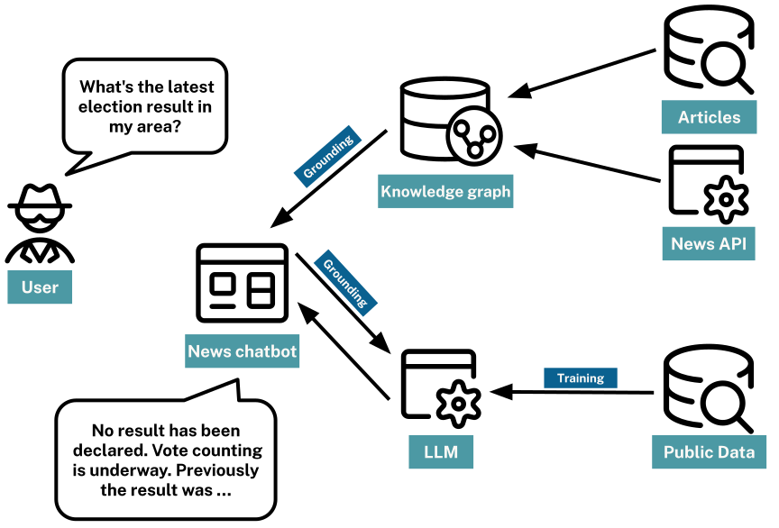

= Grounding an LLM
:order: 4
:type: lesson

[slide.discrete]
== Grounding

_Grounding is the process of providing context to an LLM to improve the accuracy of its responses._
_Grounding allows a language model to reference external, up-to-date sources or databases to enrich the responses._

[.slide]
== Retrieval Augmented Generation

For instance, if building a chatbot for a news agency, instead of solely relying on the model’s last training data, grounding could allow the model to pull real-time headlines or articles from a news API. 
When a user asks, "What’s the latest news on the Olympics?", the chatbot, through grounding, can provide a current headline or summary from the most recent articles, ensuring the response is timely and accurate.

This approach is known as **Retrieval Augmented Generation**, or **RAG**

RAG combines the strengths of large-scale language models with external retrieval or search mechanisms, enabling you to feed relevant information from vast datasets into the model.

In summary, by adding content from additional data sources, you can improve the responses generated by an LLM.

[WARNING]
.Bad data in, bad data out
====
When prompting the LLM to respond based on the context provided, the answer will always be as good as the provided context.

If your prompt suggests pineapple as a pizza topping, don't be surprised if it suggests that you order a Hawaiian Pizza.
====

[.slide.discrete.col-2]
== News Agency Chatbot

[.col]
====
RAG could support the new agency chatbot by:

. Accessing real-time new feeds
. Pulling recent headlines or news articles from a database,
. Giving this additional context to the LLM

New articles stored in a knowledge graph would be ideal for this use case. A knowledge graph could pass the LLM detail about the relationship between the entities involved and the article's metadata.

For example, when asking about the results of a recent election, the knowledge could provide additional context about the candidates, news stories relating to them, or interesting articles from the same author.
====

[.col]
====

====

[.slide.discrete]
== RAG approaches
During the workshop, you will explore approaches for implementing RAG with Neo4j, including:

* Semantic Search
* Zero-shot and few-shot learning and prompts
* Text embedding and vector indexes with unstructured data
* Cypher generation to gather structured data from a knowledge graph

[.next]
== Continue

When you are ready, you can move on to the next task.

read::Move on[]

[.summary]
== Lesson Summary

You learned about grounding and Retrieval Augmented Generation (RAG) and how to improve the responses generated by an LLM.

Next, you will use a chat model to provide context to an LLM.