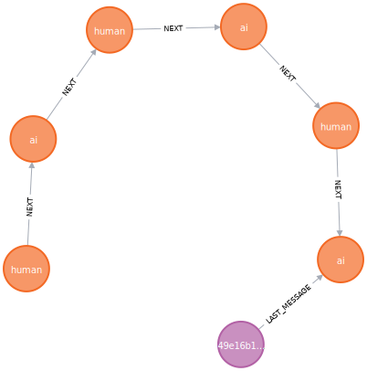

= Chat models
:order: 5
:type: challenge
:branch: main

[slide.discrete]
== Chat model

Until now, you have been using a language model to communicate with the LLM. 
A language model predicts the next word in a sequence of words. 
Chat models are designed to have conversations.

Open the `2-llm-rag-python-langchain\chat_model.py` file.

[.transcript-only]
====
.chat_model.py
[source,python]
----
include::{repository-raw}/{branch}/2-llm-rag-python-langchain/chat_model.py[tag=**]
----
====

Review this program and identify the following:

* The prompt is a series of messages ("system" and "human")
* The chain consists of the prompt, a `ChatOpenAI` object and an output parser
* The question is passed to the chat model as a parameter of the `invoke` method.

Run the program and note how the LLM responds to the question.

[.slide]
== Giving context

Currently, the chat model is not grounded; it is unaware of surf conditions on the beach. 
It responds based on the question and the LLMs training data (which could be months or years out of date).

You can ground the chat model by providing additional information in the prompt.

Open the `2-llm-rag-python-langchain\chat_model_context.py` file.

[.transcript-only]
====
.chat_model_context.py
[source,python]
----
include::{repository-raw}/{branch}/2-llm-rag-python-langchain/chat_model_context.py[tag=**]
----
====

[.slide.discrete]
== Context

The prompt contains an additional `context` system message to pass the surf conditions to the LLM.

[source,python]
----
include::{repository-raw}/{branch}/2-llm-rag-python-langchain/solutions/chat_model_context.py[tag=prompt]
----

[.slide.discrete]
== Current weather

The `current_weather` variable contains the surf conditions for three beaches.

[source,python]
----
include::{repository-raw}/{branch}/2-llm-rag-python-langchain/solutions/chat_model_context.py[tag=context]
----

[.slide.discrete]
== Context

The program invokes the chat model using the `current_weather` as the `context`.

[source,python]
----
include::{repository-raw}/{branch}/2-llm-rag-python-langchain/solutions/chat_model_context.py[tag=invoke]
----

Run the program and predict what the response will be.

[.transcript-only]
====
[%collapsible]
.Click to reveal the response
=====
Below is a typical response. The LLM has used the context passed in the prompt to provide a more accurate response.

    Dude, the surf at Watergate Bay is pumping! We got some sick 3ft waves rolling in, but unfortunately, we got some onshore winds messing with the lineup. But hey, it's all good, still plenty of stoke to be had out there!
=====
====

Investigate what happens when you change the context by adding additional beach conditions.

Providing context is one aspect of Retrieval Augmented Generation (RAG). 
In this program, you _manually_ gave the model context; however, you could have retrieved real-time information from an API or database.

[.slide]
== Memory

For a chat model to be helpful, it must remember what messages have been sent and received.

Without a memory the conversation may go in circles:

    [user] Hi, my name is Martin

    [chat model] Hi, nice to meet you Martin

    [user] Do you have a name?

    [chat model] I am the chat model. Nice to meet you. What is your name?

[.slide]
== Add Memory to the Chat Model
You are going to add a memory to the chat model code.

You will modify the program to store the chat history in Neo4j and pass it to the LLM in the prompt.

You will need to:

. Connect to the Neo4j database
. Create a function that returns a `Neo4jChatMessageHistory` component that will store the chat history
. Modify the prompt to include the chat history
. Wrap the chat chain in a link:https://python.langchain.com/v0.2/docs/concepts/#runnable-interface[_Runnable_] that will store and retrieve the chat history

[.slide.col-2]
== Add History to the Prompt

[.col]
====
Importing the required classes.

[source, python]
----
include::{repository-raw}/{branch}/2-llm-rag-python-langchain/solutions/chat_model_memory.py[tag=imports]
----
====

[.col]
====
As each call to the LLM is stateless, you need to include the chat history in every call to the LLM. 
You can modify the prompt template to include the chat history as a list of messages using a `MessagesPlaceholder` object.

[source, python]
----
include::{repository-raw}/{branch}/2-llm-rag-python-langchain/solutions/chat_model_memory.py[tag=prompt]
----
====

[.slide]
== Session ID

You must create and assign a session ID to each conversation to identify them.
You can generate a random UUID using the Python `uuid.uuid4` function.

Create a new `SESSION_ID` constant in your chat model program.

[source, python]
----
include::{repository-raw}/{branch}/2-llm-rag-python-langchain/solutions/chat_model_memory.py[tag=session-id]
----

[.slide]
== Neo4j Chat Message History

Create a `Neo4jGraph` object to connect to your Neo4j sandbox.

[source, python]
----
include::{repository-raw}/{branch}/2-llm-rag-python-langchain/solutions/chat_model_memory.py[tag=neo4j-graph]
----

Create a callback function that will return a `Neo4jChatMessageHistory` object to the chain. 

[source, python]
----
include::{repository-raw}/{branch}/2-llm-rag-python-langchain/solutions/chat_model_memory.py[tag=get-memory]
----

[.slide]
== Chat Message History

You can now create a new chain using the `RunnableWithMessageHistory`, passing the `chat_chain` and the `get_memory` function.

[source, python]
----
include::{repository-raw}/{branch}/2-llm-rag-python-langchain/solutions/chat_model_memory.py[tag=chat-history]
----

When you call the `chat_with_message_history` chain, the user's question and the response will be stored in the `ChatMessageHistory` memory component.

Every subsequent call to the `chat_with_message_history` chain will include the chat history in the prompt.

[.slide]
== Invoke the Chat Model

Put the call to the `chat_with_message_history` chain in a loop.

[source, python]
----
include::{repository-raw}/{branch}/2-llm-rag-python-langchain/solutions/chat_model_memory.py[tag=loop]
----

[NOTE]
The `SESSION_ID` is passed to the chain in the `invoke` configuration.

[.transcript-only]
====
[%collapsible]
.Click to reveal the complete code.
=====
[source,python]
----
include::{repository-raw}/{branch}/2-llm-rag-python-langchain/solutions/chat_model_memory.py[tag=**]
----
=====
====

Run the program and ask the LLM a few questions and note how the LLM can now response based on the conversation history.

[.transcript-only]
====
    [user] Hi, I'm down at Watergate Bay.

    [chat model] Hey dude, stoked to hear you're at Watergate Bay! How's the surf looking over there?

    [user] It's good, do you know the forecast here?

    [chat model] Right on, dude! The surf at Watergate Bay is firing with 3ft waves and some onshore winds.
====

[.slide]
== Conversation History Graph

The conversation history is stored using the following data model:

[.slide.discrete.col-60-40]
== Conversation History Graph

[.col]
====
You can return the graph of the conversation history using the following Cypher query:

[source, cypher]
----
MATCH (s:Session)-[:LAST_MESSAGE]->(last:Message)<-[:NEXT*]-(msg:Message)
RETURN s, last, msg
----
====

[.col]
====

====

[.next]
== Continue

When you are ready, you can move on to the next task.

read::Move on[]

[.summary]
== Lesson Summary

You learned how to use an LLM chat model, give it context, and store the conversation memory in Neo4j.

In the next lesson, you will learn how to create agents.