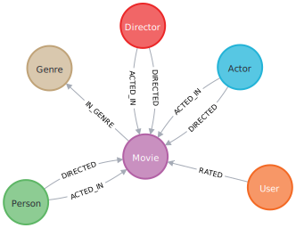

= Centrality and Importance
:type: lesson
:order: 2

[.transcript]
== Introduction
Centrality algorithms are used to determine the importance of distinct nodes in a graph.

Common use cases of centrality include:

* *Recommendations:* Identify and recommend the most influential or popular items in your content or product offering catalog
* *Supply chain analytics:* find the most critical node in your supply chain, whether it be a supplier in a network, a raw material that is part of a manufactured product, or a port in a route
* *Fraud & Anomaly Detection*: Find users with many shared identifiers or who otherwise act as a bridge between many communities

=== Degree Centrality Example

Degree centrality is one of the most ubiquitous and simple centrality algorithms.  It counts the number of relationships a node has. In the GDS implementation, we specifically calculate _out-degree_ centrality which is the count of outgoing relationships from a node. Below is an example of using degree centrality to count the number of movies each actor has acted in.

During this module, you will be using a _movie recommendations_ dataset that contains information about movies, actors, and users who have rated movies.

First create the graph projection of `Actor` and `Movie` nodes:

[source,cypher]
----
CALL gds.graph.project(
  'proj', 
  ['Actor','Movie'], 
  'ACTED_IN'
  );
----

Then stream the degree centrality to find the actors who have acted in the most movies:

[source,cypher]
----
//get top 5 most prolific actors (those in the most movies)
//using degree centrality which counts number of `ACTED_IN` relationships
CALL gds.degree.stream('proj')
YIELD nodeId, score
RETURN 
  gds.util.asNode(nodeId).name AS actorName, 
  score AS numberOfMoviesActedIn
ORDER BY numberOfMoviesActedIn DESCENDING, actorName LIMIT 5
----

The top three actors should be "Robert De Niro", "Bruce Willis", and "Nicolas Cage."

=== PageRank Example
Another common centrality algorithm is PageRank. PageRank is a good algorithm for measuring the influence of nodes in a directed graph, particularly where the relationships imply some form of _flow_ of movement such as in payment networks, supply chain and logistics, communications, routing, and graphs of website and links.

PageRank was originally developed by Google co-founders Larry Page and Sergey Brin at Stanford University in 1996 as part of a research project about a new kind of search engine. It has since been used by Google Search to rank web pages in their search engine results.

In summary, PageRank estimates the importance of a node by counting the number of incoming relationships from neighboring nodes weighted by the importance and out-degree centrality of those neighbors. The underlying assumption is that more important nodes are likely to have proportionately more incoming relationships from other important nodes. https://neo4j.com/docs/graph-data-science/current/algorithms/page-rank/[Our PageRank documentation^] offers a thorough technical explanation of PageRank if you are interested in digging in deeper.

Below is an example of applying PageRank to find the most influential persons in the Director -> Actor network from movies released on or after 1990 with a revenue of at least 10 Million dollars.

First, create the graph projection. We can use a Cypher projection to create an in-memory graph with `:DIRECTED_ACTOR` relationships between two `(:Person)` nodes. This graph can be traversed to understand the influence across directors and actors.

[source,cypher]
----
// drop last graph projection
CALL gds.graph.drop('proj', false);

// create Cypher projection for network of people directing actors
// filter to recent high grossing movies
MATCH (source:Person)-[:DIRECTED]->(m:Movie)<-[:ACTED_IN]-(target)
WHERE m.year >= 1990 AND m.revenue >= 10000000
WITH source, target, count(*) as actedWithCount
WITH gds.graph.project(
  'proj',
  source,
  target,
  {
    relationshipType: "DIRECTED_ACTOR"
  }
) as g
RETURN
  g.graphName AS graph, g.nodeCount AS node, g.relationshipCount AS rels
----

Next stream PageRank to find the top 5 most influential people in director-actor network.

[source,cypher]
----
CALL gds.pageRank.stream('proj')
YIELD nodeId, score
RETURN 
  gds.util.asNode(nodeId).name AS personName, 
  score AS influence
ORDER BY influence DESCENDING, personName LIMIT 5
----

The top three persons should be "Robert De Niro", "Greg Kinnear", and "Sandra Bullock."

=== Other Centrality Algorithms
Other GDS production tier centrality algorithms include:

* *Betweenness Centrality*: Measures the extent to which a node stands between the other nodes in a graph. It is often used to find nodes that serve as a bridge from one part of a graph to another.
* *Eigenvector Centrality*: Measures the transitive influence of nodes. Similar to PageRank, but works only on the largest eigenvector of the adjacency matrix so does not converge in the same way and tends to more strongly favor high degree nodes.  It can be more appropriate in certain use cases, particularly those with undirected relationships.
* *Article Rank*: A variant of PageRank which assumes that relationships originating from low-degree nodes have a higher influence than relationships from high-degree nodes.

A full list of centrality algorithms across all product tiers can be found in https://neo4j.com/docs/graph-data-science/current/algorithms/centrality/[the Centrality section of the GDS documentation^].

=== Check your understanding

include::questions/1-algorithm-purpose.adoc[leveloffset=+1]

include::questions/2-name-the-algorithm.adoc[leveloffset=+1]

[.summary]
== Summary
In this lesson you learned about centrality in GDS.  We went over common use cases and how to run some of the most popular centrality algorithms in GDS.

