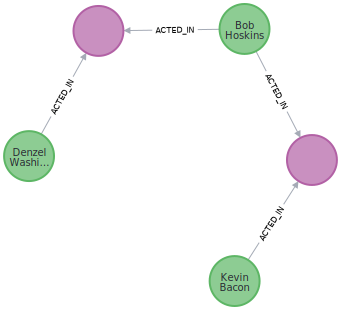

= Path Finding
:type: lesson
:order: 4

[.transcript]
== Introduction
Path finding algorithms find the shortest path between two or more nodes or evaluate the availability and quality of paths.

Common use cases of path finding are:

* *Supply chain analytics*: Identifying the fastest path between an origin and a destination or between a raw material and a finished product
* *Customer Journey*: Analyzing the events that make up a customer's experience. In healthcare for example, this can be the experience of an in-patient from admission to discharge.

=== Dijkstra Source-Target Shortest Path
A common, industry standard, path finding algorithm is Dijkstra. It computes the shortest path between a source and a target node. Like many other path finding algorithms in GDS, Dijkstra supports weighted relationships to account for distance or another cost property when comparing paths.

Below is an example of using Dijkstra source-target shortest path to find the shortest path between the actors "Kevin Bacon" and "Denzel Washington".

First, create the graph projection.

[source,cypher]
----
CALL gds.graph.project('proj',
    ['Person','Movie'],
    {
        ACTED_IN:{orientation:'UNDIRECTED'},
        DIRECTED:{orientation:'UNDIRECTED'}
    }
);
----

Then we can run Dijkstra's shortest path.

[source,cypher]
----
MATCH (kevin:Actor{name : 'Kevin Bacon'})
MATCH (denzel:Actor{name : 'Denzel Washington'})

CALL gds.shortestPath.dijkstra.stream(
    'proj', 
    {
        sourceNode:kevin, 
        TargetNode:denzel
    }
)

YIELD sourceNode, targetNode, path
RETURN sourceNode, targetNode, nodes(path) as path;
----

This should give you a path consisting of four relationships between Kevin Bacon and Denzel Washington.

=== Other Path Finding Algorithms
Other GDS production tier Path Finding algorithms can be split into a few different subcategories that are listed below:

Shortest path between _two_ nodes:

* *Apass:[* ] Shortest Path:* An extension of Dijkstra that uses a heuristic function to speed up computation.
* *Yen’s Algorithm Shortest Path:* An extension of Dijkstra that allows you to find multiple, the top _k_, shortest paths.

Shortest path between a source node and multiple other target nodes:

* *Dijkstra Single-Source Shortest Path:* Dijkstra implementation for shortest path between one source and multiple targets.
* *Delta-Stepping Single-Source Shortest Path:* Parallelized shortest path computation. Computes faster than Dijkstra single-source shortest Path but uses more memory.

General path search between a source node and multiple other target nodes:

* *Breadth First Search:* Searches paths in order of increasing distance from the source node on each iteration.
* *Depth First Search:* Searches as far as possible along a single multi-hop path on each iteration.

A full list of path finding algorithms across all product tiers can be found in the https://neo4j.com/docs/graph-data-science/current/algorithms/pathfinding/[Pathfinding documentation^].

== Check your understanding

include::questions/1-algorithm-purpose.adoc[leveloffset=+1]

include::questions/2-name-the-algorithm.adoc[leveloffset=+1]

[.summary]
== Summary
In this lesson you learned about path finding in GDS. We went over common use cases and how to run an example to identify shortest paths in GDS.

In the next lesson, you will use this knowledge to execute a Shortest Path algorithm.