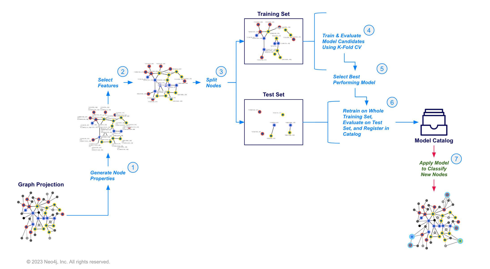

= Node Classification Pipeline
:type: lesson
:order: 2

[.transcript]
== Introduction
In this lesson you will learn how to use node classification in GDS.  This includes configuring and executing the pipeline as well as how to make predictions with the resulting modeling object.

=== Node Classification Pattern in GDS
Below is an illustration of the high level node classification pattern in GDS, going from a projected graph through various steps to finally registering a model and making predictions on your data.

In practice, steps 1-6 will be executed automatically by the pipeline. You will just be responsible for providing configuration and hyperparameters for them. So at a high level, your workflow will look like the following for node classification, this will be the same for link prediction as well:

. Project a graph and configure the pipeline (the order doesn’t matter).
. Execute the pipeline with a `train` command.
. Predict on a projected graph with the `predict` command.  The predictions can then be written back to the database if desired using graph write operations.

=== Example: Predicting Movie Genre with Node Classification

==== Setting up the Problem

For this example, we will train a model to predict which movies in the graph are comedies which we will define as any movie that has a `Genre` of "Comedy".

`Genre` is currently represented by its own node in the graph.  For this problem we need it represented as a property of the `Movie` node.  For demonstration purposes we will assign a `cls` property which is 1 if the movie is a comedy and 0 otherwise.

[source,cypher]
----
MATCH(m:Movie)-[:IN_GENRE]->(g)
WITH m , collect(g.name) AS genres
SET m.cls = toInteger('Comedy' IN genres)
RETURN count(m), m.cls;
----

The `Movie` node also has some missing property values for `runtime` and `imdbRating`, which could carry predictive signal for this problem. In a real-world scenario we may want to impute values for these, for purposes of quick demonstration we will just exclude them from the sample via label assignment. While we do this we will filter the movies to only consider those released on or after 2010 as this type of data may drift overtime making data further in the past less relevant.

[source,cypher]
----
MATCH(m:Movie)
WHERE m.year >= 2010
    AND m.runtime IS NOT NULL
    AND m.imdbRating IS NOT NULL
SET m:TrainMovie
RETURN count(m)
----

Now we can project a graph using the `TrainMovie` node label. We will project mirroring natural and reverse relationships then use `collapsePath` to provide a monopartite projection which will make the graph easier to handle inside the pipeline for a quick demonstration.

[source,cypher]
----
CALL gds.graph.project('proj',
    {
        Actor:{},
        TrainMovie:{ properties: ['cls', 'imdbRating', 'runtime']}
    },
    {
        ACTED_IN:{},
        HAD_ACTOR:{type:'ACTED_IN', orientation:'REVERSE'}
    }
);

CALL gds.beta.collapsePath.mutate('proj',
  {
    pathTemplates: [['HAD_ACTOR', 'ACTED_IN']],
    allowSelfLoops: false,
    mutateRelationshipType: 'SHARES_ACTOR_WITH'
  }
) YIELD relationshipsWritten;
----

==== Configure the Pipeline

The configuration steps are as follows. Technically they need not be configured in order, though it helps to do so to make things easy to follow.

. Create the Pipeline
. Add Node Properties
. Select Node Properties as Features
. Configure Node Splits
. Add Model Candidates

To get started, create the pipeline by running the following command

[source,cypher]
----
CALL gds.beta.pipeline.nodeClassification.create('pipe')
----

Once that is complete we will add node properties.  A node classification pipeline can execute one or several GDS algorithms in mutate mode that create node properties in the projection.

For our problem, let’s do a few things

First, lets generate FastRP embeddings which will encapsulate the locality of movie nodes in the graph

[source,cypher]
----
CALL gds.beta.pipeline.nodeClassification.addNodeProperty('pipe', 'fastRP', {
  embeddingDimension: 32,
  randomSeed: 7474,
  mutateProperty:'embedding'
})
YIELD name, nodePropertySteps;
----

Next, we can add degree centrality which will measure the number of other movies that share actors.

[source,cypher]
----
CALL gds.beta.pipeline.nodeClassification.addNodeProperty('pipe', 'degree', {
  mutateProperty:'degree'
})
YIELD name, nodePropertySteps;
----

Lastly, we will scale the runtime property which is good practice for values like this one that are relatively high magnitude compared to the other properties.

[source,cypher]
----
CALL gds.beta.pipeline.nodeClassification.addNodeProperty('pipe', 'alpha.scaleProperties', {
  nodeProperties: ['runtime'],
    scaler: 'Log',
  mutateProperty:'logRuntime'
})
YIELD name, nodePropertySteps;
----

Once the properties are configured, we can configure the subset of node properties that we want to use as features for the model

[source,cypher]
----
CALL gds.beta.pipeline.nodeClassification.selectFeatures(
    'pipe',
    ['imdbRating', 'logRuntime', 'embedding', 'degree'])
YIELD name, featureProperties;
----

After that we can configure the data splitting. In this case, it is fairly straightforward.  We configure a `testFraction` which determines how to randomly split between test and training nodes. Since the pipeline uses a cross-validation strategy, we can also set the number of validation folds we want here.

[source,cypher]
----
CALL gds.beta.pipeline.nodeClassification.configureSplit('pipe', {
 testFraction: 0.2,
  validationFolds: 5
})
YIELD splitConfig;
----

The final step to pipeline configuration is creating model candidates.  The pipeline is capable of running multiple models with different training methods and hyperparameter configurations. The best performing model will be selected after the training step completes.

To demonstrate, we will just add a few different logistic regressions here with different penalty hyperparameters. GDS also has a random forest model and there are more hyperparameters for each that we could adjust, see the https://neo4j.com/docs/graph-data-science/current/machine-learning/training-methods/[Training methods docs^] for more details.

[source,cypher]
----
CALL gds.beta.pipeline.nodeClassification.addLogisticRegression('pipe', {penalty: 0.0})
YIELD parameterSpace;
----

[source,cypher]
----
CALL gds.beta.pipeline.nodeClassification.addLogisticRegression('pipe', {penalty: 0.1})
YIELD parameterSpace;
----

[source,cypher]
----
CALL gds.beta.pipeline.nodeClassification.addLogisticRegression('pipe', {penalty: 1.0})
YIELD parameterSpace;
----

==== Train the Pipeline

The following command will train the pipeline. This process will

. Apply node and relationship filters
. Execute the above pipeline configuration steps
. Train with cross-validation for all the candidate models
. Select the best candidate according to the `metric` parameter.  We will use `ACCURACY` for ease of interpretation but other F1 and precision/recall metrics exists, you can reference them in  https://neo4j.com/docs/graph-data-science/current/machine-learning/nodeclassification-pipelines/#nodeclassification-pipeline-metrics[the documentation node classification pipelines documentation here^]
. Retrain the winning model on the entire training set and perform a final evaluation on the test set according to the `metric`
. Register the winning model in the model catalog

[source,cypher]
----
CALL gds.beta.pipeline.nodeClassification.train('proj', {
  pipeline: 'pipe',
  targetNodeLabels: ['TrainMovie'],
  modelName: 'nc-pipeline-model',
  targetProperty: 'cls',
  randomSeed: 7474,
  metrics: ['ACCURACY']
}) YIELD modelInfo
RETURN
  modelInfo.bestParameters AS winningModel,
  modelInfo.metrics.ACCURACY.train.avg AS avgTrainScore,
  modelInfo.metrics.ACCURACY.outerTrain AS outerTrainScore,
  modelInfo.metrics.ACCURACY.test AS testScore;
----

This command should output training scores according to `metric`. In this case we will get an accuracy of ~70%. Certainly a lot of room for improvement given the class balance. There are plenty of ways this problem could be remodeled with different features from the graph.

==== Predict with the Pipeline

The operation for predicting with the trained model and writing back to the graph has the following form

[source,cypher,role=noplay]
----
CALL gds.beta.pipeline.nodeClassification.predict.write(
  graphName: String,
  configuration: Map
)
YIELD
  preProcessingMillis: Integer,
  computeMillis: Integer,
  postProcessingMillis: Integer,
  writeMillis: Integer,
  nodePropertiesWritten: Integer,
  configuration: Map
----

The operation also supports `stream` and `mutate` execution modes.

You can use this to classify newly added nodes or nodes in other regions of the graph.  We will not go over a specific example here (We will spend some time on using `predict` in the link prediction lesson).

=== Check your understanding

include::questions/1-ml-steps.adoc[leveloffset=+2]

include::questions/2-pipeline-execution.adoc[leveloffset=+2]

[.summary]
== Summary

In this lesson you learned how node classification works in GDS and how to configure, execute, and predict with a pipeline.  As always, our https://neo4j.com/docs/graph-data-science/current/machine-learning/node-property-prediction/nodeclassification-pipelines/node-classification/[Node classification pipelines documentation^] contains more in depth resources on node classification methodology and configuration.
