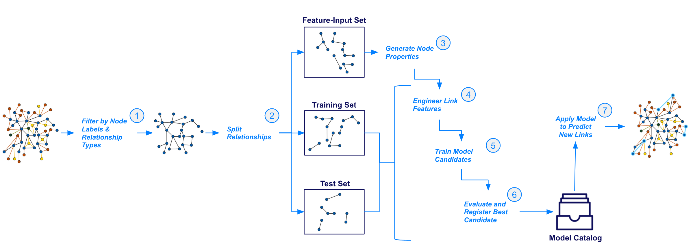

= Link Prediction
:type: quiz

// [.video]
// video::xxxx[youtube,width=560,height=315]

[.transcript]
== Introduction

Link Prediction is the machine learning task of predicting relationships or “links” between nodes. It has broad applications across recommendation systems, fraud detection, entity resolution, social networks, supply chain & logics, and more.

//may need to cut a lot of this introduction
While of high utility, Link prediction is susceptible to many of the model design issues we discussed at the beginning of this module, namely severe class imbalance, data leakage, and performance issues when data sampling is not approached thoughtfully.

Going into full detail on proper model design for link prediction is out of scope of this course.  It is a rather involved subject that requires an intermediate understanding of data modeling and statistical concepts.  In fact, this is a primary reason for why we developed Link Prediction pipelines in the first place: to solve for the class imbalance, data leakage, and performance issues in our implementation, so you can avoid common pitfalls and focus more on higher-level Machine Learning strategy.

As such we will go over link prediction in GDS at only a high-level in this lesson so you are able to use it within the GDS ecosystem.  We will spare lower level model & pipeline design details and reference documentation for further explanation on some of the more nuanced concepts where they are written to in more length.

=== Link Prediction in GDS

At Neo4j, we are quickly iterating and developing upon our link prediction model and pipeline.  GDS currently offers a binary classifier where the target is a 0-1 indicator, 0 for no link, 1 for a link with either a logistic regression or random forest model.  This type of link prediction works really well on an undirected graph where you are predicting one type of relationship between nodes of a single label, such as for social network and entity resolution problems.

=== Link Prediction Pipeline

//possible updates to this figure
Below is a diagram of how the Link Prediction pipeline is executed going from a projected graph, through node/relationship filtering, data splitting and feature engineering steps, to training and producing a model for the catalog, then finally to prediction.

Like with node classification, these steps get configured in a pipeline.  We will go over how to configure these steps in the next lesson.  In this lesson we will cover some high level concepts

. Negative Sampling & Weighting Methodology
. Link Feature Engineering
. Relationship Splitting & Node Properties

=== Negative Sampling & Weighting Methodology
For a supervised machine learning classifier to work, it needs both positive and negative examples.  Within the context of link prediction a positive example is any node pair with connected by a relationship or "link" and a negative example is any node pair that isn't connected by a link.

The number of possible links in an undirected graph is stem:[{N(N-1)}/2] where stem:[N] is the number of nodes.  In most real-world graph use cases you will have far fewer relationships than this maximum possible in the graph, meaning that most node pairs will not have relationships between them and the number of possible pairs is very, very large. For example, if you have 100,000 nodes in your graph you have almost 5,000,000,0000 possible links.  This leads to an extreme class imbalance problem and a very large potential sample size that, without a mechanism to narrow down the sample space, could render the link prediction slow to infeasible.

The GDS Link Prediction Pipeline has two parameters to handle this problem.  The first is the *negative sampling ratio* that determines the rate of negative example sampling relative to the number of positive examples. For example, setting the negative sample ratio to 3.0 would randomly select node pairs at 3 times the rate of positive node pairs, So if there are 100 links in the train/test set 300 node pairs without links between them will be selected randomly to serve as negative examples. The second is a negative sample weight which determines the weighting of negative examples during model evaluation, this can be used to re-balance the probability mass to better understand how the model will perform in the real-world under varying levels of class imbalance.

We will go over setting these in more detail in the next lesson.

=== Link Feature Engineering

Link Prediction in GDS generates features from numeric node properties with a *link feature function*.

There are currently 3 supported link feature functions.  Define a node pair between nodes stem:[i] and stem:[j] and let stem:[n_i] and stem:[n_j] be their respective property vectors.

[options="header"]
|==============================================================================================================================================
| Link Feature Type  | Formula                                                                                                          | Description
| L2                 | stem:[f_{i,j} = \[(n_{i,1} - n_{j,1})^2, (n_{i,2} - n_{j,2})^2,..., (n_{i,K} - n_{j,K})^2\] ]                    | Squared Difference
| HADAMARD           | stem:[f_{i,j} = \[n_{i,1} * n_{j,1}, n_{i,2} * n_{j,2},..., n_{i,K} * n_{j,K}\] ]                                | Hadamard product
| COSINE             | stem:[f_{i,j} = \frac{sum_(k=1)^K n_{i,k} * n_{j,k}}{sqrt(sum_(k=1)^K n_{i,k}^2)sqrt(sum_(k=1)^K n_{j,k}^2)}]    | Cosine Similarity
|==============================================================================================================================================

These functions are symmetric, so the ordering of stem:[i] and stem:[j] in the pair doesn't matter. A link feature can be generated from a single node property or a concatenation of multiple and a pipeline can include one or multiple link features.

[Thomaz-like Diagram here maybe]

Note that only the link features are used in the link prediction model - not the original node properties.

=== Relationship Splitting and the Feature-Input Set
Often when using link prediction, you only want to predict links of a certain type - a subset of all the relationship types in the graph.  The pipeline allows you to filter by relationship types and node labels, but it is the first step in the pipeline, meaning that all subsequent pipeline steps will only operate on this subset.  This means that there are two places node properties can come from:

. *Endogenous Node Properties:* Meaning the node properties are engineered from the subset of relationships being predicted in the pipeline via algorithms like embeddings, centrality, etc.
. *Exogenous Node Properties:* The node properties are NOT engineered from the relationships being predicted in the pipeline. Meaning they were either present in the source data or were engineered from relationships not included in the subset being filtered to in the pipeline.

Exogenous node properties can be calculated outside the pipeline and should not cause data leakage problems.
Endogenous node properties will cause data leakage in the pipeline if not treated correctly as they create situations where the model can use information about a relationship's existence to predict it's existence, basically allowing the model to cheat and overestimate performance.  To avoid this data leakage, there is a specific `NodeProperties` step in the pipeline to calculate the properties as well as special data splitting strategy.

Unlike a tradition ML workflow that splits data into a Train and Test set, the GDS Link Prediction Pipeline also includes a third *Feature-Input* set.

The Feature-Input set is hold-out we use for the endogenous node properties.  Relationships are randomly selected to go into each of three sets including the Feature-Input set.  When we calculate node properties inside the pipeline we will only use the feature input set. This fixes the data leakage problem, as the relationships set aside in the feature-input set will now be completely seperated from the relationships used in training and test.

=== Evaluation Metric - AUCPR
To evaluate model candidates the link prediction pipeline uses the Area Under the Precision-Recall Curve (AUCPR) metric. Precision measures the proportion of positive predictions that are true positives, while recall measures the ratio of positive examples that were identified by the model.  AUCPR basically measures the trade-off between these two metrics, it is bound between [0,1] with 1 being a perfect score.  AUCPR is a good metric for imbalanced datasets where there are far fewer positive examples then negative examples. When applied to imbalanced data AUCPR will often be lower than AUC based on the Receiver Operator Characteristic (ROC) but gives you a better picture of performance trade-offs in a real-world production setting. See the https://neo4j.com/docs/graph-data-science/current/machine-learning/linkprediction-pipelines/#linkprediction-pipelines-classimbalance:[Link Prediction Pipelines documentation^] for more information.

== Check your understanding

[.summary]
== Summary
