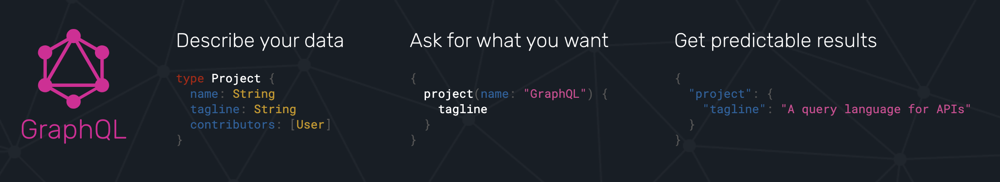
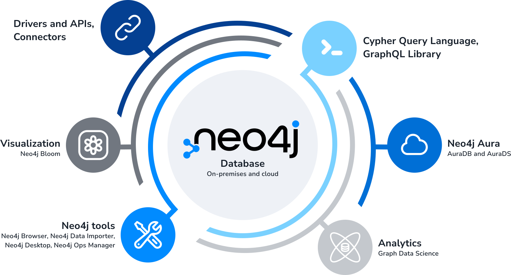

= Introduction To GraphQL
:order: 1

== What is GraphQL?

GraphQL is an API query language and runtime for fulfilling operations such as queries. 

GraphQL uses a type system to define the data available in the API, including what entities and attributes (known as *types* and *fields* in GraphQL) exist and how types are connected (the data graph). 

[source,GraphQL]
----
type Course {
  title: String
  author: String
  credits: Int
}
----

GraphQL operations (queries, mutations, or subscriptions) specify an entry-point and the expected data.

[source,GraphQL]
----
{
  Course {
    title
    author
  }
}
----

The response to a GraphQL operation will return the data requested.

[source,json]
----
{
  "data": {
    "Course": [
      { 
        "title": "Introduction to Neo4J & GraphQL", 
        "author": "neo4j" 
      }
    ]
  }
}
----

== Graphs, GraphQL and Neo4j

Graphs provide a natural way to represent data, where Nodes (or vertices) that represent entities that can be connected by Relationships (or edges). 

GraphQL itself is a database-agnostic query language. Many database providers offer libraries that convert a GraphQL operation into a query language that works with the underlying data store e.g. SQL for relational databases and Cypher for graph databases. 

Depending on the underlying data store and the data itself, the GraphQL library may need to undertake significant transformation and relationship mapping to access and make sense of the data, leading to the creation of unnatural tables with strange names are created, duplicated data to improve query response times and resulting in technical debt.

This is where Neo4j comes in. Neo4j is a native graph database that stores data in a graph structure. Neo4j is a natural fit for GraphQL as the GraphQL type system can map directly to the data graph.

The Neo4j Graph Platform is a complete solution for building graph applications and includes:

* The Neo4j DBMS
* The property graph data model
* The Cypher statement language
* Language drivers using the Bolt protocol for building applications
* Graph analytics with Graph Data Science
* Data visualization with Neo4j Bloom
* Neo4j Aura database-as-a-service
* A GraphQL integration for building GraphQL APIs backed by Neo4j

[TIP]
.The Graph In GraphQL
====
You can learn more about _The Graph In GraphQL_ in this article - link:https://www.smashingmagazine.com/2023/03/consider-graphs-graphql-project/[https://www.smashingmagazine.com/2023/03/consider-graphs-graphql-project/]
====

=== GraphQL Concepts

It is important to have an understanding of the key GraphQL concepts:

* Type Definitions
* Operations
* Selection set
* Resolver functions

\... before exploring GraphQL's use with Neo4j. 

The https://graphql.org/[official GraphQL site^] is a great place if you want to learn more about GraphQL.

==== GraphQL Type Definitions

GraphQL type definitions define the data available in the API. These type definitions are typically defined using the GraphQL Schema Definition Language (SDL), a language-agnostic way of expressing the types.

This example type definition describes a `Course` and `Lesson` type with a relationship between them:

[source,GraphQL]
----
type Course {
  title: String
  author: String
  credits: Int
  lessons: [Lesson]
}

type Lesson {
  title: String
  content: String
  optional: Boolean
}
----

==== GraphQL Operations

Each GraphQL operation is either a Query, Mutation, or Subscription. 

The following query will return course data as described by the type definitions:

[source,GraphQL]
----
{
  Course(title: "Introduction to Neo4J & GraphQL") {
    title
    author
  }
}
----

The fields of the Query, Mutation, and Subscription types define the entry point for an operation e.g. 

[source,GraphQL]
----
Course(title: "Introduction to Neo4J & GraphQL")
----

==== The Selection Set

The selection set specifies the fields to be returned by a GraphQL operation.

The selection set of this query would return the `Course` `title` and the `title` and `content` for each `Lesson`.

[source,GraphQL]
----
{
  Course(title: "Introduction to Neo4J & GraphQL") {
    title
    lessons() {
      title
      content
    }
  }
}
----

The query can be modified to return the `Course` `author` and `credits` by adding them to the selection set:

[source,GraphQL]
----
{
  Course(title: "Introduction to Neo4J & GraphQL") {
    title
    author
    credits
    lessons() {
      title
      content
    }
  }
}
----

[TIP]
.Traversing the data graph
====
The selection set can be thought of as a traversal through the data graph; a map of the data you want to return.
====

The response to a GraphQL operation will match the shape of the selection set and return the data requested.

[source,json]
----
{
  "data": {
    "Course": [
      {
        "title": "Introduction to Neo4J & GraphQL",
        "author": "neo4j",
        "credits": 25,
        "lessons": [
          {
            "title": "Introduction To GraphQL",
            "content": "GraphQL is an API query language ..."
          }
        ]
      }
    ]
  }
}
----

==== Resolver Functions

GraphQL resolvers are the functions responsible for fulfilling the GraphQL operation. In the context of a query, this means fetching data from a data layer.

[source,javascript]
----
const resolvers = {
  Query: {
    Course: (object, params, context, info) => {
      return context.db.coursesBySearch(params.searchString)
    }
  },
  Course: {
    lesson: (object, params, context, info) => {
      return context.db.lessonForCourse(object.courseId)
    }
  }
}
----

=== Benefits of GraphQL

Some of the benefits of GraphQL include:

* **Efficient data fetching** - GraphQL queries return only the data requested in the selection set, reducing the amount of data transferred over the network.
* The **GraphQL specification** provides a strong definition for GraphQL APIs and tooling.
* **"Graphs all the way down"** - GraphQL can help unify disparate systems and focus API interactions on relationships instead of resources.
* **Developer productivity** - By reasoning about application data as a graph with a strict type system, developers can focus on building applications.

=== GraphQL Challenges

GraphQL is clearly not perfect! It's important to be aware of some of the challenges that come from introducing GraphQL in a system:

* Some well-understood practices from REST don't apply:
    ** HTTP status codes
    ** Error handling
    ** Caching
* Exposing arbitrary complexity to the client and performance considerations
* The n+1 query problem - the nested nature of GraphQL operations can lead to multiple requests to the data layer(s) to resolve a request
* Query costing and rate limiting

Best practices and tooling have emerged to address these challenges, however it's important to be aware of them.

[.quiz]
== Check Your Understanding

include::questions/selection-set.adoc[leveloffset=+1]

include::questions/nplus1.adoc[leveloffset=+1]

[.summary]
== Summary

In this lesson, you were introduced GraphQL. In the next lesson you will setup the Neo4j GraphQL Toolbox to interact with data in a Neo4j database.
