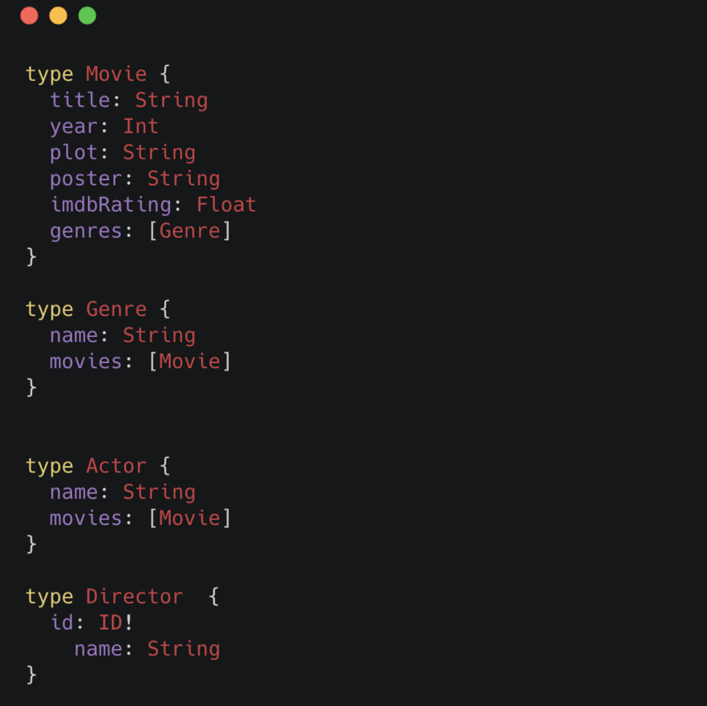
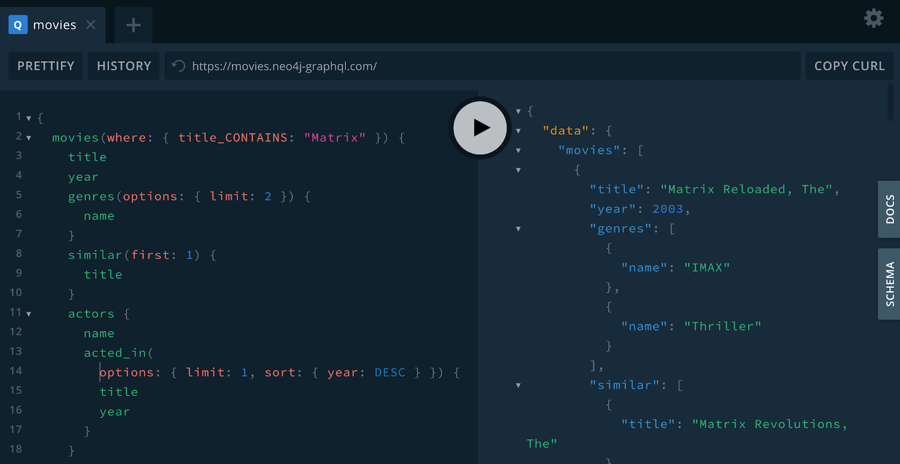

= Introduction To GraphQL
:order: 1

== What is Neo4j?

image::images/01graphplatform.png[The Neo4j Graph Data Platform,width=500,align=center]

Neo4j is a native graph database with many features and functionality making up the Neo4j Graph Platform. Specifically:

* The Neo4j DBMS
* The property graph data model
* The Cypher statement language
* Language drivers using the Bolt protocol for building applications
* Graph analytics with Graph Data Science
* Data visualization with Neo4j Bloom
* Neo4j Aura database-as-a-service
* A GraphQL integration for building GraphQL APIs backed by Neo4j

This course may be completed even if you don't have much Neo4j experience, however we suggest reviewing the https://neo4j.com/developer/graph-platform/[Neo4j Developer Guides^] for a better understanding of some of the features of the Neo4j graph database.

== What is GraphQL?

image::images/01graphqloverview.png[GraphQL Overview,width=500,align=center]

GraphQL is an API query language and runtime for fulfilling those queries. GraphQL uses a type system to define the data available in the API, including what entities and attributes (*types* and *fields* in GraphQL parlance) exist and how types are connected (the data graph). GraphQL operations (queries, mutations, or subscriptions) specify an entry-point and a traversal of the data graph (the *selection set*) which defines what fields to be returned by the operation. See the https://graphql.org/[official GraphQL site^] for a more in-depth overview of GraphQL.

=== Important GraphQL Concepts

==== GraphQL Type Definitions

GraphQL type definitions define the data available in the API. These type definitions are typically defined using the GraphQL Schema Definition Language (SDL), a language-agnostic way of expressing the types. However, type definitions can be also be defined programmatically.

==== GraphQL Operations

Each GraphQL operation is either a Query, Mutation, or Subscription. The fields of the Query, Mutation, and Subscription types define the entry points for an operation. Each operation starts at the field of one of these types.

==== The Selection Set

The selection set specifies the fields to be returned by a GraphQL operation and can be thought of as a traversal through the data graph.

The response to a GraphQL operation matches the shape of the selection set, returning on the data requested.

==== Resolver Functions

GraphQL resolvers are the functions responsible for actually fulfilling the GraphQL operation. In the context of a query, this means fetching data from a data layer.

=== Benefits of GraphQL

Some of the benefits of GraphQL include:

* **Overfetching** - sending less data over the wire
* **Underfetching** - everything the client needs in a single request
* The **GraphQL specification** defines exactly what GraphQL is
* **Simplify data fetching** with component-based data interactions
* **"Graphs all the way down"** - GraphQL can help unify disparate systems and focus API interactions on relationships instead of resources.
* **Developer productivity** - By reasoning about application data as a graph with a strict type system, developers can focus on building applications.

=== GraphQL Challenges

Of course GraphQL is not a silver bullet. It's important to be aware of some of the challenges that come from introducing GraphQL in a system.

* Some well understood practices from REST don't apply
    * HTTP status codes
    * Error handling
    * Caching
* Exposing arbitrary complexity to the client and performance considerations
* The n+1 query problem - the nested nature of GraphQL operations can lead to multiple requests to the data layer(s) to resolve a request
* Query costing and rate limiting

Best practices and tooling have emerged to address all of the above, however it's important to be aware of these challenges.

== What is the Neo4j GraphQL Library?

The fundamental goal of the Neo4j GraphQL Library is to make it easier to build GraphQL APIs backed by Neo4j.

> It's important to point out that GraphQL is an API query language and NOT a database query language. The goal of the Neo4j GraphQL Library is to help build the API layer that sits between the client and database, not to execute GraphQL queries directly against the database.

At a high level, the goals of the Neo4j GraphQL Library are focused on:

* Reducing boilerplate
* Developer productivity
* Extensibility
* Performance

=== Goals of the Neo4j GraphQL Library

==== GraphQL First Development

GraphQL type definitions can drive the database data model, which means we don't need to maintain two separate schemas for our API and database.

==== Auto-generate GraphQL API Operations

With the Neo4j GraphQL Library, GraphQL type definitions provide the starting point for a generated API that includes:

* Query & Mutation types (an API entrypoint for each type defined in the schema)
* Ordering
* Pagination
* Complex filtering
* DateTime & Spatial types and filtering

==== Generate Cypher From GraphQL Operations

To reduce boilerplate and optimize for performance the Neo4j GraphQL Library automatically generates a single database query for any arbitrary GraphQL request. This means the developer does not need to implement resolvers and each GraphQL operation results in a single roundtrip to the database.

==== Extend GraphQL With Cypher

To add custom logic beyond CRUD operations, you can use the https://neo4j.com/docs/graphql-manual/current/type-definitions/cypher/[`@cypher` GraphQL schema directive] to add computed fields bound to a Cypher statement to the GraphQL schema.

=== Neo4j GraphQL Library Quickstart

The focus of this course is using the Neo4j GraphQL Library to build GraphQL APIs backed by the Neo4j graph database.
Each lesson will be a hands-on mix of introducing concepts, examples, exercises, and quizzes.

[IMPORTANT]
As mentioned previously you won't be installing or running the Neo4j GraphQL Library locally, instead you will use the Neo4j GraphQL Toolbox to develop, test, and query your GraphQL API.

However, it's important to understand how to install and get started with the Neo4j GraphQL Library after you have completed this course.

The Neo4j GraphQL Library can be installed using `npm` as shown here:

[source,bash]
----
$ npm install @neo4j/graphql graphql neo4j-driver apollo-server
----

The Neo4j GraphQL Library is a *Node.js* JavaScript library that can be used with JavaScript GraphQL implementations.

[source,JavaScript,role=nocopy]
----
// index.js

const { Neo4jGraphQL } = require("@neo4j/graphql");
const neo4j = require("neo4j-driver");
const { ApolloServer } = require("apollo-server");

const typeDefs = `
    type Movie {
        title: String
        year: Int
        imdbRating: Float
        genres: [Genre] @relationship(type: "IN_GENRE", direction: OUT)
    }

    type Genre {
        name: String
        movies: [Movie] @relationship(type: "IN_GENRE", direction: IN)
    }
`;

const driver = neo4j.driver(
    "bolt://localhost:7687",
    neo4j.auth.basic("neo4j", "letmein")
);

const neoSchema = new Neo4jGraphQL({ typeDefs, driver });

const server = new ApolloServer({
    schema: neoSchema.schema,
    context: ({ req }) => ({ req }),
});

server.listen(4000).then(() => console.log("Online"));
----

Then to start a *local* GraphQL API:

[source,bash]
----
node index.js
----

This will start a *local* GraphQL API and will also serve the GraphQL Playground IDE for querying the API or exploring documentation using GraphQL's introspection feature.

== The Neo4j GraphQL Toolbox

// TODO: short summary of the Neo4j GraphQL toolbox

[.quiz]
== Check Your Understanding

include::questions/nplus1.adoc[leveloffset=+1]

include::questions/ide.adoc[leveloffset=+1]

include::questions/selection-set.adoc[leveloffset=+1]

[.summary]
== Summary

In this lesson, we introduced GraphQL and the features of the Neo4j GraphQL Library. In the next lesson we get started using the Neo4j GraphQL Library to build a GraphQL API backed by Neo4j.

