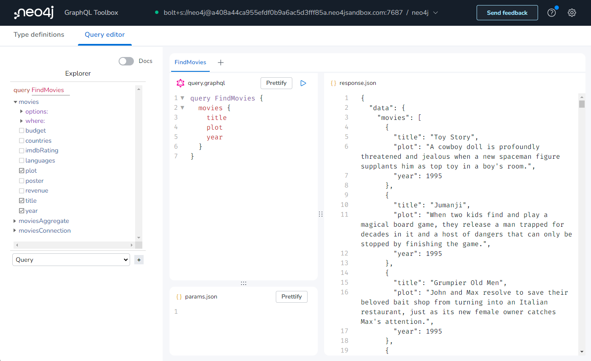
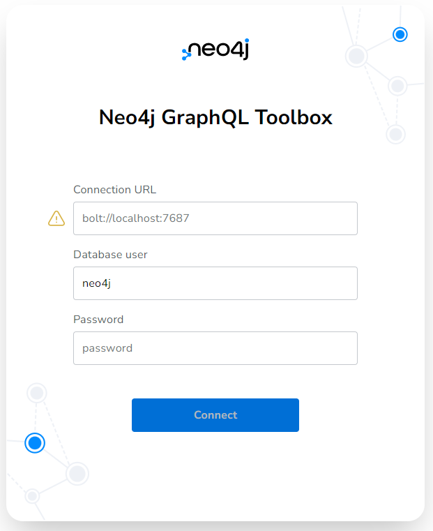
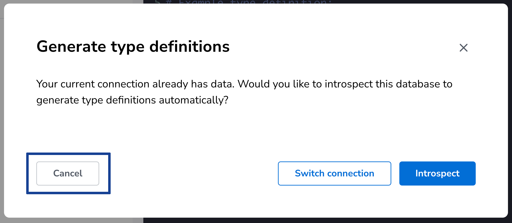
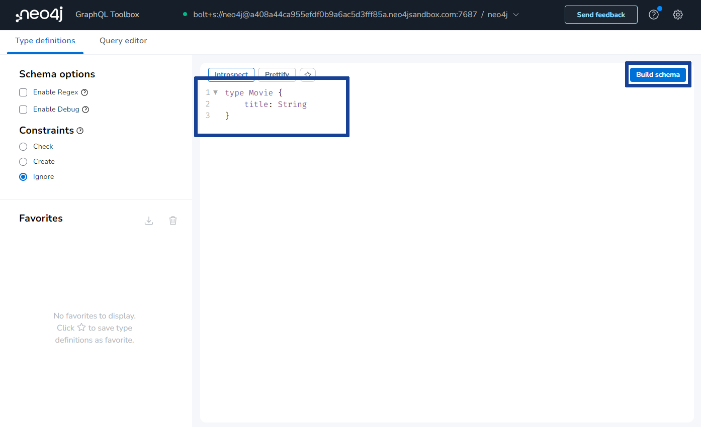
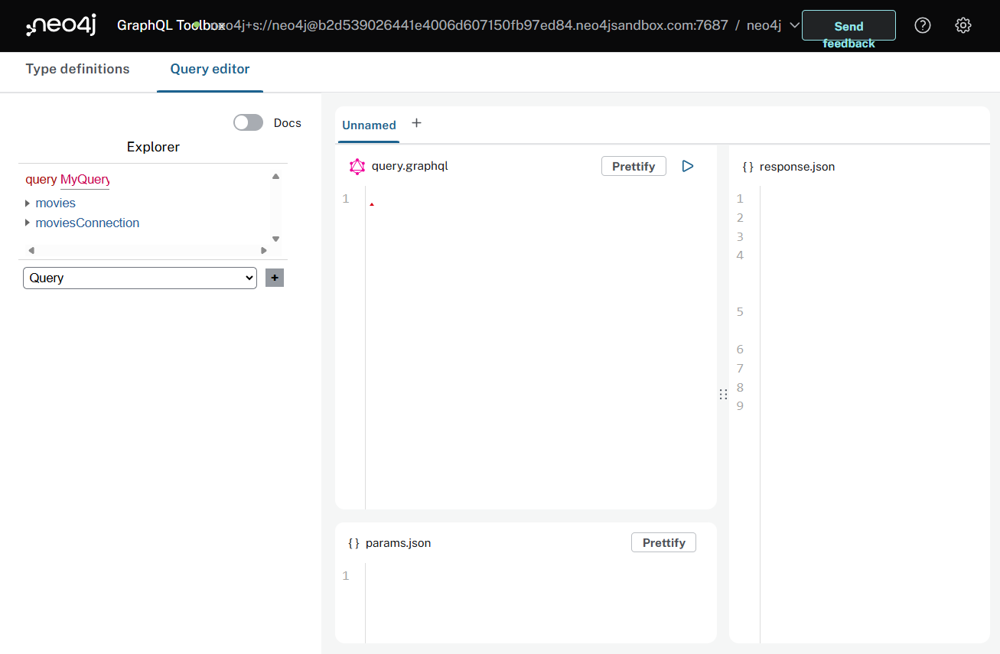

= Setting Up Neo4j GraphQL Toolbox
:order: 2

Now that you have an overview of the technologies you be using in this course it's time to get hands-on! 

You will start by setting up Neo4j GraphQL Toolbox and connecting it to a Neo4j Sandbox 

include::{shared}/courses/apps/sandbox.adoc[tag="info"]

View the `Movie` nodes in the sandbox dataset by running this cypher query.

[source,cypher]
----
MATCH (m:Movie) RETURN m
----

== Neo4j GraphQL Toolbox

The https://graphql-toolbox.neo4j.io/[Neo4j GraphQL Toolbox^] is a user interface that allows you, with very little effort, to write and execute GraphQL queries and mutations against your Neo4j database.

The toolbox is an IDE on top of the https://neo4j.com/docs/graphql-manual/current/[Neo4j GraphQL Library ^] and will support you in understanding how to use GraphQL with a Neo4j database. 

=== Connect to a Neo4j Database

The toolbox needs to connect to a Neo4j database, when you launch the toolbox it will ask you to enter the connection details of your Neo4j database.

Open the toolbox and connect to your Neo4j sandbox:

. Open https://graphql-toolbox.neo4j.io/?connectURL=bolt%2Bs://{sandbox_user}@{sandbox_host}:{sandbox_port}[Neo4j GraphQL Toolbox^] (https://graphql-toolbox.neo4j.io/?connectURL=bolt%2Bs://{sandbox_user}@{sandbox_host}:{sandbox_port}[graphql-toolbox.neo4j.io^])
+ 

. Enter the following details to connect to your Neo4j sandbox. The Connection URL and username should have been pre-populated.
+
Connection URL:: [copy]#bolt+s://{sandbox_host}:{sandbox_boltPort}#
Username:: [copy]#{sandbox_username}#
Password:: [copy]#{sandbox_password}#
. Click *Connect*

When you first connect to a database you will be asked if you want to "Generate type definitions" - click *Cancel*.

> The toolbox can generate GraphQL type definitions for you by inspecting the data structure of the database. You will be creating your own type definitions as part of this course so you can skip this step.

=== Create a type definition

To interact with the database using GraphQL you will need to create a type definition.

. Enter the following text into the *Type definitions* to define a single `Movie` type.
+
[source, GraphQL]
----
type Movie {
    title: String
}
----

> You can delete any existing type definitions and replaced them with this text.

. Click *Build Schema*
+ 
Using the Neo4j GraphQL Library a fully functional GraphQL API will be created to query data in your Neo4j Sandbox instance.

=== Run a GraphQL query

Once the schema has been built the toolbox will switch to the Query Editor where you can build GraphQL queries based on the type definitions you created.

You wil use this interface to compose and execute GraphQL queries and see the results, using data from your Neo4j Sandbox instance.

TODO - Martin needs to finish off this final section.

Here you can see a simple GraphQL query which will .... TODO, give it a try to make sure you're able to build the GraphQL schema, execute GraphQL queries, and see the results:

[source,GraphQL]
----
{
  movies {
    title
  }
}

// FIXME: find a better initial query that doesn't use a named query or variables
query FindMovies($limitValue: Int) {
    movies(options: { limit: $limitValue }) {
        title
    }
}
// more here
----

== What's Next

Now that you have your development environment set up let's learn more about how to write GraphQL queries to query the API generated by the Neo4j GraphQL Library.

read::I'm ready![]

== Lesson Summary

In this lesson, you learned about Neo4j Sandbox and Neo4j GraphQL Toolbox.

