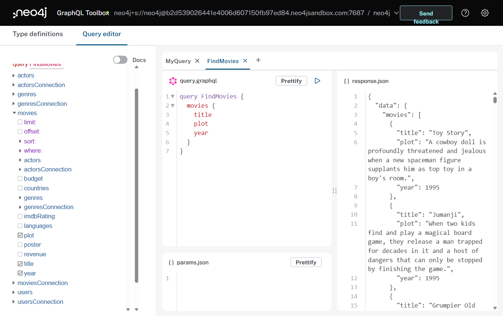
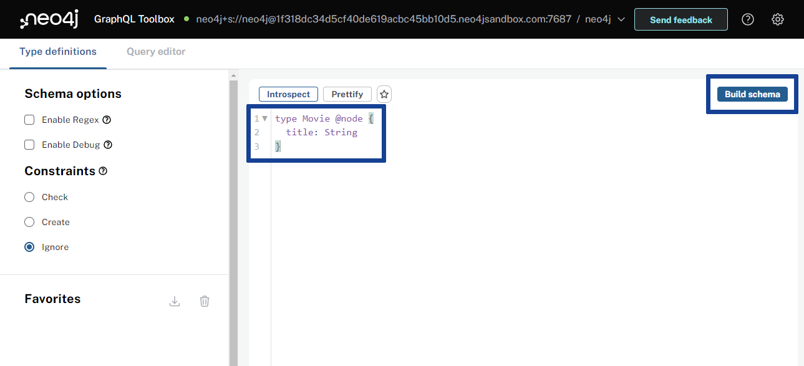

= Setting Up Neo4j GraphQL Toolbox
:order: 2
:sandbox: true

Now that you have an overview of the technologies you be using in this course it's time to get hands-on! 

You will start by setting up Neo4j GraphQL Toolbox and connecting it to a Neo4j Sandbox.

include::{shared}/courses/apps/sandbox.adoc[tag="info"]

Run this Cypher query in the sandbox to see `Movie` nodes stored in the sandbox.

[source,cypher]
----
MATCH (m:Movie) RETURN m
----

== Neo4j GraphQL Toolbox

The https://graphql-toolbox.neo4j.io/[Neo4j GraphQL Toolbox^] is a user interface that allows you, with very little effort, to write and execute GraphQL queries and mutations against your Neo4j database.

The toolbox is an IDE on top of the https://neo4j.com/docs/graphql-manual/current/[Neo4j GraphQL Library ^] and will support you in understanding how to use GraphQL with a Neo4j database. 

=== Connect to a Neo4j Database

The toolbox needs to connect to a Neo4j database, when you launch the toolbox it will ask you to enter the connection details of your Neo4j database.

Open the toolbox and connect to your Neo4j sandbox:

. Open link:https://graphql-toolbox.neo4j.io/?connectURL={connect-url}[Neo4j GraphQL Toolbox^] (link:https://graphql-toolbox.neo4j.io/?connectURL={connect-url}[graphql-toolbox.neo4j.io^])
+ 
image::images/02toolbox_creds.png[The GraphQL toolbox connection screen,width=500,align=center]
. Enter the following details to connect to your Neo4j sandbox. The Connection URL and username should have been pre-populated.
+
Connection URL:: [copy]#neo4j+s://{sandbox_host}:{sandbox_boltPort}#
Username:: [copy]#{sandbox_username}#
Password:: [copy]#{sandbox_password}#
. Click *Connect*

When you first connect to a database, the toolbox prompts you to "Generate type definitions" - click *Cancel*.

image::images/02generate_typedefs_annotated.png[Option to generate GraphQL type definitions,width=500,align=center]

[TIP]
.Auto-generated type definitions
====
The toolbox can generate GraphQL type definitions for you by inspecting the data structure of the database. You will create the type definitions as part of this course and can skip this step.
====

=== Create a type definition

To interact with the database using GraphQL you must create a type definition.

. Enter the following text into the *Type definitions* to define a single `Movie` type.
+
[source, GraphQL]
----
type Movie {
    title: String
}
----

[NOTE]
You can replace any existing type definitions with these.
. Click *Build Schema*
+ 
Using the Neo4j GraphQL Library a fully functional GraphQL API will be created to query data in your Neo4j Sandbox instance based on the type definitions you created.

=== Run a GraphQL query

The toolbox will build the schema and display the Query Editor. In the Query Editor you can create GraphQL queries based on the type definitions you created.

image::images/02query_editor.png[The GraphQL query editor screen,width=500,align=center]

You will use this interface to compose and execute GraphQL queries using the data in your Neo4j sandbox and see the results.

This simple GraphQL query will return the titles of all the movies in the sandbox.

[source,GraphQL]
----
{
  movies {
    title
  }
}
----

Copy this query to the query editor in the GraphQL toolbox and click run.

The response panel on the right will display the results of the query.

You have successfully connected the GraphQL Toolbox to your Neo4j sandbox, built a GraphQL schema and have executed a GraphQL query.

== What's Next

Congratulations, you have set up your development environment. 

In the rest of the course, you will use the Neo4j GraphQL Toolbox to write GraphQL queries to query the API generated by the Neo4j GraphQL Library.

read::I'm ready![]

== Lesson Summary

In this lesson, you learned about Neo4j Sandbox and Neo4j GraphQL Toolbox.

