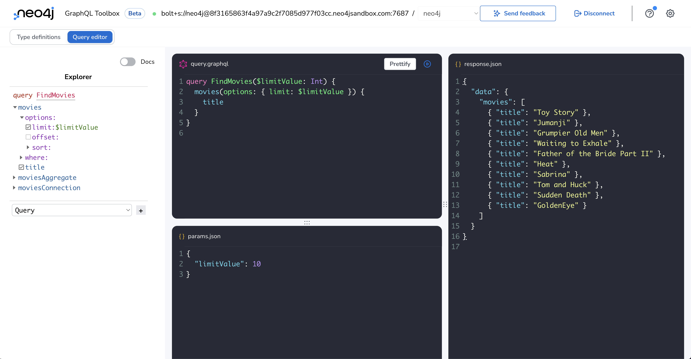

= Setting Up Neo4j GraphQL Toolbox
:order: 2
:disable-cache: true

Now that we've gotten an overview of the tools and technologies we'll be using in this course it's time to get hands-on! We'll start by setting up GraphQL Toolbox

== Neo4j Sandbox

When you enrolled in this course we provisioned a Neo4j Sandbox instance for you.

include::{shared}/courses/apps/sandbox.adoc[tag="info"]

== Neo4j GraphQL Toolbox

// TODO: more about Neo4j GraphQL Toolbox, what it is, how we're going to use it

// perhaps one of those diagrammed-over images that shows what each component of GraphQL toolbox is?

image::images/toolbox_creds.png[Neo4j GraphQL Toolbox Credentials,width=500,align=center]

// Instructions about how to authenticate your sandbox credentials with Neo4j GraphQL Toolbox

// TODO: we can introspect type definitions, but for this course we'll be entering in our type definitions manually.

Let's click "Cancel" to manually enter type definitions here. If you missed this step or your type definition editor (FIXME: what's the right word here?) contains different type definitions replace them with the following type definitions that define a single `Movie` type.

[source, GraphQL]
----
type Movie {
    title: String!
}
----

Ensure your type definitions match the text above, then click the "Build Schema" button to create a fully functional GraphQL API using the Neo4j GraphQL Library to query data in your Neo4j Sandbox instance.

The Neo4j GraphQL Library can be used to build GraphQL APIs that query any Neo4j database. For our purposes in the course we'll be using the Neo4j GraphQL Library through the Neo4j GraphQL Toolbox to understand and explore how graph data is exposed through GraphQL when building APIs using the Neo4j GraphQL Library.

image::images/toolbox_typedefs.png[GraphQL,width=500,align=center]

After clicking the "Build Schema" button you'll see the (FIXME: what is this screen called?) GraphQL query composer (??), and GraphQL response tab. We'll use this interface to compose and execute GraphQL queries and see the results, using data from our Neo4j Sandbox instance.

Here you can see a simple GraphQL query, give it a try to make sure you're able to build the GraphQL schema, execute GraphQL queries, and see the results:

[source,GraphQL]
----
// FIXME: find a better initial query that doesn't use a named query or variables
query FindMovies($limitValue: Int) {
    movies(options: { limit: $limitValue }) {
        title
    }
}
// more here
----

== What's Next

Now that you have your development environment set up let's learn more about how to write GraphQL queries to query the API generated by the Neo4j GraphQL Library.

read::I'm ready![]

== Lesson Summary

In this lesson, you learned about Neo4j Sandbox and Neo4j GraphQL Toolbox.

In the next module, you will learn how to write GraphQL queries to query the API generated by the Neo4j GraphQL Library